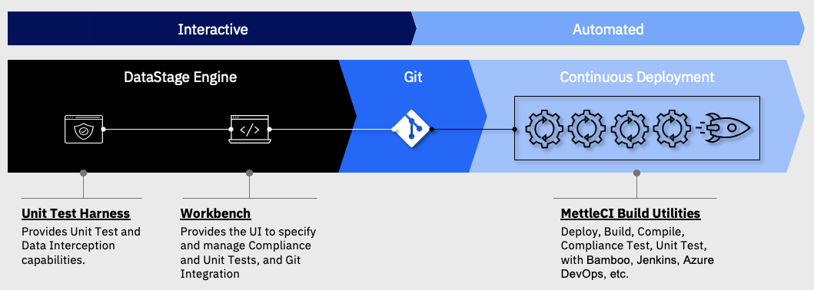

# Introduction

*   [Why MettleCI?](./introduction/why-mettleci.md)
    *   [MettleCI Functional Overview](./introduction/why-mettleci/mettleci-functional-overview.md)
    *   [Use Cases](./introduction/why-mettleci/use-cases.md)
*   [MettleCI Components for CI and CD](./introduction/mettleci-components-for-ci-and-cd.md)
*   [MettleCI Installation Roadmap](./introduction/mettleci-installation-roadmap.md)
*   [Definition of a Unit Test](./introduction/definition-of-a-unit-test.md)
*   [Development Model Options & Recommendations](./introduction/development-model-options-recommendations.md)