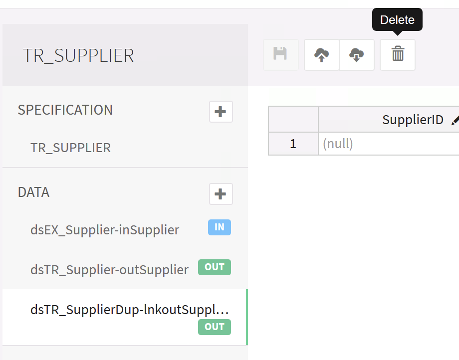

# Capturing a Baseline Test Result

As the logic of your job changes, so will the Unit Test files representing correct output need to change. You can use MettleCI to automatically re-baseline your expected output based on an execution of your DataStage job. Note that while this process is similar to the process described in [Capturing Existing Unit Test Data](  https://datamigrators.atlassian.net/wiki/spaces/MCIDOC/pages/437518414/Capturing+Existing+Unit+Test+Data), this process differs in that it only captures the **OUTPUT(S)** of your job.

* * *

## Step By Step Guide

1 In the Unit Test editor, select the Unit Test output file you want to re-baseline and in the icon bar above the table click the **Delete** button.

2\. Execute your job in Unit Testing mode from the DataStage Designer. MettleCI will identify that no expected results exist for the file(s) you’ve deleted and re-create them. The Unit Test will fail when executed in this mode.

3\. Re-execute the same job in Unit Testing mode from the DataStage Designer. MettleCI will now use the new baseline results files and your Unit Test will pass without problems.