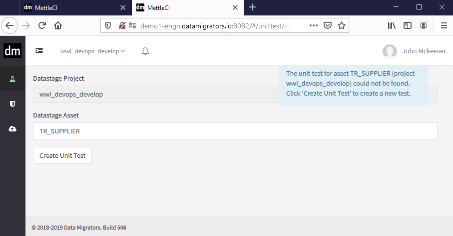
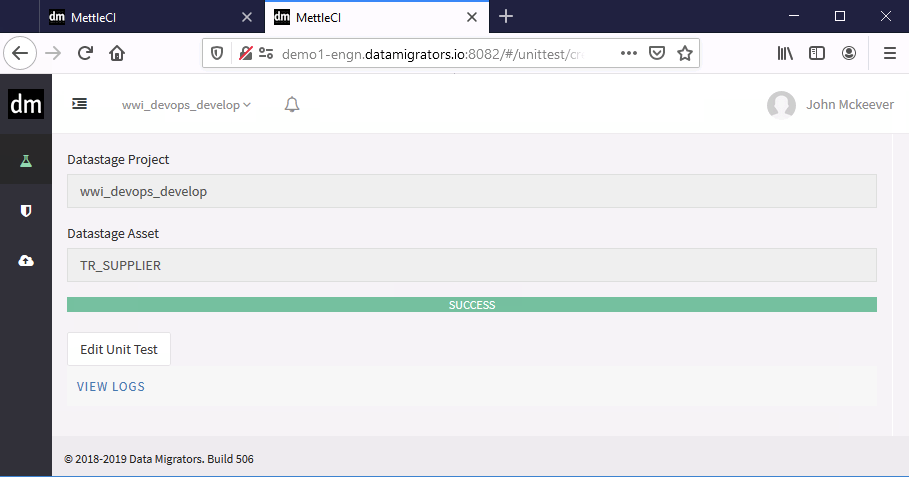
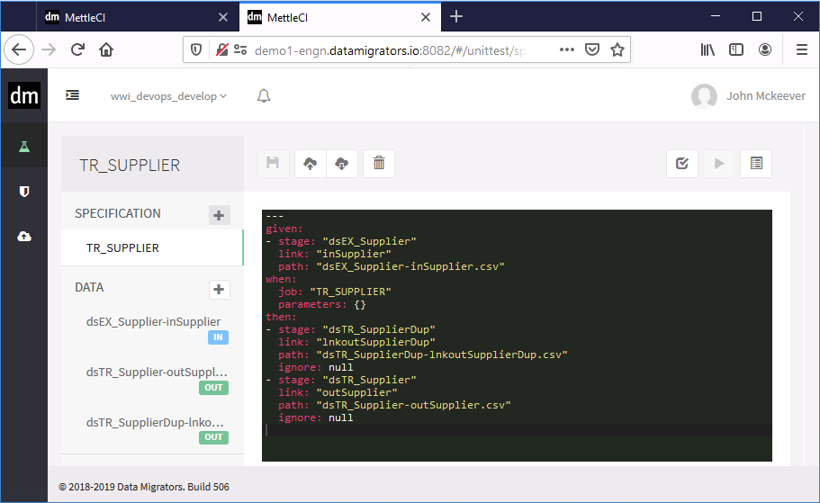

# Creating a Unit Test

## Introduction

Unit tests can be created for individual jobs using the MettleCI workbench, or en masse (for all jobs in a project) using an automated build pipeline.  When MettleCI creates a unit test, using either method, it executes the following process for each job:

1.  Interrogate your job definition in the DataStage repository and identify each job's source and target stages.
    
2.  Read the metadata definition of each source stage input link and target stage output link.  Note that each source may supply multiple output links, and each target stage may accept multiple input links.
    
3.  Create an empty unit test data file for each source and target link, with appropriate columns and metadata. 
    
4.  Read your job's list of parameters
    
5.  Create a unit test specification which provides references to all of your job's parameters as well as each newly-created unit test data file.
    

This animation illustrates the conceptual steps MettleCI goes through to create your Unit Test: 

Your browser does not support the HTML5 video element

* * *

## Create a Unit Test

1.  You can invoke the creation of a Unit Test in one of two ways:
    
    1.  using the DataStage Designer menu **Tools** → **Custom** → **Unit Test Specification**. If you don’t have a test for the selected job you’ll be prompted to allow MettleCi to create one for you. This assumes you’ve already [integrated Workbench and DataStage Designer](https://datamigrators.atlassian.net/wiki/spaces/MCIDOC/pages/454623235/Integrating+MettleCI+Workbench+and+DataStage+Designer+on+Windows), or
        
    2.  selecting the Unit Test page from the MettleCI Workbench sidebar, then clicking the **\[+\]** sign in the top right hand corner
        
2.  Enter the DataStage Job name (which will be auto-populated if you used the Designer menu item) then click **Create Unit Test**
    
    
    
3.  When the Unit Test has been created click **Edit Unit Test** to customise the test.
    
    
    
4.  Use the Unit Test Editor to modify your unit test specification and test data.
    
    