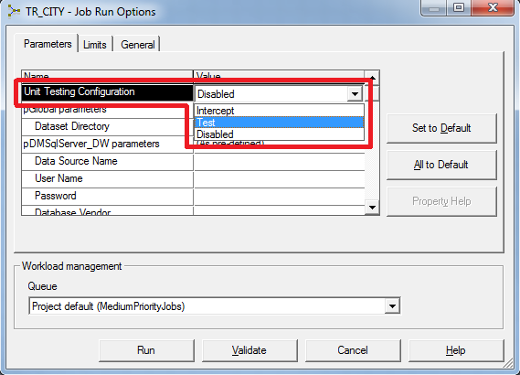

# Executing a Unit Test

*   [1\. Run DataStage Job in Unit Testing Mode](#1-run-datastage-job-in-unit-testing-mode)
*   [2\. Check Unit Tests List](#2-check-unit-tests-list)
*   [3\. Unit Test results report](#3-unit-test-results-report)

# Introduction

MettleCI Unit Tests are execute by running your DataStage job as you normally would but with the addition of a parameter value which invokes the MettleCI Unit Test Harness.  When you do this, the following process occurs:

Your browser does not support the HTML5 video element

The data comparison capabilities of MettleCI Unit testing provide the ability to validate your job’s outputs against expected results regardless of the order in which those actual output rows are produced.

* * *

## Step-by-step Guide

### 1\. Run DataStage Job in Unit Testing Mode

Run your DataStage Job in Unit Testing Mode by selecting 'Test' as the input value to the "Unit Testing Configuration" parameter.

Once your job is running you'll see the input link counts on the DataStage job canvas represent the number of rows in each of your Unit Testing input data sets.

You'll also see a warning in the DataStage job log telling you that unit testing is enabled. 

### 2\. Check Unit Tests List

Navigate back to Unit Tests List from the sidebar. You can now see Unit Test for ER\_EMPLOYEE created. The result is coloured RED because we didn't specify an output for comparison. 

### 3\. Unit Test results  report

You can view your Unit Test results by clicking the red **View** button alongside your test name.  A failed Unit Test will report differences for each output link:

A Unit Test will only report success when all output links have zero differences from their expected results:

