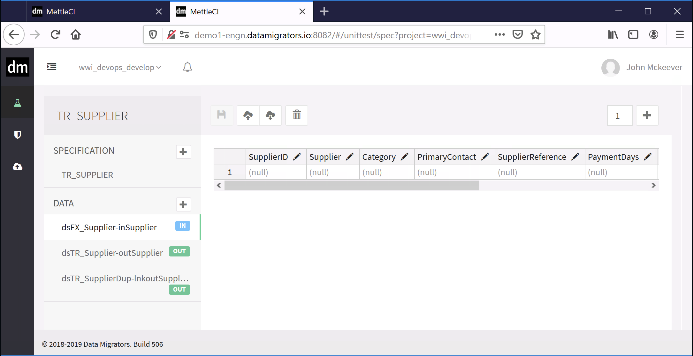
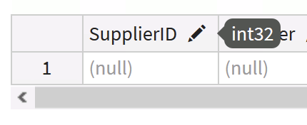
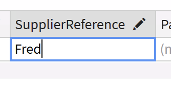
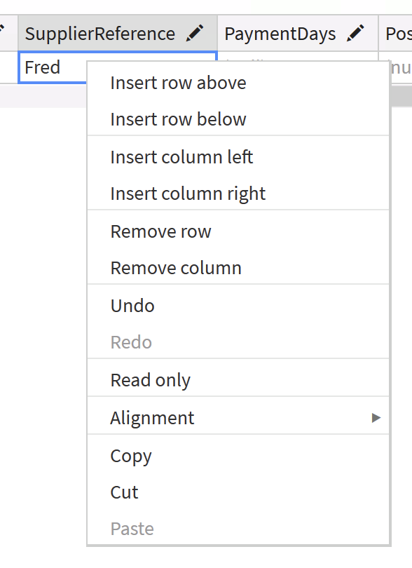
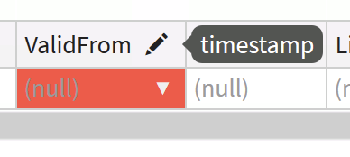
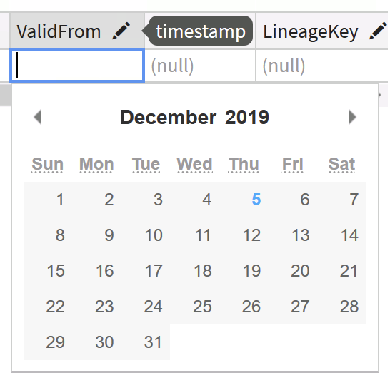

# Manually Editing Unit Test Data

Once you’ve created your Unit Test the data files comprising your test specification are listed on the left of the Unit Test editor. Selecting each of these will display it on the right-hand pane of the editor in an Excel-like tabular view.

Putting your mouse cursor over the ‘pencil’ icon next to each column header will tell you the datatype of that column.

Values in the cells can be edited just like you would in Excel.

New rows (or even columns, if you want to update your metadata) can be added using the editor’s right-click menu items.

Columns with time-based datatypes can be edited by clicking the drop-down selector in each cell.

Authoring, intercepting, or uploading large volumes of test data will eventually prevent those data from being interactively edited using MettleCI Workbench’s Unit Test Editor. In these circumstances you will be presented with a message of the form:

> *{data-file-name}*.csv is in ReadOnly mode. The data file is larger than is recommended for editing in workbench.

In this instance you can still edit the data file by exporting it to a CSV file (using the download button on the Unit Test Editor toolbar), editing it using your favourite local CSV editor, such as Microsoft Excel, and then re-importing it using the upload button.