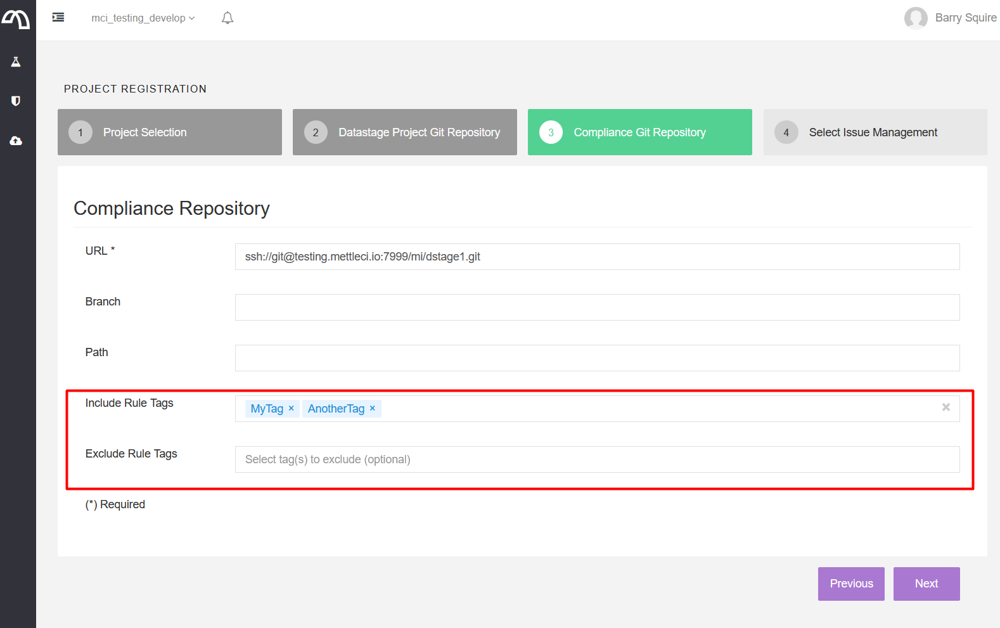
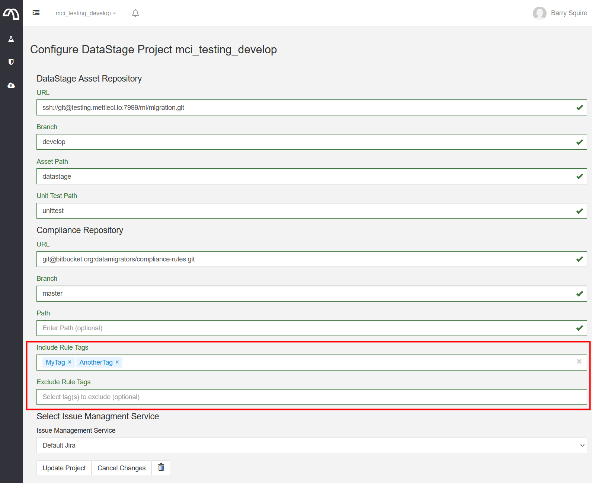

# Compliance Rule Tags

> [!INFO]
> Note that this capability is only available for the following MettleCI releases:
> *   MettleCI Workbench build **1658 or later**
>     
> *   MettleCI Command Line Interface build **243 or later** (this includes the required version of the Compliance Plugin)
>     
>     *   More specifically, you need MettleCI Compliance [Plugin](https://datamigrators.atlassian.net/wiki/spaces/MCIDOC/pages/2125725711/CLI+Plugins) build **421 or later**. i.e. `dm-compliance-plugin-2.2-421.jar` or later.

Each Compliance rule can be augmented with additional rule metadata through the use of [**annotations**](https://www.tutorialspoint.com/groovy/groovy_annotations.htm), the most significant of which is the **Tag** annotation which is described here.

# Rule Annotations

Annotations add extra information to a Compliance rule for use by the MettleCI Workbench and CLI to change their behaviour. Annotations consist of a keyword starting with an `@` character followed by relevant metadata. The only annotation you need to use on a day-to-day basis is the `@Tag` annotation which, although optional, is strongly recommended.

> [!INFO]
> If you add a `@Tag` attribute to a rule you must also add a `package` value to the top of your Compliance rule. This is required by the underlying Compliance technology, and has no functional implications.
> A good practice for the package name is to use a unique value which identifies the group that owns (and is responsible for maintaining) the rule. All out-of-the-box rules have a set of suggested tags and a package name of `datamigrators`.

# Rule Tags

Each Compliance rule may specify zero or more tags which are free-form text labels associated with each rule. You may choose any number of tags, and each tag may take any alphanumeric value you choose. Rule Tagging provides improved rule metadata management in support of a number of use cases:

*   Identifying the ‘severity’ of each rule. The MettleCI tools that use Compliance results (the Workbench user interface and the [mettleci compliance test CLI command](https://datamigrators.atlassian.net/wiki/spaces/MCIDOC/pages/408322069/Compliance+Test+Command)) need to know how to respond to Compliance Rule breaches. How a rule’s breach should be indicated in Workbench or whether its use in a CI pipeline should produce a warning message or abort the pipeline entirely [can be defined using Tags](../compliance-testing/making-ci-dependent-on-specific-compliance-rules.md).
    
*   Grouping Compliance Rules into ‘bundles’ of functionally related rules. This could enable users to report or test by functional area. Functional groups into which Compliance Rules could be bundled might be Performance, Security, Maintainability, etc. Tagging also permits a single rule to be associated with multiple functional areas, if required.
    
*   Enabling the fine-grained sharing of rules across teams within organisations (i.e. tags could be used to identify which DataStage teams they apply to)
    
*   Defining rules’ behaviour in different environments (e.g. Workbench vs. CI/CD plans)
    

The example CI/CD build pipelines that ship with MettleCI demonstrate the use of tags to identify which rules inhibit the successful completion of CI.

# Using Tags

Here’s an example of a rule definition which incorporates some Tags.

```
# Rule tags (effectively user-defined, free-form attributes)
@Tag("security")            # This rule identifies a potential security vulnerability
@Tag("portability")         # This rule identifies a issues with assets' portability between environments
@Tag("maintainability")     # This rule identifies a potential maintainability issue
@Tag("CorpDataWarehouse")   # This rule is specific to the 'CorpDataWarehouse' team
@Tag("fail-ci")             # This rule is mandatory and so should fail continuous integration if breached

# Rule attributes
@AssetType("data_intg_flow")
package datamigrators

# Rule definition
<blah blah blah>
```

# Include and Exclude options for Compliance operations

The various MettleCI tools which use the Compliance Rule library permit the filtering of the rules which they use by allowing users to specify which tags should cause a rule to be included and which excluded.

The [mettleci compliance test](https://datamigrators.atlassian.net/wiki/spaces/MCIDOC/pages/408322069/Compliance+Test+Command) command (available within the [Compliance namespace](https://datamigrators.atlassian.net/wiki/spaces/MCIDOC/pages/2262990849/Compliance+Namespace) of the MettleCI Command Line Interface) provides `-include-tags` and `-exclude-tags` options to filter the rules which will be used by the command. MettleCI interprets these options so that set of **include** tags is used first to generate a set of candidate rules, then the set of **exclude** tags is removed to leave the rules that will be used. In the diagram above, only the rules with tags in set A and **NOT** in B will be used to select Compliance Rules (formally referred to as the '[relative complement](https://en.wikipedia.org/wiki/Complement_(set_theory)#Relative_complement) of B in A').

## Tags Example

```
$> mettleci compliance test \
   -assets /my/datastage/assets \
   -report "my/compliance/report.xml" \
   -junit \
   -rules /my/compliance/directory \
   -exclude-tags example \
   -project-cache /my/project/cache \
   -ignore-test-failures \
   -test-suite "CI Warnings"

MettleCI Command Line (build 161)
(C) 2018-2022 Data Migrators Pty Ltd
compliance test (v2.2-425)
rules configuration discovered
included rule - 'Adjacent Transformers' (PARALLEL_JOB)
... etc.
```

Some notes on Tag behaviour:

*   Tags are case insensitive.
    
*   We strongly recommend that the values your use for Tags employ only alphanumeric characters (0-9, a-Z, A-Z) as Data Migrators can’t guarantee the support for non-alphanumeric tags across all possible CI platforms and use cases.
    
*   The default behaviour of tagging is that everything is included:
    
    *   Omitting an **Include** tag option results in everything being included.
        
    *   Omitting an **Exclude** tag option results in nothing being excluded (i.e. everything is included).
        
    *   Omitting **Include** and **Exclude** tag options results in everything being included.
        
*   When at least one tag is specified (either **Include** or **Exclude**), Compliance Rules are scanned recursively.
    
*   When no **Include** and **Exclude** tags are specified Compliance Rules are **not** scanned recursively (existing behaviour). 
    
*   You can use the asterisk (`*`) character to match all tags, which can be a useful technique to trigger recursive scanning when you need it:
    
    *   Specify an **Include** tag using `*` (to include everything) and leave **Exclude** tags blank to trigger recursive scanning of rules. This is different to omitting both specifications (or leaving them blank) which would results in shallow, non-recursive scanning.
        
*   Multiple tags are expressed as a comma separated list with no spaces. (e.g. `-include-tags MyTag,AnotherTag,YetAnotherTag`)
    

# Workbench Configuration

The MettleCI Workbench permits you to specify which include and exclude tags will be used when testing your Job’s Compliance interactively from within the Workbench interface.

|     |     |
| --- | --- |
|  |  |