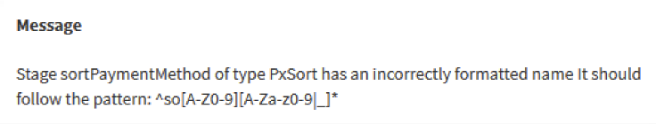
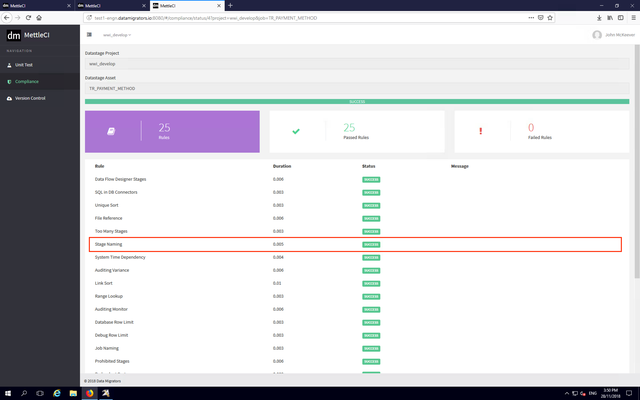

# Compliance Testing from Workbench

The Workbench **Check Compliance** functionality is used to validate DataStage assets against a set of quality criteria which MettleCI refers to as **Compliance Rules**. MettleCI ships with a [set of sample Compliance Rules](../compliance-testing/mettleci-compliance-rules-reference.md) (delivered as a Git repository) which act as the basis for customers to use as supplied, ignore, modify, or augment with new customer-specific rules as required to meet specific needs.

Data Migrators can provide assistance to help you add or modify rules to suit your specific needs.  Take a look at the MettleCI documentation to start modifying or [writing your own Compliance Rules](https://datamigrators.atlassian.net/wiki/spaces/MCIDOC/pages/117665828/Writing+Compliance+Rules). 

The concept of Compliance Testing can have a variety of uses:

*   Enforcing Coding Standards in DataStage jobs, for consistency and improved readability over time
    
*   Tracking external assets, which may require external management
    
*   Identifying deprecated stages, allowing upgrade effort to be quantified.
    

As an example of evaluating Compliance and removing a test failure, let's look at an example DataStage job in the classic (Windows-based) Designer.   

> [!INFO]
> ### WARNING
> Before running Compliance you should ensure you have **COMPILED** the job which you wish to test.  Merely saving the job will update your DataStage repository with the details of your current job design **WITH THE EXCEPTION OF THE CONTENTS OF TRANSFORMER STAGES!**   The code for the Transformer Stages as configured on your DataStage Canvas is only generated during the compile process.

  
The Sort stage (highlighted) does not comply with an existing Compliance Rule designed to ensure naming standards.  Note that the DataStage custom menu actions shown in this page are installed by following the [DataStage Integration Setup](https://datamigrators.atlassian.net/wiki/spaces/MCIDOC/pages/374669381/Introduction#IntegrationSetup) instructions.

Through the **Tools > Custom...** menu, Check Compliance functionality in Workbench can be invoked directly from DataStage. The DataStage Project and DataStage Asset are already populated with the details of the active job in the DataStage Designer palette.  Note that the Compliance functionality can also be selected directly from the Navigation menu in the Workbench application, though that case these two fields will be blank

Click the **Run Compliance** button to execute compliance testing against the job. While the compliance testing is executing, the logs can be viewed to monitor progress.

Once the compliance test execution has completed, the **Compliance Report** is displayed, showing the results.

Examining the output of the failed Stage Naming test, we can see the Sort stage "sortPaymentMethod" failed to meet the instituted naming standards.

Going back to DataStage, we rename the stage to meet with the requirements and recompile the job.

We re-execute the **Check Compliance** tests, and see that the Stage Naming test now passes. 

At this point, the job can be checked in using the Workbench Check-In functionality. Again, this can be invoked directly from the Workbench application or using the DataStage **Check-In Asset** option in the DataStage Designer **Tools > Custom...** menu.