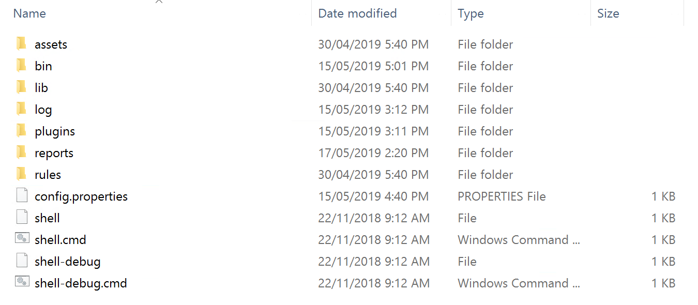
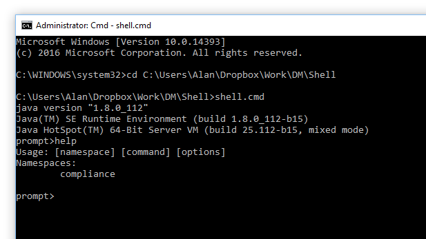
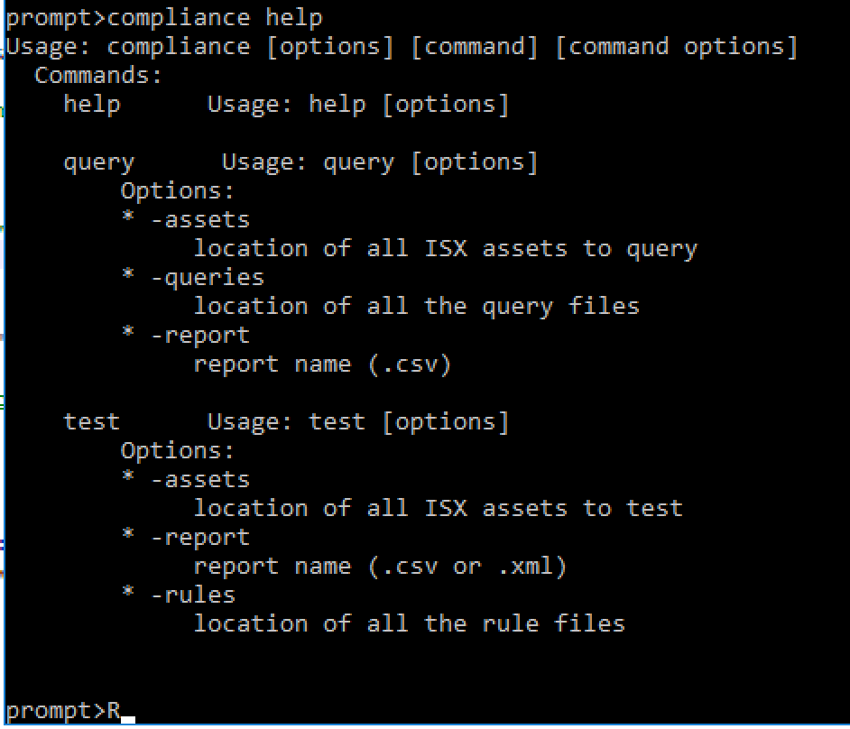
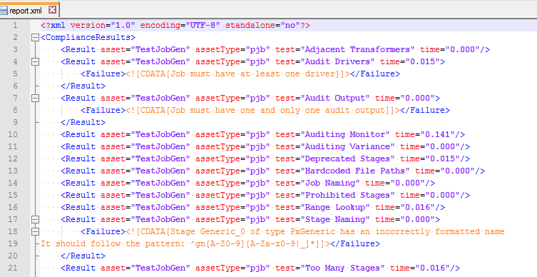
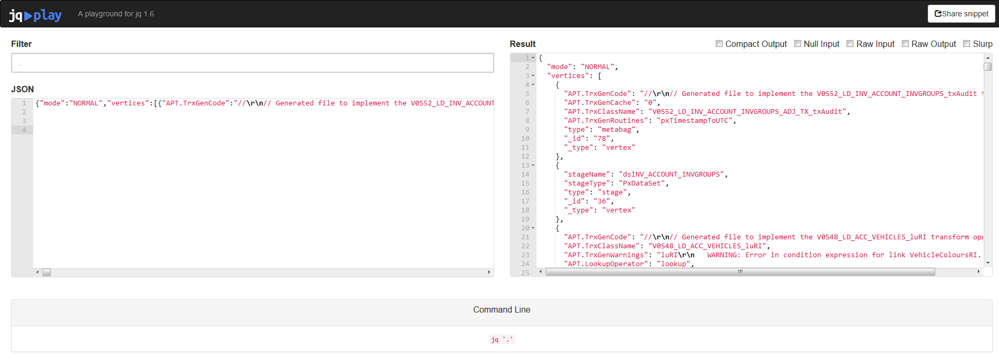
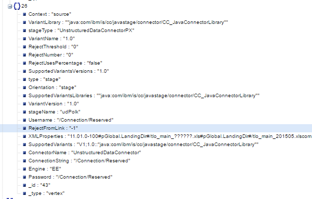
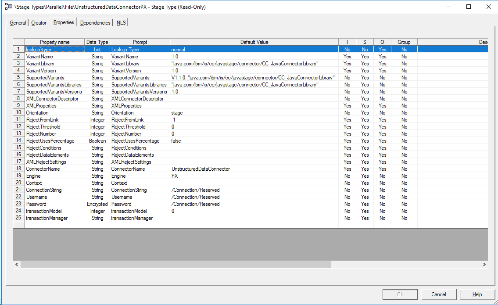

# Compliance Rule Development

*   [Introduction](#introduction)
*   [Setting up a Local Development Environment](#setting-up-a-local-development-environment)
*   [Compliance Rule Development Concepts](#compliance-rule-development-concepts)
    *   [Rules Relate to Specific DataStage Asset Types](#rules-relate-to-specific-datastage-asset-types)
    *   [Testing for Failure](#testing-for-failure)
    *   [Fundamental Graph Constructs](#fundamental-graph-constructs)
    *   [How to interpret Stage Type Properties to identify attributes (JSON) to use in Compliance Rules](#how-to-interpret-stage-type-properties-to-identify-attributes-json-to-use-in-compliance-rules)

# Introduction

The development environment consists of a simple command line interface (Java-based, with scripts for both Windows and Linux provided) that loads the MettleCI Compliance plugin and allows Compliance Rules to be executed against the exported DataStage jobs.The MettleCI suite as installed features a number of standard Compliance Rules that it executes against the ISX archive files it creates to manage DataStage jobs.

Technical end users also have the ability to create and test their own rules. As text files, Compliance Rules may be edited using any standard text editor.

NOTE: As of January 2019, this development capability is separate to the MettleCI installation and rules created by end users need to be managed and promoted to MettleCI manually.

# Setting up a Local Development Environment

**Note**: The steps involved in setup of the Command Shell tool in both Windows or Linux is the same. 

To execute Compliance Rules against ISX files, 

1.  Copy the DM Command Shell (with a name similar to `dm-mettleci-command-shell-n.n-nnn-dist.zip`) from your MettleCI installation media (See [Accessing the MettleCI Software Distribution](https://datamigrators.atlassian.net/wiki/spaces/MCIDOC/pages/1565687876/Accessing+the+MettleCI+Software+Distribution)) and unzip to a convenient directory.
    
2.  The Directory Structure that is unzipped should look like this:
    
3.  
    
    Edit `config.properties`, and on the line for `license.file`, Enter the name of the MettleCI license file, relative to this directory.
    
4.  You should have a copy of the Compliance Plugin (`dm-compliance-plugin-2.0-*.jar`) into the `plugins` directory, if not search for the `dm-compliance-plugin-2.0-*.jar` in the MettleCI installation media and copy it into the `plugins` directory shown above.
    
5.  The directory **lib** stores a few dependencies for the compliance command line execution, the directory should have the following items:
    
6.  Open a Command Prompt, and Run 'shell' and type 'help'. The shell returns Namespace 'compliance' which shows that the Compliance plugin has been copied into the plugins directory and is available for use.
    



7) Execute 'compliance help' to see the required parameters for executing a compliance test.



8) The full command to run a Compliance test is:

```
compliance test -assets <Path to ISX files> -report <Path and Name of Report.xml> -rules <Path to Rules Files>
```


> [!WARNING]
> In order for a file to be recognised as MettleCI Compliance Rules, it must have the file extension `.grm`. Any files with a different file extension are ignored.

9) Sample output from the Compliance Test:



10) In order to speed up execution, JSON files are not saved by default.

However, a special 'debug' rule can be added to the rules directory that forces the testing tool to write out JSON files.

Like other rules, it is evaluated against every ISX file in the asset directory, but its sole purpose is to write the graph of each ISX file to a JSON file.

This debug rule (suggested name 'debug.pjb.grm') contains the following line of code:

```
item.graph.saveGraphSON("${item.name}.json")
// NOTE: the JSON outputted by this method has some limitations.
// If the DS stage has nested properties, then these nested properties
// won't be represented in the JSON. There is a debug method described
// further down in this document that will output these values.
```

  
Once the relevant JSON files have been written, the file extension of that rule can be changed to something other than .grm in order to deactivate it.

While the output is JSON, it isn't human readable without running it through a JSON formatter/beautifier.  There are a lot of tools available that can make JSON easier to understand and search, one possible open source tool is jq which is available as a [command line](https://stedolan.github.io/jq/) and [web](https://jqplay.org/) tool.  For example, debug output processed by the online version of jq looks like this:



Note that the filter parameter was set to `.` to ensure the entire json document was processed.

# Compliance Rule Development Concepts

### Rules Relate to Specific DataStage Asset Types

When .ISX files are exported from DataStage, each asset type is given an 'extension', according to the following table:-

| Extension | Asset Type |
| --- | --- |
| **pjb** | **Parallel job** |
| **qjb** | **Sequence job** |
| **sjb** | **Server job** |
| prt | Parallel routine |
| srt | Server routine |
| **psc** | **Parallel shared container** |
| **ssc** | **Server shared container** |
| tbd | Table definition |
| tfm | Transform |
| dqs | Data quality specification (match specification or rule set) |
| stp | Stage type |
| dcn | Data connection |
| pst | Parameter set |

> [!WARNING]
> *   MettleCI's Compliance feature only support the asset types in **bold type** in the above table.
>     
> *   Each rule covers a single asset type only, as each type has a different internal model.

When creating a Compliance Rule, the naming standard is **<Rule Name>.<Extension>.grm**

e.g.: Rules that check Parallel jobs need to be called <Rule Name>.pjb.grm.

### Testing for Failure

There are a few fundamental concepts involved with creating Gremlin rules for Compliance:

*   Compliance Rules must explicitly test for Failure, ie: by default, rules will return as a Pass
    
    *   use the **.comply** pipe to test for failure. Requires an error message, followed by the logic to evaluate
        
    *   explicitly call **compliance.failure**, followed by the error message
        

###  Fundamental Graph Constructs  

**item.graph - Graph**

Refers to the entire graph, under which two main collections exist:

`V` **- Vertices** - all Vertices in the model: Stages, Pins, Metabags, Containers, Annotations

`E` **- Edges** - all Edges in the model: Links and Pins (the Edges that connects a Stage to a Pin)

**Vertices** are connected by **Edges**, and the graph can be walked Vertex by Vertex using:

`.in` **- Inbound (Upstream) Vertices:** Refers to the Vertex at the end of an inbound Edge

`.out` **- Outbound (Downstream) Vertices:** Refers to the Vertex at the end of an outbound Edge

`.inE` **- Inbound Edges connecting to upstream Vertices:** Refers to the outbound Edges.

`.outE` **- Outbound Edges connecting to downstream Vertices:** Refers to the inbound Edges.  

**V** and **.in** and **.out** are used in conjunction with a Vertex filter. MettleCI creates three of these filters to allow for more concise coding of rules.

`.stage` \-  filter the Vertices to just the Stages and is a shortcut for `.has('type', 'stage')`

`.pin` - either end of a Link

`.metabag` - for a Stage, it is the contents of the Advanced tab. For a Pin it is the contents of the Input or Output tab of the adjacent Stage (depending on how it was traversed to).  

If traversal involves Edges:

`.inE` **- Inbound Edges connecting to upstream Vertices:** Refers to the outbound Edges. Edges have a **label** property of either "link" or "pin"

`.outE` **- Outbound Edges connecting to downstream Vertices:** Refers to the inbound Edges.

**E** and **.inE** and **.outE** are used in conjunction with an Edge filter. MettleCI creates two of these:

`.link` - filter the Edges to those that are the actual DataStage Link (connects directly to the adjacent Stage) and is a shortcut for **.has('label', 'link')**

`.pin` - filter the Edges to those that connect to a Pin (which connects to the Metabag containing Stage Input or Output tab properties)

To illustrate some of the terms, let's look at a portion of a DataStage job:


            

           

In this example:

*   `def B = item.graph.V.stage.has("stageName", "txRICheck")` - B refers the the txRICheck stage
    
*   `B.in` - refers to A, and the Pin containing the Metabag that stores the properties of the Input tab in the txRICheck Stage Properties
    
*   `B.in.stage` - refers to A (luRI)
    
*   `B.in.pin.out.metabag` - refers to the Metabag containing the properties of the input tab. Note there is only one input link.
    
*   `B.out.stages` - refers to C (scDisRIAccounts) and D (txAudit)
    
*   `B.out.pin.as("pin").outE.has('linkName', 'RIChecked').back("pin").out.metabag` - refers to the Metabag containing the properties of the output tab for the Link named "RIChecked"
    

  
There are two primary ways of filtering to find the objects that meet certain criteria. They are used most commonly on Vertices, as Edges have few properties of interest in MettleCI.

`.has(<property>,<value>)` - if the Vertex contains a property and the value of that property matches the value specified, the object is retained for evaluation.

`.filter{...}` - behaves similarly to an function call, and returns true or false.  If true is returned, the object is retained for evaluation. This allows for more complex logic to be used. The function code may be defined prior and used like a function pointer, or defined inline.  

**The Comply Pipe**

`.comply{<message closure>}, {<compliace closure>}` **-**

The first parameter is closure which returns the compliance message that gets output for each failure.

The second parameter is optional and accepts a closure that is evaluated to be true/false. If true, the processed Vertex or Edge 'complies' and the message is not output but if false, it does not comply and the message is output.  If the user only supplies the first parameter, it is assumed that all processed Vertices or Edges do not comply.

So the expression 'item.graph.V.stage.comply{message closure}{comply closure}' means 'In the Vertices graph, for all the items of stages, check if they comply with {comply closure}. If false, output {Message Closure}.

**The Debug Pipe**

`.debug(<output file name>)` **-**

While the 'debug' rule described above is great for dumping the entire graph in JSON format, there are times that you will want to debug specific graph Vertices and Edges.  There are also some properties, such as sort keys and connector properties, which cannot be described in a valid JSON format. 

All Vertices or Edges processed by the debug pipe are passed from input to output without any change.  However, each Vertex and Edge that passes through the pipe is dumped to the provided file name in a format that looks similar to JSON.  This allows the pipe to be used during compliance rule development to inspect the Vertices/Edges being processed at various points in your compliance rule.  For example, multiple debug pipes can be used to inspect graph processing:

```
item.graph.V
	.stage.has("type", "PxJoin").debug("D:/temp/joinStages.txt")
	.out.pin.debug("D:/temp/joinOutPins.txt")
```

Due to the advanced output capabilities of the debug pipe, it can also be used to help understand the available stage properties and how to access them from within compliance rules. 

For example, the following debug output as from an Oracle Connector Stage:

```
{
    Context: "target"
    RejectDataElements: "ERRORCODE ERRORTEXT "
    VariantLibrary: "ccora11g"
    xaoDbName: "/Connection/xaoDbName"
    stageType: "OracleConnectorPX"
    VariantName: "11g"
    RejectThreshold: "0"
    RejectNumber: "0"
    RejectUsesPercentage: "0"
    SupportedVariantsVersions: "1.0,1.0"
    type: "stage"
    Orientation: "link"
    SupportedVariantsLibraries: "ccora10g,ccora11g"
    VariantVersion: "1.0"
    stageName: "ocACC_VEHICLES"
    Username: "/Connection/Username"
    RejectFromLink: "-1"
    XMLProperties: {
        @version: "1.1"
        Common: {
            Context: "2" {
                @type: "int"
            }
            Variant: "11g" {
                @type: "string"
            }
            DescriptorVersion: "1.0" {
                @type: "string"
            }
            PartitionType: "8" {
                @type: "int"
            }
            RCP: "0" {
                @type: "int"
            }
        }
        Connection: {
            Server: "#pBIS.Server#" {
                @modified: "1"
                @type: "string"
            }
            Username: "#pBIS.User#" {
                @modified: "1"
                @type: "string"
            }
            Password: "#pBIS.Password#" {
                @modified: "1"
                @type: "string"
            }
            OSLevelAuthentication: "0" {
                @type: "bool"
            }
            Version: "11g" {
                @modified: "1"
                @type: "string"
            }
        }
        Usage: {
            WriteMode: "6" {
                @modified: "1"
                @type: "int"
            }
            TableName: {
                @modified: "1"
                @type: "string"
                TableScope: "0" {
                    @type: "int"
                }
            }
            EnableQuotedIDs: "0" {
                @type: "bool"
            }
            SQL: 
            TableAction: {
                @modified: "1"
                @type: "int"
                GenerateTruncateStatement: {
                    @type: "bool"
                    FailOnError: "1" {
                        @type: "bool"
                    }
                }
                TableActionFirst: "0" {
                    @modified: "1"
                    @type: "bool"
                }
            }
            Session: {
                ArraySize: "2000" {
                    @type: "int"
                }
                DropUnmatchedFields: "0" {
                    @type: "bool"
                }
                TreatWarningsAsErrors: "0" {
                    @type: "bool"
                }
                PreserveTrailingBlanks: "1" {
                    @type: "bool"
                }
                FailOnRowErrorPX: "1" {
                    @type: "bool"
                }
            }
            BeforeAfter: {
                @modified: "1"
                @type: "bool"
                BeforeSQL: {
                    @modified: "1"
                    @type: "string"
                    ReadFromFileBeforeSQL: "1" {
                        @modified: "1"
                        @type: "bool"
                    }
                    FailOnError: "1" {
                        @type: "bool"
                    }
                }
                AfterSQL: {
                    @modified: "1"
                    @type: "string"
                    ReadFromFileAfterSQL: "1" {
                        @modified: "1"
                        @type: "bool"
                    }
                    FailOnError: "1" {
                        @type: "bool"
                    }
                }
                BeforeSQLNode: {
                    @collapsed: "1"
                    @type: "string"
                    ReadFromFileBeforeSQLNode: "0" {
                        @type: "bool"
                    }
                    FailOnError: "1" {
                        @type: "bool"
                    }
                }
                AfterSQLNode: {
                    @collapsed: "1"
                    @type: "string"
                    ReadFromFileAfterSQLNode: "0" {
                        @type: "bool"
                    }
                    FailOnError: "1" {
                        @type: "bool"
                    }
                }
            }
            LoadControl: {
                ManualMode: "0" {
                    @collapsed: "1"
                    @type: "bool"
                }
                EnableParallelLoadSessions: "1" {
                    @type: "bool"
                }
                Buffersizeinkilobytes: "1024" {
                    @type: "int"
                }
                UseDateCache: "0" {
                    @collapsed: "1"
                    @type: "bool"
                }
                SkipIndexes: "2" {
                    @modified: "1"
                    @type: "int"
                }
                DisableRedoLog: "1" {
                    @modified: "1"
                    @type: "bool"
                }
                BeforeLoad: {
                    @modified: "1"
                    @type: "bool"
                    DisableConstraints: "1" {
                        @modified: "1"
                        @type: "bool"
                    }
                    DisableTriggers: "1" {
                        @modified: "1"
                        @type: "bool"
                    }
                }
                AfterLoad: {
                    @modified: "1"
                    @type: "bool"
                    RebuildIndexes: {
                        @modified: "1"
                        @type: "bool"
                        ParallelClause: "0" {
                            @collapsed: "1"
                            @type: "int"
                        }
                        LoggingClause: "0" {
                            @type: "int"
                        }
                        FailOnRebuildIndex: "1" {
                            @modified: "1"
                            @type: "bool"
                        }
                    }
                    EnableConstraints: "1" {
                        @modified: "1"
                        @type: "bool"
                    }
                    EnableTriggers: "1" {
                        @modified: "1"
                        @type: "bool"
                    }
                }
            }
            ApplicationFailoverControl: "0" {
                @collapsed: "1"
                @type: "bool"
            }
            Disconnect: {
                @modified: "1"
                @type: "int"
                InactivityPeriod: "300" {
                    @type: "int"
                }
            }
        }
    }
    SupportedVariants: "V1;10:"10g":ccora10g;11:"11g":ccora11g"
    ConnectorName: "OracleConnector"
    ConnectionString: "/Connection/Server"
    Engine: "EE"
    Password: "/Connection/Password"
    OSLevelAuthentication: "/Connection/OSLevelAuthentication"
}
```

  
As can be seen, there are a lot of available properties which can easily be mapped to those available when editing the stage in the Designer Client.  Say you were writing a rule that needed to verify the Load Control setting was manual, this dump indicates that the following chain of fields can be used to access the desired information:

```
<stage vertex>.XMLProperties.Usage.LoadControl.ManualMode
```

### How to interpret Stage Type Properties to identify attributes (JSON) to use in Compliance Rules

In DataStage, one can view the list of Stage Types Properties which makes it easy to identify certain attributes in the JSON to use in Compliance Rules

For example, in the JSON snippet below, we can see some of the settings related to the UnstructuredData Connector (or Excel Stage)



In the StageTypes Properties in DataStage, we can see the same options, like `RejectFromLink` on Line 11.



So it is possible to use any of these Attributes in Compliance Rules.

Some stages properties such as Sort Key Ascending/Descending or Connector Properties are hierarchical in nature and cannot be easily understood by looking at Stage Type properties.  In these cases, use the .debug() pipe describe above to inspect all properties of any Vertex (ie. Stage, pin, metabag, etc) or Edge (ie. Links, etc)

A [Graph Modelling Language](https://en.wikipedia.org/wiki/Graph_Modelling_Language/) (GML) notation version of the graph can also be output as a JSON file, which allows one to check the various attributes of the Stages and Links, usually for debugging purposes.