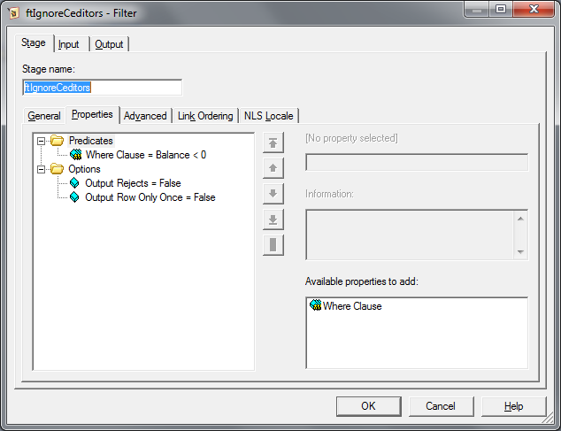
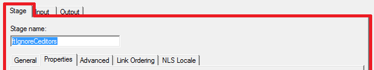
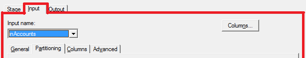
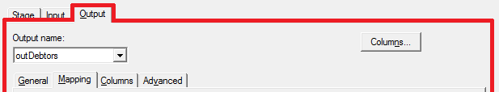
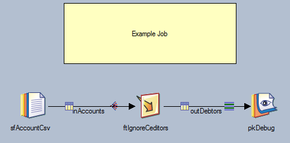
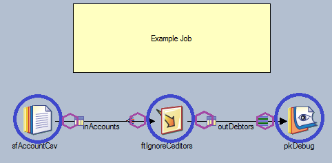
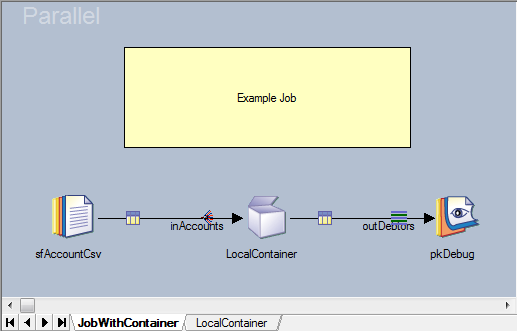
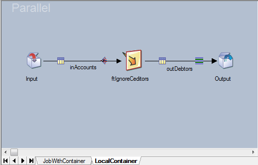
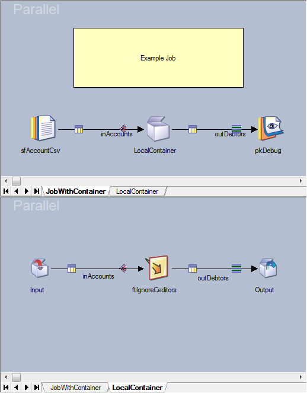

# Compliance Rule Graphs

*   [Introduction](#introduction)
*   [Representing a DataStage Job as a Graph](#representing-a-datastage-job-as-a-graph)
    *   [Stage Page](#stage-page)
    *   [Input Page](#input-page)
    *   [Output Page](#output-page)
    *   [Links](#links)
*   [Representing Jobs with Local Containers](#representing-jobs-with-local-containers)
*   [Gremlin](#gremlin)
*   [On the Nature of Pipes](#on-the-nature-of-pipes)

## Introduction

MettleCI ships with a library of 'Compliance Rules' which are codified tests against which DataStage jobs are evaluated to return a pass or fail result.  These rules are written using MettleCI's DataStage-specific extensions to the [Apache Gremlin](https://tinkerpop.apache.org/gremlin.html) language, a graph traversal language that enables users to succinctly express complex queries involving objects and the relationships between them. Every Gremlin traversal is composed of a sequence of (potentially nested) steps.


A visual representation of a Directed Acyclic Graph.

## Representing a DataStage Job as a Graph

DataStage is a [Flow Based Programming](https://en.wikipedia.org/wiki/Flow-based_programming) environment, meaning DataStage jobs are presented as a [Directed Graph](https://en.wikipedia.org/wiki/Directed_graph).  In this graph each job's numerous stages ([Vertices](https://en.wikipedia.org/wiki/Vertex_(graph_theory))) connected to each other by directional links ([Edges](https://en.wikipedia.org/wiki/Edge_(geometry))) which describe the direction in which data flows through the job.  These flows can only go in one direction, and the graph cannot have any loops or 'cycles', meaning you can't feed a job's output back to an input.  For this reason the type of graph represented by a DataStage job can be referred to as a [Directed Acyclic Graph](https://en.wikipedia.org/wiki/Directed_acyclic_graph), sometimes abbreviated to 'DAG'.

In order to assess whether a DataStage job complies with specific coding rules we will use a language that enables us to pick a starting point on the graph and traverse the stages and links, checking properties as we go.  This is similar to how data traverses your job, as it appears in the DataStage Designer, from input stages via links to subsequent stages until reaching the output stages.

In keeping with DataStage's internal representation of a job, stage properties in the DataStage Designer are stored in one of several places when converted to the graph representation used by compliance.  Reviewing the Stage Editor in the DataStage Designer:



  

### Stage Page



*   The contents of most tabs, including the Properties tab, are stored directly against a **Vertex** of type **Stage** within the graph model.
    
*   The contents of the Advanced tab are stored in an object known in DataStage Basic programming as a **Metabag**. In the graph model, this is represented as a **Vertex**.
    

### Input Page



*   Each link available in the Input page is represented in the graph model as a **Vertex** of type **Pin**.
    
*   The contents of most tabs including the Partitioning and (optionally) the Properties tab, are stored as properties of the **Pin**.
    
*   Column level data is not currently available in the graph model.
    
*   The contents of the Advanced tab are stored in an object known in DataStage Basic programming as a **Metabag**. In the graph model, this is represented as a **Vertex**.
    

### Output Page



*   Each link available in the Output page is represented in the graph model as a **Vertex** of type **Pin**.
    
*   The contents of most tabs including the (optional) Properties tab, are stored as properties of the **Pin**.
    
*   Column level data, including the any column Mappings, are not currently available in the graph model
    
*   The contents of the Advanced tab are stored in an object known in DataStage Basic programming as a **Metabag**. In the graph model, this is represented as a **Vertex**.
    

### Links

*   DataStage Links within the graph model are represented as **Edges** which connect two **Pins.**
    
*   Link Edge have a label of type **Link**. 
    
*   The link's name is available as a property of the Link Edge called linkName
    
*   Configurable Link properties are stored against Pin Vertices, not the Link Edges.
    
*   Links do not have a **Metabag**.
    

  

Putting all this together, lets review a simple DataStage job design and its equivalent graph model (simplified):

**Job Designer**



**Job Designer with Partial Graph overlay**



**Simplified Graph Model**


So to access the Advanced properties of an output Link on a Stage, traverse vertices out from the Stage → Output Pin → Metabag. 

Using the simplified model above, analysing the connection between stages requires traversing the graph from Stage → Output Pin → Input Pin → Stage.  Most compliance rules do not need to inspect Pin properties, so the generated graph model includes an additional Link Edge between each pair of stages. This additional Link Edge is not shown above but is provided to conveniently allow Stage → Stage traversal.  The properties on the Link Edge between Stages are identical to those of the Link Edge between Pins (including linkName).  The annotation is also represented as a **Vertex** of type **Annotation** but has no input or output **Edges**.

The full graph representation of this example without any any simplification is shown below:


Once the job has been represented as a graph in this way, rules can be specified in a language called [Gremlin](https://en.wikipedia.org/wiki/Gremlin_(programming_language)/)'. The Graph representing a DataStage job is read or 'traversed' from Left to Right, so the rules are written with that assumption.  Before one starts to write Compliance Rules, one needs to learn about Gremlin and the concept of Pipes.

## Representing Jobs with Local Containers

All containers, local or shared, are presented in the graph model as a **Vertex** of type **Stage**. Therefore, when represented as a graph, the following top level job design is converted to a graph model similar to the example above:

  




However, the content of all Local Containers are also converted to the graph model where the "Input" and "Output" containers are Represented as a single **Vertex** of type **Container:**

  




All previously discussed graph representation rules apply to local containers, including annotations and Stage → Stage Link Edge.  However, traversal from Container to input or output stages can only be performed using Container → Pin → Pin → Stage as no convenience Link Edge is created between the Container and Stage Vertices.

Finally all local container sub graphs are connected to the local container stage with an Edge between the Stage Vertex and  Container Vertex:




## Gremlin

**Gremlin** is a [graph traversal](https://en.wikipedia.org/wiki/Graph_traversal) language and [virtual machine](https://en.wikipedia.org/wiki/Virtual_machine) developed by Apache TinkerPop of the [Apache Software Foundation](https://en.wikipedia.org/wiki/Apache_Software_Foundation). The command syntax is based on [Groovy](http://groovy-lang.org/documentation.html), a superset of Java. This means that Java code can be written directly inside Groovy.   Gremlin was designed to work with a specific type of graph called a Property Graph. Property graphs are explained, in detail, in this article [Defining a Property Graph](https://github.com/tinkerpop/gremlin/wiki/Defining-a-Property-Graph).   The official [Gremlin wiki](https://github.com/tinkerpop/gremlin/wiki/) on Github contains excellent [Getting Started](https://github.com/tinkerpop/gremlin/wiki/Getting-Started/) article, including useful examples of Gremlin design patterns.

> [!WARNING]
> MettleCI Compliance Rules use TinkerPop version 2.3.0. The current version available is TinkerPop 3.x, so please ensure that external documentation relates to the correct version.

In Gremlin, there is a simple, 6 vertex/6 edge, example graph that is provided with Gremlin and is fully diagrammed in [Defining a Property Graph](https://github.com/tinkerpop/gremlin/wiki/Defining-a-Property-Graph). This graph is referred to so extensively throughout the documentation, that the standard Gremlin libraries contain a factory method to create it for use:  `TinkerGraphFactory.createTinkerGraph()`.  
Query this model to gain a basic understanding of the commands and responses in Gremlin. A full list of commands is also available on [GremlinDocs](http://gremlindocs.spmallette.documentup.com/).

## On the Nature of Pipes

A superb introduction to Gremlin can be found in the article '[On the Nature of Pipes](https://markorodriguez.wordpress.com/2011/08/03/on-the-nature-of-pipes/)' by Marko A. Rodriquez. This provides illustrated examples of how Gremlin code filters data and returns properties by 'piping' it through a series of chained commands.  The example below is also based on the ubiquitous Tinkerpop built-in model graph.

|     |     |
| --- | --- |
|  | <br><br>```<br>g.v(1).out.name<br>==>vadas<br>==>lop<br>==>josh<br>``` |

In this example:

*   **g** is the graph itself
    
*   **v(1)** is vertex number 1
    
*   **out** refers to the array of vertices connected to **v(1)** by outbound edges (where the arrow points away from **v(1)**)
    
*   **name** is the name property of each vertex in the array referred to by **v(1).out**