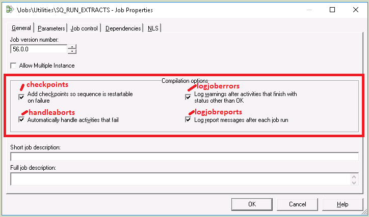

# Example Compliance Rule - Job Sequence is Restartable

When you look at the General tab of a sequence, all **Compilation options** are stored as a comma separated list in a job property called `jobSeqCodeGenOpts`. Each check box corresponds to a named value in the comma separated list:



For example, jobs with **Add checkpoints so sequence is restartable on failure** and **Automatically handle activities that fail** will have a `jobSeqCodeGenOpts` value of `handleaborts,checkpoints`. Putting all this together, a simple compliance rule for ensuring all sequences must have checkpoints enabled would look something like this:

#### **Job Sequence is Restartable.qjb.grm**

```
// In file "Job Sequence Is Restartable.qjb.grm"
if (item.properties.jobSeqCodeGenOpts.contains("checkpoints") == false) {
   compliance.failure("Sequence is not restartable on failure")
   return
}
```