# Creating and Running Multiple Unit Tests for a Single Job

If you are not familiar with how to create and execute a MettleCI Unit Test you should start with [this page](https://datamigrators.atlassian.net/wiki/spaces/MCIDOC/pages/415170592/Unit+Testing+User+Guide).

When you create a Unit Test for a DataStage job MettleCI will create a single Unit Test named after the job. In many cases this will be sufficient, but in some cases where you run the job using multiple Invocation IDs you may wish to define separate tests for each Invocation ID. For example, you may have a job utilising [Runtime Column Propagation](https://www.ibm.com/support/knowledgecenter/en/SSZJPZ_11.7.0/com.ibm.swg.im.iis.ds.parjob.dev.doc/topics/c_deeref_Runtime_Column_Propagation.html) which is run with different metadata under different Invocation ID’s. In this case you may wish to create additional test cases for each Invocation ID. This page describes the steps required to achieve that.

To create additional Unit Test cases for a single job you will need to create a separate Unit Test specification for each Unit Test, with each specification referencing appropriate corresponding data inputs and outputs

> [!INFO]
> Only ‘Multi-instance’ DataStage Jobs can have Multiple Unit Tests defined for them as MettleCI uses the Job Invocation ID to distinguish which test to execute at runtime

## Creating Additional Unit Tests

Open the Unit Test editor for the Job for which you wish to create a new Unit Test. Create a new test specification by clicking the **\[+\]** button next to **SPECIFICATION**.

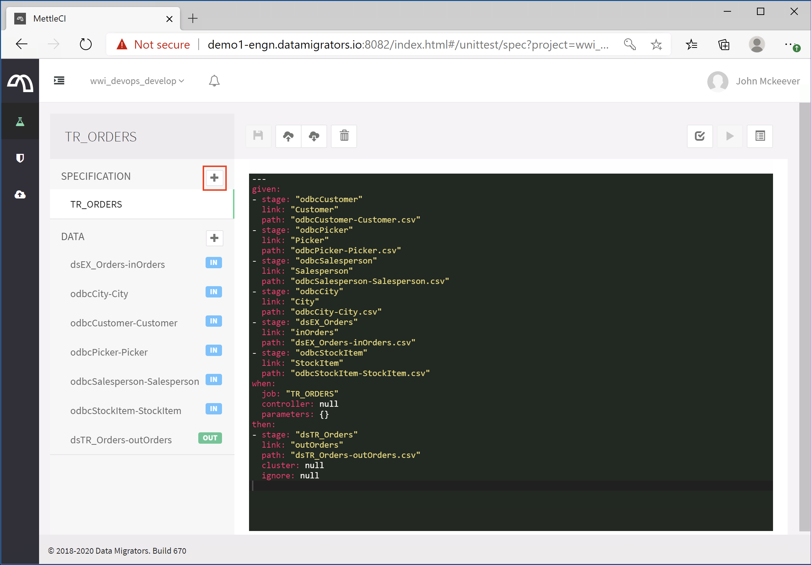

Give your new Unit Test specification a name consisting of letters, numbers, hyphens, and underscores. For this walkthrough we’re using ‘**My\_New\_Test**’.

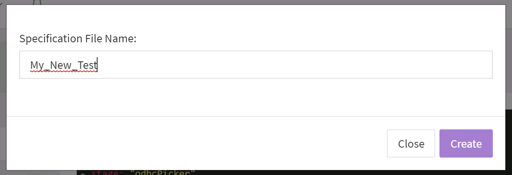

Your Unit Test specification will be created with a template YAML file awaiting completion. Don’t edit the YAML file yet, but click the **Save** icon above it to save the new test.

In order for your new Unit Test to do something different to the existing Unit Test(s) you’ll need to provide some new input test data along with its associated expected output data. To do this, create a new source (input) data file by clicking the **\[+\]** button next to **DATA**.

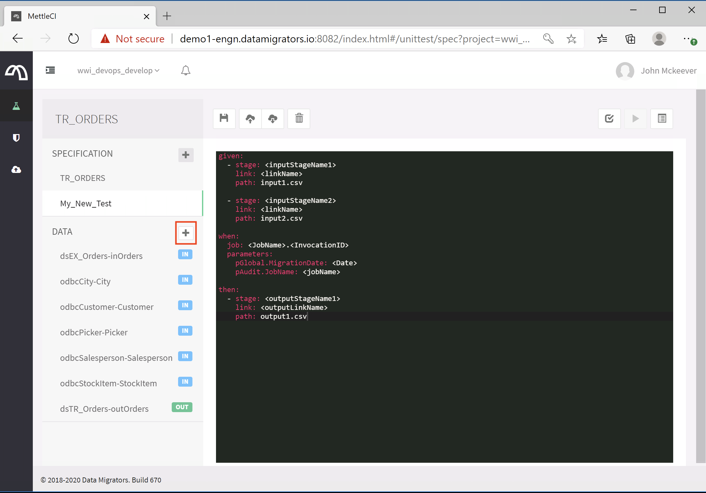

Give your new data file a name consisting of letters, numbers, hyphens, and underscores. A standard we’ve found works well is `{JobName}-{LinkName}_{Description}`, but feel free to use whatever aids your understanding of which link in your job the data file represents.

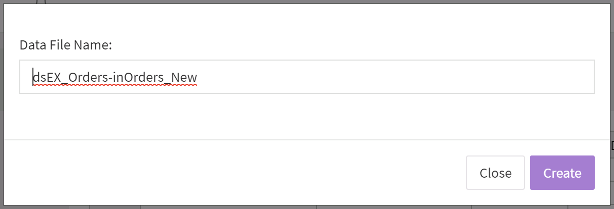

Populate your new datafile with appropriate test data matching the input link for which it is intended. A quick way to do this might be to export and import data from another existing data file representing the same link, or to import the data from a CSV file. Remember to click the ‘Save’ button to store your data file before taking the next step.

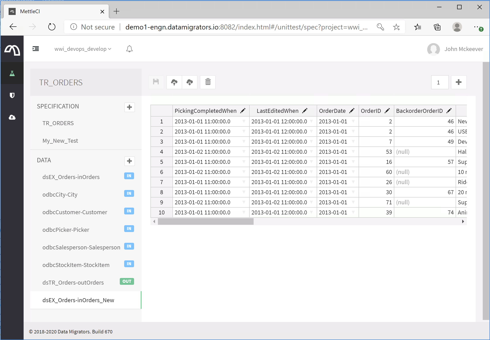

Repeat the previous steps to generate another new data file representing the expected test output for your new test.

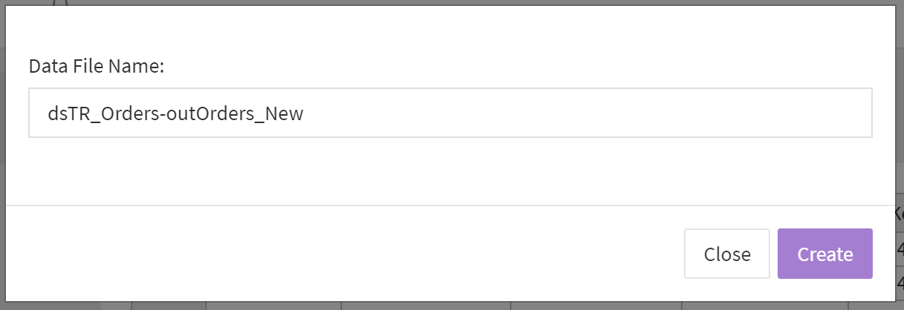

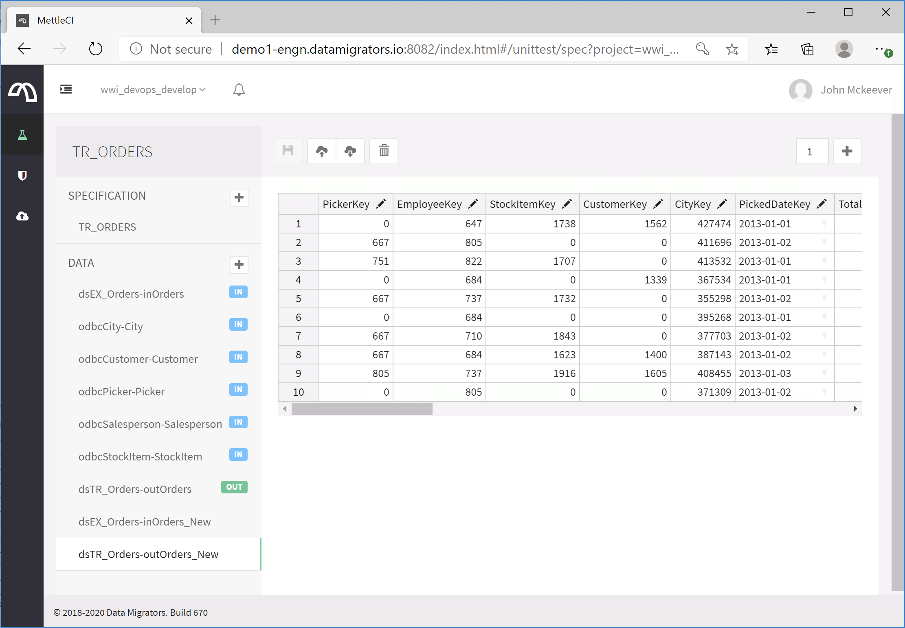

Now that we have two new data files to support a new Unit Test, go back to the YAML Unit Test specification and update it to refer to those new files. Select your new test specification on the left hand side of the Workbench window (‘**My\_New\_Test**’, in this example) and edit it to create a correctly formatted YAML specification. An easy way to do this is to copy and paste the ‘default’ specification (named after the job) which was originally created for you by MettleCI.

Edit the YAML to include references to your new data files against the appropriate links. This is done by modifying the **path** value in the appropriate stages under the **given** and **then** sections, for input and output data files respectively.

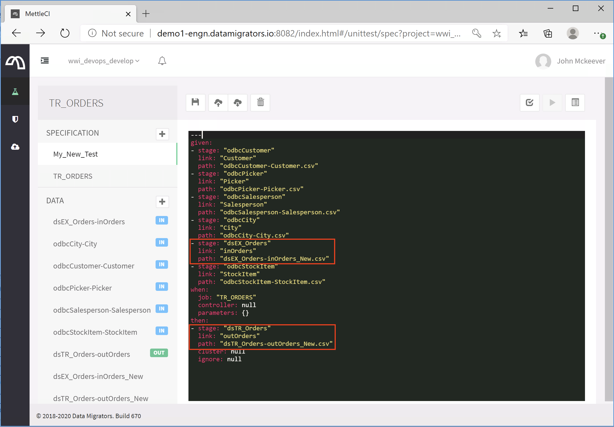

> [!INFO]
> Note that the test data file references you place in the YAML file must include a ‘.csv’ extension after the data file name

Now that we’ve got two Unit Test specifications we need to provide MettleCI with a way of determining which of them should be used for any given execution. To do this we’ll modify the **Job** value under the **When** section. Change this to `{JobName}.{InvocationID}` between the double quotes. In this example we'll use '**test2**' for the Invocation ID. Remember to click the **Save** button to save your Unit Test specification.

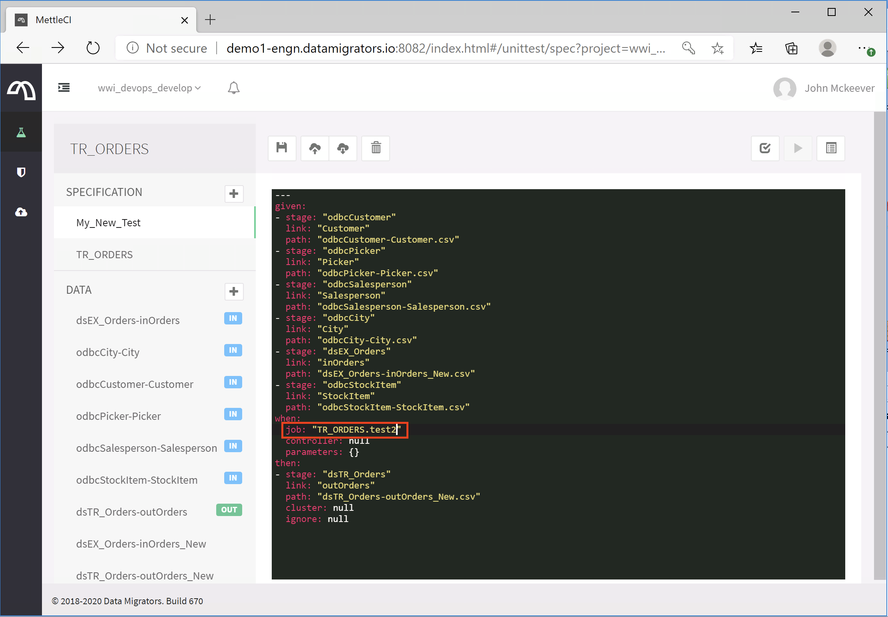

Ensure your DataStage Job is a multi-invocation Job by opening your Job’s properties panel and checking the option on the General tab.

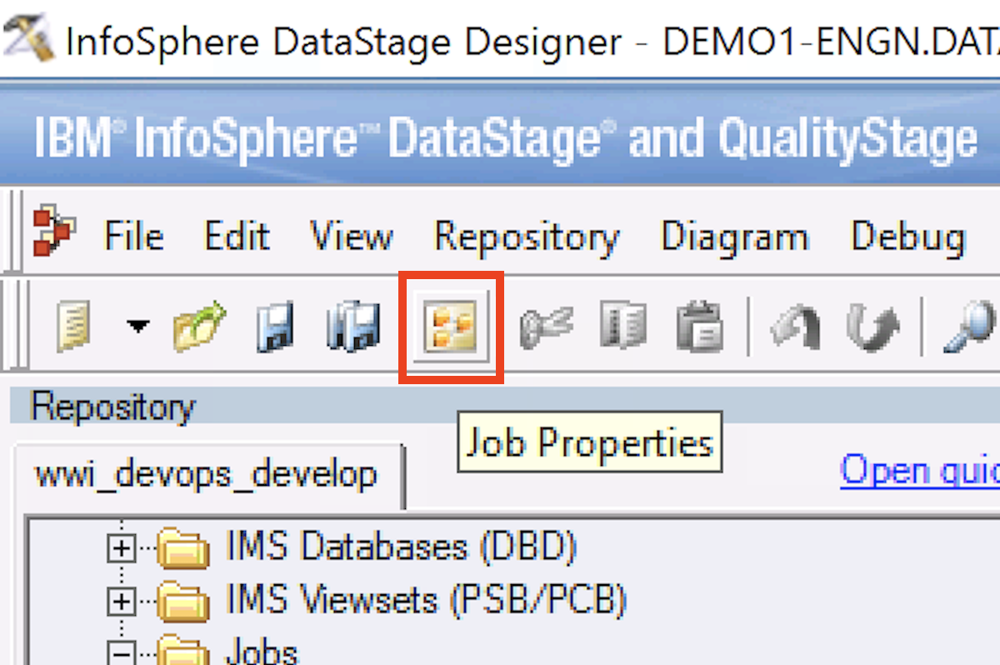

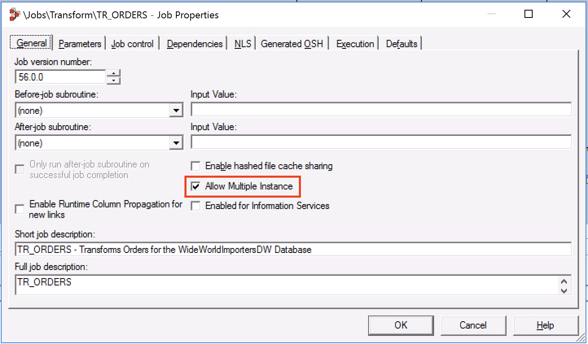

## Running Additional Unit Tests

Now it’s time to run our new test. Use the value you added above as the Job Invocation ID:

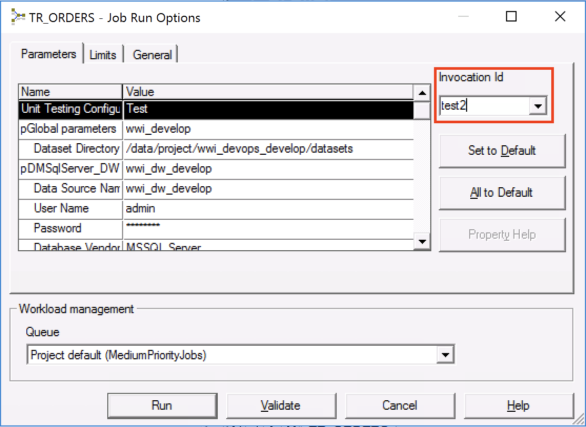

Finally, check the DataStage Job log and you’ll see under the ‘Testing Report’ line a reference to the Unit Test specification which was selected for this run:

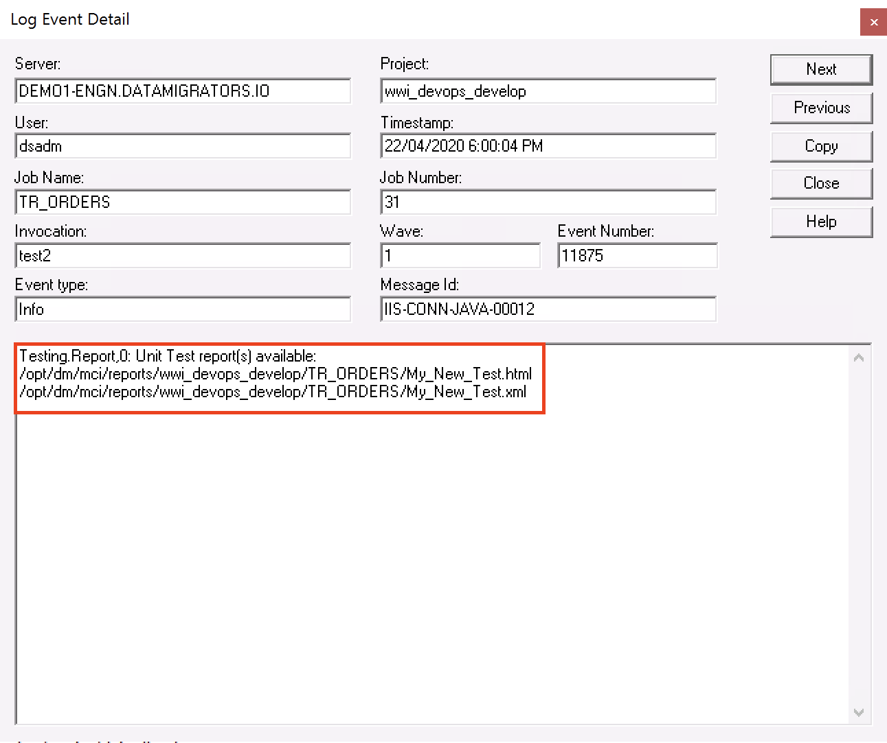

> [!INFO]
> Note that your default Unit Test (specified with a ‘Job’ value of just the Job name, and no dot-delimited Invocation ID) will continue to be execute in those instances where you invoke the Job with no Invocation ID.