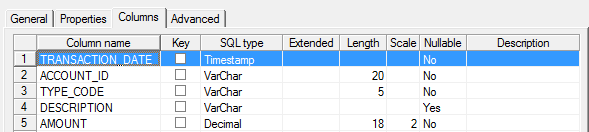

# High Volume Unit Tests

During MettleCI’s automated Unit Test execution, the actual data produced by a job is compared against expected test data to identify and report on any differences. MettleCI utilizes Dynamic Programming algorithms to accurately report differences without needing to understand the underlying properties of the data being compared.

When performing Unit Testing with large volumes of data, the complexity of the comparison algorithm is likely to consume too much memory and cause your job to abort with a fatal error. The best approach to resolving this issue is to reduce your test data volume to the smallest number of records which exercise each code path through your job. Doing so will ensure that your unit tests execute quickly, can easily be understood and maintained.

In the event that unit test data available to you cannot easily be reduced, the memory required by the data processed by MettleCI’s comparison algorithm can be reduced by specifying a **Cluster Key** (based on one or more columns) in the test specification.

# Using Cluster Keys in Unit Tests

Setting a Cluster Key will prompt MettleCI to split the actual data output and expected data into multiple, smaller subsets before the data is compared. Data is split such that each subset will only contain records that have the same values for all columns that make up the Cluster Key. The data are then sorted and a comparison of actual and expected data is performed using multiple, smaller operations which require less memory and are performed sequentially.

> [!INFO]
> **Test result behaviour**: Due to the iterative nature of comparisons using a Cluster Key, each record which has differences in the Cluster Key columns will be reported as 1 added record and 1 removed record rather than shown as a single record with a change indicator.

A good Cluster Key is one that results in data subsets which strike a balance between the following factors:

*   Each subset should fit in memory during comparison. Test execution will abort when memory thresholds are breached.
    
*   Are as large as possible given the memory constraint. Lots of tiny subsets will degrade comparison performance.
    

Selecting an appropriate Cluster Key might require several iterations to find a column (or combination of columns) which not only prevents Job aborts but also keeps run times acceptable. Unless you are comparing unusually wide records, a good starting point is to aim for each subset of data to contain no more than 1,000 records and adjust the Cluster Key if memory thresholds continue to be breached.

> [!INFO]
> If you have used Interception to capture some input and / or expected test data for a Unit Test and subsequently decide you want to apply a Cluster Key, **you don’t have to re-run Interception.** This is also the case if you’ve manually created any test data files. The Cluster Key is used at run time and therefore doesn’t require any additional data preparation by the user.

# Example

Consider the situation where a MettleCI Unit Test has to compare several million financial transaction records with the following schema:



```
given:
...
then:
  - stage: Output
    link: Transactions
    path: Output-Transactions.csv
```

The test specification can be updated with a Cluster Key to enable iterative comparison of actual and expected test data. In this example, `ACCOUNT_ID` and `TYPE_CODE` is specified as the compound Cluster Key:

```
given:
...
then:
  - stage: Output
    link: Transactions
    path: Output-Transactions.csv
    cluster:
      - ACCOUNT_ID
      - TYPE_CODE
```

> [!INFO]
> Cluster Keys are set on a per-link basis, DataStage jobs with multiple output links can use any combination of clustered and non-clustered comparisons within a single Test Specification.

# Caveats

Cluster keys should be chosen to break Actual and Expected data into clusters which are small enough to fit in memory.

Note that if a Unit Test detects a value difference in a column which is a cluster key column, then the Unit Test difference report (which would normally describe the difference as a ‘modified’ row when not using a cluster key) will now describe the difference as distinct ‘added’ and ‘removed’ entries.

As useful as Cluster Keys are, it’s poor practice to simply apply them to every MettleCI Unit Test that has to process high data volumes. You will almost certainly find combinations of Jobs and data volumes in your Project where no Cluster Key will reduce the memory demands of a Unit Test enough to avoid Job aborts (See [Unit Test throws OutOfMemoryError exception](https://datamigrators.atlassian.net/wiki/spaces/MCIDOC/pages/2789933074)). In these situations you can manage your test data volumes by …

*   carefully selecting a subset of records from your data sources,
    
*   using the MettleCI Workbench’s built-in data fabrication feature, or
    
*   both of these approaches in combination.
    

While it is fair to say every DataStage developer will, at some point, face the challenge of having to run MettleCI Unit Tests where the only data sources available are full volume, a growing need to use Cluster Keys ought to prompt a realistic discussion about the sustainability of your organisation’s test data management practices. Data Migrators are always happy to help MettleCI customers consider options and solutions for effective and repeatable test data sub-setting and masking.