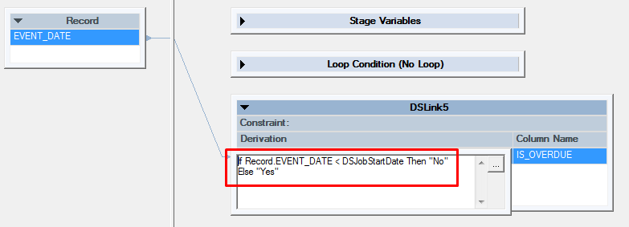
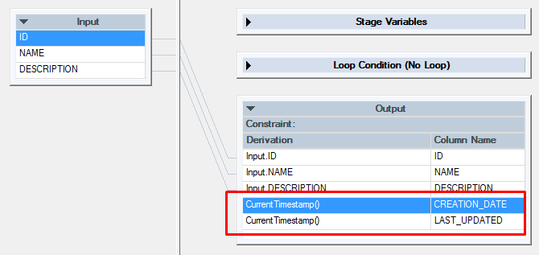

# Unit Testing Jobs with current date calculations

Repeatable Unit Tests require that the job under test produce deterministic data based on a set of predefined inputs and parameters. Calculations based on the current date are common in DataStage jobs but will cause the output produced by jobs to change depending on the date the job executed. This page outlines practices aimed at ensuring jobs using current date calculations are able to be validly tested.

# Transformer Stages using CurrentDate(), CurrentTime() or CurrentTimestamp() functions

Unless your date calculation requires an exact date/time a record was being processed, the standard `CurrentDate()`, `CurrentTime()` and `CurrentTimestamp()` functions can be substituted with the `DSJobStartDate`, `DSJobStartTime` and `DSJobStartTimestamp` macros. This enables you to set them to a specific value during testing. Add `DSJobStartDate`, `DSJobStartTime` and/or `DSJobStartTimestamp` to the **parameters** clause of the Unit Test Specification and set the appropriate date and time values used during Unit Testing.

**Example**



```
...
when:
  parameters:
    DSJobStartDate: 2012-01-15
    DSJobStartTime: 11:05:01

```

> [!WARNING]
> Be careful when setting `DSJobStartTimestamp` in conjunction with either `DSJobStartDate` or `DSJobStartTime`, the MettleCI Unit Testing feature does not enforce that these parameters are logically consistent.

# Ignoring columns which are known to be non-deterministic

Rather than ensuring that a job under test produces deterministic data, you may decide to exclude one or more output columns from Unit Test comparisons. This can be done by adding the columns to be ignored to the **then** clause of the Unit Test Specification.

**Example**



```
given:
...
when:
...
then:
  - stage: Transform
    link: Output
    path: Transform-Output.csv
    ignore: 
      - CREATION_DATE
      - LAST_UPDATED
```

> [!CAUTION]
> **Danger**: Ignoring columns will …
> *   prevent columns containing non-deterministic from affecting test results, but also means…
>     
> *   those columns are omitted from test comparisons, so unexpected output in those columns, or changes in the output of those columns will not be detected.