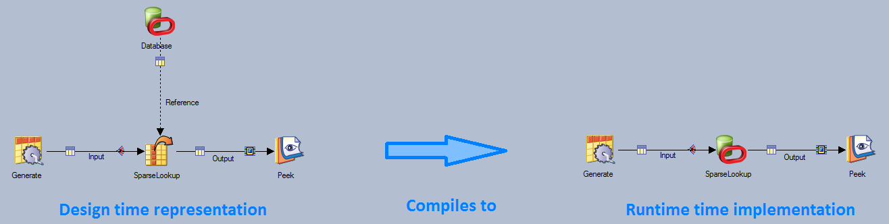
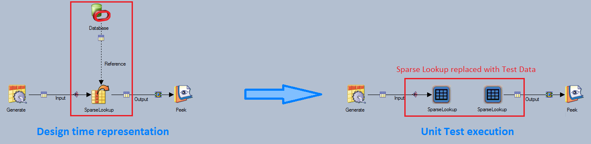
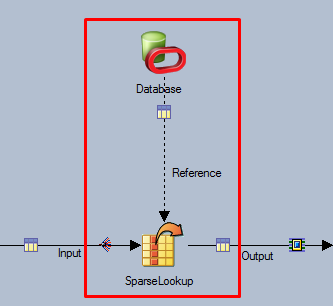
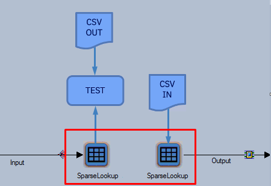
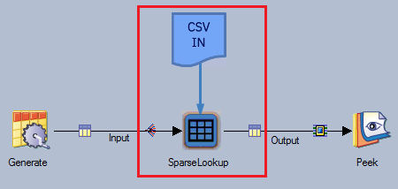
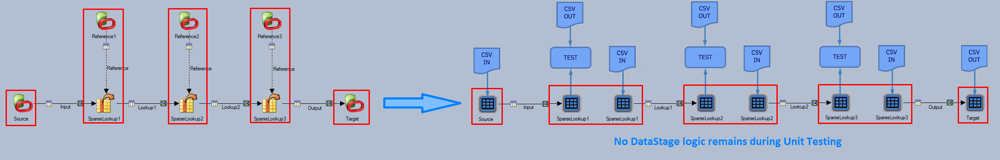
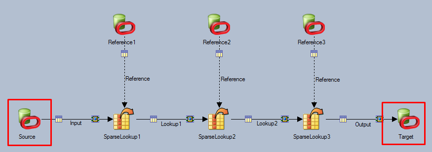
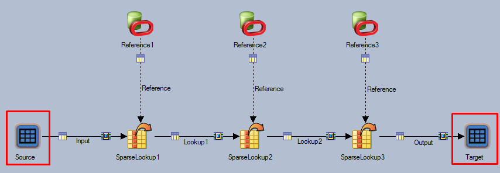

# Unit Testing Sparse Lookup Stages

> [!INFO]
> Note that this page is specific to [**SPARSE**](https://www.ibm.com/docs/en/iis/11.7?topic=stages-database-sparse-lookup-vs-join) Lookups. Regular Lookup stages do not need any special considerations for MettleCI Unit Testing.

# Sparse Lookup Stage ('Explicit' test method)

When building DataStage jobs using the Lookup stage, performing a Sparse or Normal lookup is as simple as changing the lookup type of the reference Database stage. When a DataStage job featuring a sparse Lookup is compiled to OSH and executed, however, the Lookup stage is not used to perform the sparse lookup. Instead, DataStage replaces the Lookup stage with the Database operator which is responsible for reading input rows, looking up values from the database and producing output records. It is for this reason that all Database log messages in the DataStage Director are attributed to the Lookup stage and why the Database stage never appears in the Monitor of the DataStage Director.



To Unit Test job designs using Sparse Lookup stages the sparse lookup functionality needs to be explicitly replaced with user-supplied Unit Test data:



The most explicit way to configure Unit Testing to replace a Sparse Lookup with Test data is by adding the input link to the `then` (expected outputs) clause of the Unit Test Spec and the output link to the `given` (supplied inputs) clause of the Job’s Unit Test Specification.

*   The CSV file specified in the `then` clause contains the data that will be be compared to the data flow of records *arriving at the input of the Sparse Lookup stage*. The data should describe what records are expected to be used to provide the sparse lookup’s key columns.
    
*   The CSV file specified in the `given` clause contains the data that will be become the data flow of records *from the output of the Sparse Lookup stage*. The data should simulate what would be produced by the real Sparse Lookup Stage if it had actually processed the Unit Test input records against the real database reference source, however they don't *have* to.
    



```
given:
  - stage: SparseLookup
    link: Output
    path: SparseLookup-Output.csv
when:
...
then:
  - stage: SparseLookup
    link: Input
    path: SparseLookup-Input.csv
```



# Sparse Lookup Stage ('Replace' method)

**MettleCI Unit Test Harness version** `1.1-379` **and later** provides a convenient alternative capability which uses the new Unit Test Specification `spareseLookup` and associated `key` clauses to replace the entire Sparse Lookup stage with Test Data while only requiring the user to supply Test Data for the reference link:


```
given:
  - sparseLookup: SparseLookup
    path: Database-Reference.csv
    key:
      - KEY_COLUMN_1
      - KEY_COLUMN_2
...
```



In this mode the Sparse Lookup stage is *replaced entirely* with a Unit Test version of the sparse lookup which uses the specified Test Data as the lookup data. It is provided as a convenient alternative to explicitly replacing Sparse Lookup stage input and output links, allowing the remaining logic in the job to be tested while not actually testing the behaviour of DataStage’s Sparse Lookup stage.

When generating Unit Tests from Job designs containing Sparse Lookups, **MettleCI Workbench version** `1.0-1483` **and later** will automatically apply this Unit Test pattern and generate test specifications which replace Sparse Lookup stages entirely.

> [!WARNING]
> **Known Limitations**
> Replacing the Sparse Lookup stage with a Unit Test version of the sparse lookup comes with some limitations that DataStage developers should keep in mind.
> *   Unit Test Sparse Lookup stages *simulate* typical key matching and assumes data equality with [three-valued-logic](https://en.wikipedia.org/wiki/Three-valued_logic) semantics. Custom key-matching logic embedded in custom lookup SQL (eg. SQL with a where clause like `where KEY_COLUMN=Upper(ORCHESTRATE.KEY_COLUMN)`) will not be replicated.
>     
> *   When running [Unit Testing in Interception mode](https://datamigrators.atlassian.net/wiki/spaces/MCIDOC/pages/437518414/Intercepting+Existing+Test+Data), one additional Sort operation per Unit Test Sparse Lookup stage is required. For sparse lookup stages which produce large volumes of output data this can have an adverse affect on job execution times when running in Interception mode.
>     
> *   Reference data records that contain Nulls or Default Values for **all columns** are ignored during interception when the Sparse Lookup stage is set to `Continue` on Lookup Failure. This will have no functional impact on the output of the Sparse Lookup Stage and is expected behaviour.
> Where you consider these limitations unacceptable you can revert to the original (explicit) method for replacing Sparse Lookups.

# A pragmatic approach for Multiple Sparse Lookups

For jobs where the vast majority of job logic is implemented using Sparse Lookup stages, replacing all lookups with Unit Test data would result in little-to-no DataStage logic being tested (as illustrated below).



For the type of Job design show above, a traditional explicit testing approach would necessitate the developer providing 8 sets of test data! An alternative testing approach is to leave the Sparse Lookups in place and replace only the input and output stages with Unit Test data. **A live Database connection will be required during testing** but the `when` clause can be used to set job parameters that dictate database connection settings.

> [!WARNING]
> **Technically this is an Integration Test, not a Unit Test:** The Unit Test Harness does not provide any functionality for populating database reference tables with Unit Test data prior to test execution, users are responsible for managing Integration Test setup and tear down through governance and/or CI/CD pipeline customisation.



```
given:
  - stage: Source
    link: Input
    path: Source-Output.csv
when:
  parameters:
    DbName: MyUnitTestDb
    DbUser: MyUnitTestUser
    DbPass: {iisenc}dKANDae233DJIQeiidm==
then:
  - stage: Target
    link: Output
    path: Target-Output.csv
```

