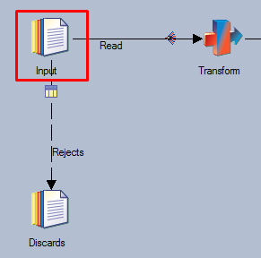
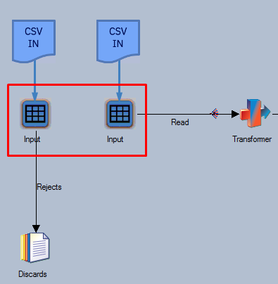
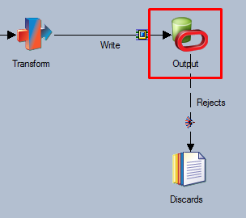
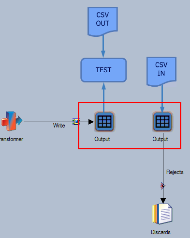

# Unit Testing Stages with Rejects

Most DataStage jobs can be tested via MettleCI’s Unit Testing function simply by replacing input and output stages. However, some job designs - while commonplace - will necessitate a more advanced Unit Testing configuration. The sections below outline MettleCI Unit Test Spec patterns that best match these job designs.

# Input stage with rejects

The Input stage can be Unit Tested by including both read and reject links in the **given** clause of the Unit Test Spec.

The CSV data specified for the rejects link should contain records that will actually test the flow of records through the reject path(s) of the job.

> [!INFO]
> If you use MettleCI’s automated Unit Test creation function for a Job that needs this Unit Testing pattern, MettleCI will ensure the resulting Spec in that new Unit Test reflects the above approach.

### Your Job



### Your Test Spec

```
given:
  - stage: Input
    link: Read
    path: Input-Read.csv
  - stage: Input
    link: Rejects
    path: Input-Rejects.csv
when:
...
```

### What’s Generated



# Output stage with rejects

The output stage can be Unit Tested by including

*   the write link in the **then** clause of the Unit Test Spec; and
    
*   the reject in the **given** clause of the Unit Test Spec.
    

The CSV data specified for the rejects link should contain records that will actually test the flow of records through the reject path(s) of the job.

> [!INFO]
> If you use MettleCI’s automated Unit Test creation function for a Job that needs this Unit Testing pattern, MettleCI will ensure the resulting Spec in that new Unit Test reflects the above approach.

### Your Job



### Your Test Spec

```
given:
  - stage: Output
    link: Rejects
    path: Output-Rejects.csv
when:
...
then:
  - stage: Output
    link: Write
    path: Output-Write.csv
```

### What’s Generated

