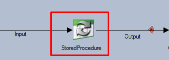
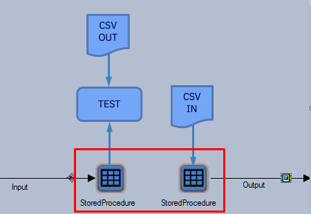

# Unit Testing Stored Procedure Stages

> [!TIP]
> Since the release of **MettleCI Workbench v707** this process is handled automatically by the Unit Test creation process. This page is left here as a reference to explain the structure of the YAML test specification generated for jobs including these stages.

# Stored Procedure Stage

A Stored Procedure Stage will not only connect to an external Database for processing but it will also produce output records which are not deterministic. MettleCI’s Unit Test function needs to be made aware of the Stored Procedure Stage to be replaced by unit test data during unit test execution. This is done by adding the input link to the **then** clause of the Unit Test Spec and the output link in the **given** clause of the Unit Test Spec.

The CSV input specified by the **given** clause contains the data that will become the flow of records from the Stored Procedure stage. The data could simulate what would be produced by the real stored procedure if it had processed the Unit Test input records, however they don’t have to.



```
given:
  - stage: StoredProcedure
    link: Output
    path: StoredProcedure-Output.csv
when:
...
then:
  - stage: StoredProcedure
    link: Input
    path: StoredProcedure-Input.csv
```

