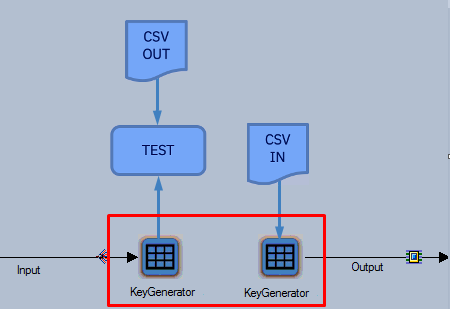

# Unit Testing Surrogate Key Generator Stages

# Classic Surrogate Key Generator stage

The classic Surrogate Key Generator stage will generate sequential keys from a given start value (typically set via a Job Parameter). To ensure that values generated by the Surrogate Key Generator stage remain the same between each execution of Unit Testing, add a fixed value for the start value Job Parameter in the **when** clause of the Unit Test Spec.


```
given:
...
when:
  job: KeyGeneratorExample
  parameters:
     START_KEY: 100
then:
...
```

# Database or Flat File-backed Surrogate Key Generator stage

Surrogate Key Generators backed by a Database or a Flat File will produce output records which are not deterministic. The use of a Database-backed Surrogate Key Generator will also require a live connection to an external Database which is not ideal for Unit Testing. To Unit Test job designs containing this type of Surrogate Key Generator, the Surrogate Key Generator stage needs to be removed from the job and replaced with Unit Test Data. This is done by adding the input link in the **then** clause of the Unit Test Spec and the output link in the **given** clause of the Unit Test Spec.

The CSV input specified by the **given** clause contains the data that will become the flow of records from the Surrogate Key Generator stage. The data could simulate what would be produced by the real Surrogate Key Generator if it had processed the Unit Test input records, however it doesn’t have to. The easiest way to simulate the Surrogate Key Generator output records using MettleCI Workbench would be to copy the CSV specified in the **then** clause, add a new column to represent the generated key and set appropriate key values.


```
given:
  - stage: KeyGenerator
    link: Output
    path: KeyGenerator-Output.csv
when:
...
then:
  - stage: KeyGenerator
    link: Input
    path: KeyGenerator-Input.csv
```

