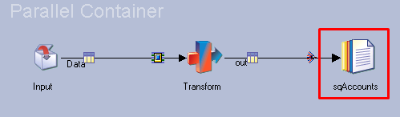

# Unit Tests featuring Local and Shared Containers

The structure of a MettleCI Unit Test Specification (“Spec”) is modelled loosely on the [Gherkin syntax](https://cucumber.io/docs/gherkin/reference/) of a testing tool called [Cucumber](https://cucumber.io/). It associates Unit Test data, which are stored in CSV files identified by the `path` property, with each of your Job’s input and output links, which are identified by the `stage` and `link` properties of your Spec. The `Given` clause defines the Unit Test data for your Job’s input links and the `Then` clause for the output links.

# Example

Here's a simple example:

|     |     |
| --- | --- |
| **Job design**<br><br> | **Unit test Specification**<br><br>```<br>given:<br>  - stage: sqInput<br>    link: in<br>    path: given.csv<br>...<br>then:<br>  - stage: sqOutput<br>    link: out<br>    path: expected.csv<br>``` |
| **Logical view**<br><br> |     |

Local and Shared Containers complicate this as Stage names in DataStage are only unique within a given Job or Local/Shared Container.

Consider writing a Unit Test Spec for the following Job `MyJob` which includes a Shared Container stage `ContainerC1` which is a reference to the Shared Container `scWriteAccounts`:

|     |     |
| --- | --- |
| **Job** `MyJob`<br><br> | **Unit Test Specification**<br><br>```<br>given:<br>  - stage: sqAccounts<br>    link: inAccounts<br>    path: GivenAccounts.csv<br>when:<br>...<br>then:<br>  - stage: sqAccounts<br>    link: out<br>    path: ExpectedAccounts.csv<br>``` |
| **Shared Container** `scWriteAccounts`<br><br> |

The resulting Unit Test Spec is ambiguous because the MettleCI Unit Test Harness will not be able to uniquely identify which Unit Test Data file is associated with each `sqAccounts` stage. To avoid these sort of issues, the **stage** properties within Unit Test Specs expect *fully qualified stage names*. A fully qualified stage name is prefixed with any relevant parent Container names using the format `<container name>.<stage name>`.

Here’s an example of a fully qualified stage name:

|     |     |
| --- | --- |
| **Job** `MyJob`<br><br> | **Unit Test Specification**<br><br>```<br>given:<br>  - stage: sqAccounts<br>    link: inAccounts<br>    path: GivenAccounts.csv<br>when:<br>...<br>then:<br>  - stage: ContainerC1.sqAccounts<br>    link: out<br>    path: ExpectedAccounts.csv<br>``` |
| **Shared Container** `scWriteAccounts`<br><br> |

Since the output `sqAccounts` stage is within `ContainerC1` its full qualified stage name is `ContainerC1.sqAccounts` (line 8) and the Unit Test Spec is no longer ambiguous. When working with Shared Containers the `<container name>` within a fully qualified stage name refers to the stage name in the parent Job (`ContainerC1`) rather than the Shared Container itself (`scWriteAccounts`).

# Share Containers


When automatically generating a Unit Test Spec MettleCI will correctly generate the references to input and output stages within Local Containers, including where input or output stages are defined within those Local Containers.

Automatically-generated Unit Test Specs for Jobs which feature one or more Shared Containers will also be modelled correctly **with the exception that they will omit any inputs or output stages defined within any constituent Shared Containers**. Unfortunately the design time Job information available from DataStage does not provide enough information for MettleCI to adequately identify and complete the generation of Unit Test Specs where a Share Container includes a stage which needs to be referenced by the Spec.

Once a MettleCI Unit Test Spec is adequately configured (with correct Shared Container references, if required) then the MettleCI Unit Test Harness can correctly handle input and output stages within Local and Shared Containers.

# Summary

When Unit Testing stages within Local and/or Shared Containers, developers should be aware of the following requirements and constraints:

*   When working with Local Containers the `<container name>` is the name of the Stage on the parent canvas.
    
*   When working with Shared Containers, the `<container name>` is also the name of the Stage on the parent canvas rather than the name of the Shared Container itself.
    
*   Stages inside multi-level nested containers can be defined using `<container name>.<container name>.<container name>.<stage name>` where the left-most container name is the top level container, the next container name is the second level and so on.
    
*   `Input` and `Output` container stages do not exist at runtime and can’t be referenced in a MettleCI Unit Test Spec. They can simply be ignored.
    
*   The Unit Test Spec and Unit Test Harness make no distinction between Shared and Local Containers. Therefore the use of Local and Shared Containers can be used interchangeably or even mixed within a single Job.