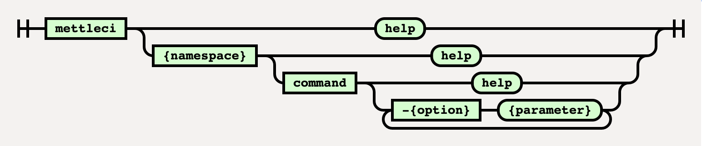

# MettleCI CLI Operating Modes

*   [Console Mode](#console-mode)
*   [Command mode](#command-mode)
*   [Use a password containing special characters](#use-a-password-containing-special-characters)
*   [Using external command files with the MettleCI Command Line](#using-external-command-files-with-the-mettleci-command-line)
    *   [Related Pages](#related-pages)

The MettleCI Command Line Interface is available from either your Windows command line or Unix shell.  It provides one way of accessing MettleCI's build and deployment functions, and supports two different modes of operation: **console** or **command line**. MettleCI commands accept various parameters which can optionally be sourced from a command file.

# Console Mode

To enter console mode start the MettleCI Command Line Interface by entering `mettleci` UNIX or `mettleci.cmd` WINDOWS.

```
C:\> mettleci.cmd
MettleCI Command Line
(C)2019 Data Migrators Pty Ltd
Enter [namespace] [command] {options}
or 'help', 'exit', or 'quit'.
mettleci>
```

In console mode, MettleCI prints a command prompt and waits for a command. Each command is processed without exiting MettleCI. You may need to provide authentication options for a commands which invoke functionality in third party systems. You can enter help to get assistance, or exit the console mode by entering `exit`, or `quit` at the prompt.

# Command mode

In command mode you can enter commands one at a time at your operating system's command line. Start each command (omitting the quotes) with `mettleci` UNIX or `mettleci.cmd` WINDOWS followed by a namespace and command, then the parameters.



Some of the available commands (listed below) use IBM DataStage client components, and so are platform specific.  For example, job compilation requires access to Windows-only components, and so will not be supported on Unix environments. The MettleCI command is followed by a namespace, which groups a collection of build and deployment operations.  Each of these commands accepts a number of mandatory and/or optional parameters.   

```
mettleci [namespace] [command] {commandoptions}
```

Here's an example of the MettleCI Command Line being used to compile an entire DataStage project (using the ['compile' command provided by the 'datastage' namespace](../mettleci-command-line-interface/mettleci-command-line-reference/datastage-namespace/datastage-compile-command.md)) :

```
# Npte that the example below uses the line continuation charactere ('\' on Unix or '^' on Windows)
# to aid readability, but your mettleci command line can all be on a single line if you prefer 

$> mettleci datastage compile \
   -domain test1-svcs.datamigrators.io:59445 \
   -server test1-engn.datamigrators.io -project dstage1 \
   -username isadmin -password isadminpwd
Analyzing assets to compile
Compilation folder location = C:\Apps\command-shell\log\compiliation
Attempting to compile with 4 working threads.
Compiling DataStage jobs...
 * Compile 'test2-engn.datamigrators.io/dstage1/Jobs/Load/EX_Account.pjb' - COMPLETED
 [SNIP]
 * Compile 'test2-engn.datamigrators.io/dstage1/Jobs/Load/TX_StockHolding.pjb' - COMPLETED
Compilation complete
$> 
```

> [!INFO]
> Note that MettleCI Command Line namespaces, commands, and options are all case sensitive.

# Use a password containing special characters

If the password contains special characters, you will need to wrap it with single or double quote or by using escape characters.

| **Password contains** | **Windows-based** | **Unix-based** |
| --- | --- | --- |
| ! (exclamation) | Use password without modification. For example: `MyPassword!` | Wrap password with single quote. For example: `'MyPassword!'` |
| “ (double quote) | Use escape character `\`. For example: `My\”Password` | Wrap password with single quote. For example: `'My"Password'` |
| ' (single quote) | Wrap password with double quote. For example: `“My'Password”` | Wrap password with single quote and use escape character `\`. For example: `'My'\''Password'` |
| \* (asterisk) | Use password without modification. For example: `My*Password` | Wrap password with single quote. For example: `'My*Password'` |
| <space> | Wrap password with double quote. For example: `“My Password”` | Wrap password with single quote. For example: `'My Password'` |

# Using external command files with the MettleCI Command Line

MettleCI allows you to define a MettleCI command in a text-based ‘command file’ and pass the file as parameter to the MettleCI command. This is accomplished using the '@' command syntax:

```
# Here's a typical command file
$> cat file mycommand.txt
datastage
compile
-domain
test1-svcs.datamigrators.io:59445
-username
isadmin
-password
isadminpwd
-server
test1-engn.datamigrators.io
-project
dstage1

# ... and here's how to invoke it
$> mettleci @mycommand.txt
```

**Note:**

*   Each element of a command file needs to be on an individual line (i.e. separated by your operating system’s newline ASCII character combination)
    
*   A command file can only contain the definition of a single MettleCI command
    
*   You can run the MettleCI Command Line with multiple commands by invoking it with individual command files from a shell script with one command per line. E.g.
    

```
#!/usr/bin/env bash
mettleci @mycommand1.txt
mettleci @mycommand2.txt
mettleci @mycommand3.txt
# etc.
```

* * *

## Related Pages

*   [MettleCI CLI Plugin Reference](../mettleci-command-line-interface/mettleci-command-line-reference.md)
    
*   [Installing the MettleCI Command Line Interface](https://datamigrators.atlassian.net/wiki/spaces/MCIDOC/pages/488898631/Installing%2BMettleCI%2BCommand%2BLine%2BInterface)