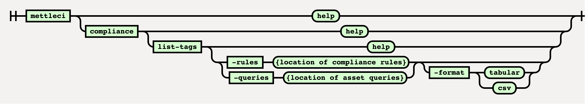

# Compliance List-Tags Command

# Purpose

This command analyses a specified set of Compliance Rules or Asset Queries and reports the tags defined for each. Output is available in an easy-to-read tabulated for, or as a CSV for downstream processing. When no format optin

# Syntax



(function(){ var data = { "addon\_key":"render-Markdown", "uniqueKey":"render-Markdown\_\_markdown4087016687957431114", "key":"markdown", "moduleType":"dynamicContentMacros", "moduleLocation":"content", "cp":"/wiki", "general":"", "w":"", "h":"", "url":"https://d27i9fmzbobp10.cloudfront.net/render-markdown.html?pageId=2504654859&pageVersion=32&macroHash=4a601e4a-2631-4fb4-9d68-ae8003d23e36&macroId=4a601e4a-2631-4fb4-9d68-ae8003d23e36&outputType=email&highlightStyle=&highlight=&xdm\_e=https%3A%2F%2Fdatamigrators.atlassian.net&xdm\_c=channel-render-Markdown\_\_markdown4087016687957431114&cp=%2Fwiki&xdm\_deprecated\_addon\_key\_do\_not\_use=render-Markdown&lic=none&cv=1000.0.0-f660f55a6ec0", "structuredContext": "{\\"confluence\\":{\\"editor\\":{\\"version\\":\\"\\\\\\"v2\\\\\\"\\"},\\"macro\\":{\\"outputType\\":\\"email\\",\\"hash\\":\\"4a601e4a-2631-4fb4-9d68-ae8003d23e36\\",\\"id\\":\\"4a601e4a-2631-4fb4-9d68-ae8003d23e36\\"},\\"content\\":{\\"type\\":\\"page\\",\\"version\\":\\"32\\",\\"id\\":\\"2504654859\\"},\\"space\\":{\\"key\\":\\"MCIDOC\\",\\"id\\":\\"264011780\\"}},\\"url\\":{\\"displayUrl\\":\\"https://datamigrators.atlassian.net/wiki\\"}}", "contentClassifier":"content", "productCtx":"{\\"page.id\\":\\"2504654859\\",\\"macro.hash\\":\\"4a601e4a-2631-4fb4-9d68-ae8003d23e36\\",\\"space.key\\":\\"MCIDOC\\",\\"page.type\\":\\"page\\",\\"content.version\\":\\"32\\",\\"page.title\\":\\"compliance list-tags command syntax\\",\\"macro.localId\\":\\"\\",\\"macro.body\\":\\"### Syntax : compliance list-tags \[options\]\\\\n### Description\\\\n\\\\n\* \*\*-rules\*\*\\\\n\\\\n location of all the rule files\\\\n\\\\n \\\\n\* \*\*-queries\*\*\\\\n\\\\n\\",\\": = | RAW | = :\\":null,\\"space.id\\":\\"264011780\\",\\"macro.truncated\\":\\"true\\",\\"content.type\\":\\"page\\",\\"output.type\\":\\"email\\",\\"page.version\\":\\"32\\",\\"macro.fragmentLocalId\\":\\"\\",\\"content.id\\":\\"2504654859\\",\\"macro.id\\":\\"4a601e4a-2631-4fb4-9d68-ae8003d23e36\\",\\"editor.version\\":\\"\\\\\\"v2\\\\\\"\\"}", "timeZone":"UTC", "origin":"https://d27i9fmzbobp10.cloudfront.net", "hostOrigin":"https://datamigrators.atlassian.net", "sandbox":"allow-downloads allow-forms allow-modals allow-popups allow-popups-to-escape-sandbox allow-scripts allow-same-origin allow-top-navigation-by-user-activation allow-storage-access-by-user-activation", "apiMigrations": { "gdpr": true } } ; if(window.AP && window.AP.subCreate) { window.\_AP.appendConnectAddon(data); } else { require(\['ac/create'\], function(create){ create.appendConnectAddon(data); }); } // For Confluence App Analytics. This code works in conjunction with CFE's ConnectSupport.js. // Here, we add a listener to the initial HTML page that stores events if the ConnectSupport component // has not mounted yet. In CFE, we process the missed event data and disable this initial listener. const \_\_MAX\_EVENT\_ARRAY\_SIZE\_\_ = 20; const connectAppAnalytics = "ecosystem.confluence.connect.analytics"; window.connectHost && window.connectHost.onIframeEstablished((eventData) => { if (!window.\_\_CONFLUENCE\_CONNECT\_SUPPORT\_LOADED\_\_) { let events = JSON.parse(window.localStorage.getItem(connectAppAnalytics)) || \[\]; if (events.length >= \_\_MAX\_EVENT\_ARRAY\_SIZE\_\_) { events.shift(); } events.push(eventData); window.localStorage.setItem(connectAppAnalytics, JSON.stringify(events)); } }); }());

# Example

This example shows how to list the tags of a directory of Compliance Rules in both tabulated and CSV formats:

```
# ####################################
# list-tags output in tabulated format
# ####################################
$> mettleci compliance list-tags -rules ~/Projects/bitbucket.org/compliance-rules -format table
MettleCI Command Line (build 174)
(C) 2018-2022 Data Migrators Pty Ltd
compliance list-tags (v2.2.x)
rules configuration discovered
included rule - 'Adjacent Transformers' (PARALLEL_JOB)
included rule - 'Adjacent Transformers' (SERVER_JOB)
... <SNIP> ...
included rule - 'Transformer With Unreferenced Stage Variable' (SERVER_JOB)
included rule - 'Unique Sort' (PARALLEL_JOB)
                                       Rule Name  Asset Type                 example  fail-ci  fail-upgrade  functionality  governance  maintainability  performance  portability  security  testability
================================================  =========================  =======  =======  ============  =============  ==========  ===============  ===========  ===========  ========  ===========
                           Adjacent Transformers  PARALLEL_JOB               -------  -------  ------------  -------------  ----------  maintainability  -----------  -----------  --------  -----------
                           Adjacent Transformers  SERVER_JOB                 -------  -------  ------------  -------------  ----------  maintainability  -----------  -----------  --------  -----------
                                Audit Annotation  PARALLEL_JOB               example  -------  ------------  -------------  ----------  maintainability  -----------  -----------  security  -----------
                                Audit Annotation  SEQUENCE_JOB               example  -------  ------------  -------------  ----------  maintainability  -----------  -----------  security  -----------
                                Audit Annotation  SERVER_JOB                 example  -------  ------------  -------------  ----------  maintainability  -----------  -----------  security  -----------
                                          <SNIP>  <SNIP>                     ...      ...      ...           ...            ...         ...              ...          ...          ...       ...
               Transformer Uses Abort After Rows  PARALLEL_JOB               -------  -------  ------------  functionality  ----------  ---------------  -----------  -----------  --------  -----------
               Transformer Uses Abort After Rows  PARALLEL_SHARED_CONTAINER  -------  -------  ------------  functionality  ----------  ---------------  -----------  -----------  --------  -----------
    Transformer With Unreferenced Stage Variable  PARALLEL_JOB               -------  -------  ------------  functionality  ----------  maintainability  -----------  -----------  --------  -----------
    Transformer With Unreferenced Stage Variable  SERVER_JOB                 -------  -------  ------------  functionality  ----------  maintainability  -----------  -----------  --------  -----------
                                     Unique Sort  PARALLEL_JOB               -------  -------  ------------  -------------  ----------  maintainability  -----------  -----------  --------  -----------

# ##############################
# list-tags output in CSV format
# ##############################
$> mettleci compliance list-tags -rules ~/Projects/bitbucket.org/compliance-rules -format csv
MettleCI Command Line (build 174)
(C) 2018-2022 Data Migrators Pty Ltd
compliance list-tags (v2.2-SNAPSHOT)
rules configuration discovered
... <SNIP> ...
Rule Name,Asset Type,example,fail-ci,fail-upgrade,functionality,governance,maintainability,performance,portability,security,testability
Adjacent Transformers,PARALLEL_JOB,,,,,,maintainability,,,,
Adjacent Transformers,SERVER_JOB,,,,,,maintainability,,,,
Audit Annotation,PARALLEL_JOB,example,,,,,maintainability,,,security,
Audit Annotation,SEQUENCE_JOB,example,,,,,maintainability,,,security,
Audit Annotation,SERVER_JOB,example,,,,,maintainability,,,security,
... <SNIP> ...
Transformer With Unreferenced Stage Variable,PARALLEL_JOB,,,,functionality,,maintainability,,,,
Transformer With Unreferenced Stage Variable,SERVER_JOB,,,,functionality,,maintainability,,,,
Unique Sort,PARALLEL_JOB,,,,,,maintainability,,,,

$>
```