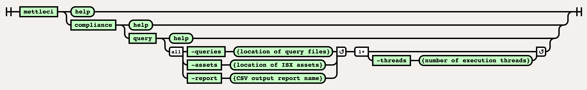

# Compliance Query Command

> [!INFO]
> This page is for running MettleCI **ASSET QUERIES**.  If you're looking for the Compliance Results typically returned by MettleCI Workbench then please see the [Compliance Test Command](../compliance-namespace/compliance-test-command.md).

# Purpose

The command line implementation of the Compliance Query functionality exposes the low-level mechanism to produce a report listing the results of the specified Asset Queries.

# Syntax



(function(){ var data = { "addon\_key":"render-Markdown", "uniqueKey":"render-Markdown\_\_markdown1084010237315257526", "key":"markdown", "moduleType":"dynamicContentMacros", "moduleLocation":"content", "cp":"/wiki", "general":"", "w":"", "h":"", "url":"https://d27i9fmzbobp10.cloudfront.net/render-markdown.html?pageId=865239041&pageVersion=175&macroHash=7a1a25f8-1b8c-46e1-9e06-7d4be8f01afa&macroId=7a1a25f8-1b8c-46e1-9e06-7d4be8f01afa&outputType=email&highlightStyle=&highlight=&xdm\_e=https%3A%2F%2Fdatamigrators.atlassian.net&xdm\_c=channel-render-Markdown\_\_markdown1084010237315257526&cp=%2Fwiki&xdm\_deprecated\_addon\_key\_do\_not\_use=render-Markdown&lic=none&cv=1000.0.0-f660f55a6ec0", "structuredContext": "{\\"confluence\\":{\\"macro\\":{\\"outputType\\":\\"email\\",\\"hash\\":\\"7a1a25f8-1b8c-46e1-9e06-7d4be8f01afa\\",\\"id\\":\\"7a1a25f8-1b8c-46e1-9e06-7d4be8f01afa\\"},\\"content\\":{\\"type\\":\\"page\\",\\"version\\":\\"175\\",\\"id\\":\\"865239041\\"},\\"space\\":{\\"key\\":\\"MCIDOC\\",\\"id\\":\\"264011780\\"}},\\"url\\":{\\"displayUrl\\":\\"https://datamigrators.atlassian.net/wiki\\"}}", "contentClassifier":"content", "productCtx":"{\\"page.id\\":\\"865239041\\",\\"macro.hash\\":\\"7a1a25f8-1b8c-46e1-9e06-7d4be8f01afa\\",\\"space.key\\":\\"MCIDOC\\",\\"page.type\\":\\"page\\",\\"content.version\\":\\"175\\",\\"page.title\\":\\"compliance query command syntax\\",\\"macro.localId\\":\\"\\",\\"macro.body\\":\\"### Syntax : compliance query \[options\]\\\\n### Description\\\\n\\\\n\* \*\*-queries\*\*\\\\n\\\\n location of all the query files\\\\n\\\\n \*Required\*\\\\n\* \*\*-in\\",\\": = | RAW | = :\\":null,\\"space.id\\":\\"264011780\\",\\"macro.truncated\\":\\"true\\",\\"content.type\\":\\"page\\",\\"output.type\\":\\"email\\",\\"page.version\\":\\"175\\",\\"macro.fragmentLocalId\\":\\"\\",\\"content.id\\":\\"865239041\\",\\"macro.id\\":\\"7a1a25f8-1b8c-46e1-9e06-7d4be8f01afa\\"}", "timeZone":"UTC", "origin":"https://d27i9fmzbobp10.cloudfront.net", "hostOrigin":"https://datamigrators.atlassian.net", "sandbox":"allow-downloads allow-forms allow-modals allow-popups allow-popups-to-escape-sandbox allow-scripts allow-same-origin allow-top-navigation-by-user-activation allow-storage-access-by-user-activation", "apiMigrations": { "gdpr": true } } ; if(window.AP && window.AP.subCreate) { window.\_AP.appendConnectAddon(data); } else { require(\['ac/create'\], function(create){ create.appendConnectAddon(data); }); } // For Confluence App Analytics. This code works in conjunction with CFE's ConnectSupport.js. // Here, we add a listener to the initial HTML page that stores events if the ConnectSupport component // has not mounted yet. In CFE, we process the missed event data and disable this initial listener. const \_\_MAX\_EVENT\_ARRAY\_SIZE\_\_ = 20; const connectAppAnalytics = "ecosystem.confluence.connect.analytics"; window.connectHost && window.connectHost.onIframeEstablished((eventData) => { if (!window.\_\_CONFLUENCE\_CONNECT\_SUPPORT\_LOADED\_\_) { let events = JSON.parse(window.localStorage.getItem(connectAppAnalytics)) || \[\]; if (events.length >= \_\_MAX\_EVENT\_ARRAY\_SIZE\_\_) { events.shift(); } events.push(eventData); window.localStorage.setItem(connectAppAnalytics, JSON.stringify(events)); } }); }());

# Example

This example demonstrates how to export a set of ISX files and run Asset Queries against them. Note that asset paths specification in the export command uses the [same wildcard rules](https://www.ibm.com/docs/en/iis/11.7?topic=command-asset-paths) as the `istool` command.

```
# ============================== 
# Export the required ISX assets
# ============================== 
C:\> mettleci isx export ^
     -domain myteam-svcs.corp.com:59445 ^
     -username myuser -password mypassword ^
     -server myteam-engn.corp.com ^
     -project myproject ^
     -jobname .*LD_S.*
Exporting [.*LD_S.*] from repository...
Exporting DataStage assets...
 * Export 'test2-engn.datamigrators.io/myproject/Jobs/Load/LD_SUPPLIER.pjb' - COMPLETED
 * Export 'test2-engn.datamigrators.io/myproject/Jobs/Load/LD_STOCK_HOLDING.pjb' - COMPLETED
 * Export 'test2-engn.datamigrators.io/myproject/Jobs/Load/LD_STOCKITEM.pjb' - COMPLETED
 * Export 'test2-engn.datamigrators.io/myproject/Jobs/Load/LD_SALE.pjb' - COMPLETED
Export complete

# ================================================================
# Run the specified asset queries against the exported ISX assets
# ================================================================
C:\> mettleci compliance query \
     -assets ./Jobs \
     -queries ./Queries \
     -report compliance.csv \
MettleCI Command Line (build 122)
(C) 2018-2020 Data Migrators Pty Ltd

 <SNIP>

# Done!

C:\>
```