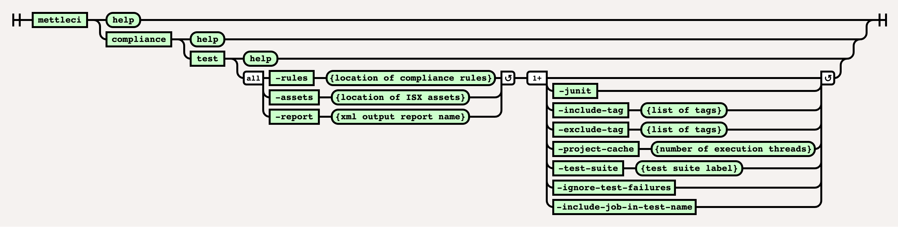

# Compliance Test Command

> [!INFO]
> This page is for running MettleCI **COMPLIANCE RULES**.  If you're looking for the Asset Queries typically used in a MettleCI Report Card then please see the [Compliance Query Command](../compliance-namespace/compliance-query-command.md).

> [!INFO]
> The ‘tags’ feature documented on this page is available in MettleCI releases greater than v1.1

# Purpose

The command line implementation of the Compliance Test functionality enables the production of a Compliance Results report of the specified assets against the specified set of [MettleCI Compliance Rules](https://datamigrators.atlassian.net/wiki/spaces/MCIDOC/pages/2213085185/MettleCI+Compliance+Rules+Reference).

For more information on using the `-project-cache` parameter see our [detailed explanation](https://datamigrators.atlassian.net/wiki/spaces/MCIDOC/pages/1356890161/MettleCI+CLI+and+the+project-cache+directory).

# Syntax



(function(){ var data = { "addon\_key":"render-Markdown", "uniqueKey":"render-Markdown\_\_markdown8229190389388571169", "key":"markdown", "moduleType":"dynamicContentMacros", "moduleLocation":"content", "cp":"/wiki", "general":"", "w":"", "h":"", "url":"https://d27i9fmzbobp10.cloudfront.net/render-markdown.html?pageId=864845845&pageVersion=175&macroHash=b19ee1a0-a8ca-45ed-9178-ca6f0d312515&macroId=b19ee1a0-a8ca-45ed-9178-ca6f0d312515&outputType=email&highlightStyle=&highlight=&xdm\_e=https%3A%2F%2Fdatamigrators.atlassian.net&xdm\_c=channel-render-Markdown\_\_markdown8229190389388571169&cp=%2Fwiki&xdm\_deprecated\_addon\_key\_do\_not\_use=render-Markdown&lic=none&cv=1000.0.0-f660f55a6ec0", "structuredContext": "{\\"confluence\\":{\\"macro\\":{\\"outputType\\":\\"email\\",\\"hash\\":\\"b19ee1a0-a8ca-45ed-9178-ca6f0d312515\\",\\"id\\":\\"b19ee1a0-a8ca-45ed-9178-ca6f0d312515\\"},\\"content\\":{\\"type\\":\\"page\\",\\"version\\":\\"175\\",\\"id\\":\\"864845845\\"},\\"space\\":{\\"key\\":\\"MCIDOC\\",\\"id\\":\\"264011780\\"}},\\"url\\":{\\"displayUrl\\":\\"https://datamigrators.atlassian.net/wiki\\"}}", "contentClassifier":"content", "productCtx":"{\\"page.id\\":\\"864845845\\",\\"macro.hash\\":\\"b19ee1a0-a8ca-45ed-9178-ca6f0d312515\\",\\"space.key\\":\\"MCIDOC\\",\\"page.type\\":\\"page\\",\\"content.version\\":\\"175\\",\\"page.title\\":\\"compliance test command syntax\\",\\"macro.localId\\":\\"\\",\\"macro.body\\":\\"### Syntax : compliance test \[options\]\\\\n### Description\\\\n\\\\n\* \*\*-rules\*\*\\\\n\\\\n location of all the rule files, searched recursively whe\\",\\": = | RAW | = :\\":null,\\"space.id\\":\\"264011780\\",\\"macro.truncated\\":\\"true\\",\\"content.type\\":\\"page\\",\\"output.type\\":\\"email\\",\\"page.version\\":\\"175\\",\\"macro.fragmentLocalId\\":\\"\\",\\"content.id\\":\\"864845845\\",\\"macro.id\\":\\"b19ee1a0-a8ca-45ed-9178-ca6f0d312515\\"}", "timeZone":"UTC", "origin":"https://d27i9fmzbobp10.cloudfront.net", "hostOrigin":"https://datamigrators.atlassian.net", "sandbox":"allow-downloads allow-forms allow-modals allow-popups allow-popups-to-escape-sandbox allow-scripts allow-same-origin allow-top-navigation-by-user-activation allow-storage-access-by-user-activation", "apiMigrations": { "gdpr": true } } ; if(window.AP && window.AP.subCreate) { window.\_AP.appendConnectAddon(data); } else { require(\['ac/create'\], function(create){ create.appendConnectAddon(data); }); } // For Confluence App Analytics. This code works in conjunction with CFE's ConnectSupport.js. // Here, we add a listener to the initial HTML page that stores events if the ConnectSupport component // has not mounted yet. In CFE, we process the missed event data and disable this initial listener. const \_\_MAX\_EVENT\_ARRAY\_SIZE\_\_ = 20; const connectAppAnalytics = "ecosystem.confluence.connect.analytics"; window.connectHost && window.connectHost.onIframeEstablished((eventData) => { if (!window.\_\_CONFLUENCE\_CONNECT\_SUPPORT\_LOADED\_\_) { let events = JSON.parse(window.localStorage.getItem(connectAppAnalytics)) || \[\]; if (events.length >= \_\_MAX\_EVENT\_ARRAY\_SIZE\_\_) { events.shift(); } events.push(eventData); window.localStorage.setItem(connectAppAnalytics, JSON.stringify(events)); } }); }());

# Example

This example demonstrates how to export a set of ISX files and run Compliance against them. Note that asset paths specification in the export command uses the [same wildcard rules](https://www.ibm.com/docs/en/iis/11.7?topic=command-asset-paths) as the `istool` command.

```
# ============================== 
# Export the required ISX assets
# ============================== 
C:\MettleCI\cli\> mettleci isx export ^
     -domain myteam-svcs.corp.com:59445 ^
     -username myuser -password mypassword  ^
     -server myteam-engn.corp.com  ^
     -project myproject  ^
     -location C:\shared\myproject\export  ^
     -include-binaries  ^
     -project-cache C:\shared\myproject\cache
Analyzing test2-engn.datamigrators.io/myproject
Attempting to identify changes with 4 working threads.
Inspecting DataStage assets for changes...
<SNIP>
Change identification complete
Inspecting ParameterSet definition changes...
ParameterSet definition change identification complete
Deleting assets...
<SNIP>
Deletion complete
Exporting DataStage assets...
<SNIP>
Export complete
Attempting to identify last change with 4 working threads.
Inspecting DataStage assets for last change...
<SNIP>
Last change identification complete

# ==================================================================
# Run the specified compliance rules against the exported ISX assets
# ==================================================================
$> mettleci compliance test
  -rules compliance_rules
  -assets datastage
  -report compliance_report_warn.xml
  -junit
  -project-cache ./project-cache
  -test-suite warnings
  -ignore-test-failures
  -include-job-in-test-name

MettleCI Command Line (build 122)
(C) 2018-2020 Data Migrators Pty Ltd
rules configuration discovered
new rule discovered - 'Adjacent Transformers' (PARALLEL_JOB)
new rule discovered - 'CCMigrateTool Stages' (PARALLEL_JOB)
new rule discovered - 'CCMigrateTool Stages' (SERVER_JOB)
new rule discovered - 'Database Row Limit' (PARALLEL_JOB)
new rule discovered - 'Database Row Limit' (SERVER_JOB)
new rule discovered - 'Debug Row Limit' (PARALLEL_JOB)
<SNIP>
new rule discovered - 'One Dataflow' (SERVER_JOB)
new rule discovered - 'Range Lookup' (PARALLEL_JOB)
new rule discovered - 'Too Many Stages' (PARALLEL_JOB)
new rule discovered - 'Too Many Stages' (SERVER_JOB)
new rule discovered - 'Unique Sort' (PARALLEL_JOB)
[1/3] TestJob_0921 (PARALLEL_JOB)
[2/3] TestJob_0930 (PARALLEL_JOB)
[3/3] TestJob (PARALLEL_JOB)

# Done!
$>
```

  
This example produces an output file `compliance.csv` in the current directory which looks like this (formatted here for clarity):

| **asset** | **assetType** | **test** | **duration** | **result** | **message** |
| --- | --- | --- | --- | --- | --- |
| TestJob\_0921 | PARALLEL\_JOB | Adjacent Transformers | 0.046 | Success |     |
| **\---< rows redacted for brevity >---** |     |     |     |     |     |
| TestJob\_0921 | PARALLEL\_JOB | Debug Row Limit | 0.016 | Success |     |
| TestJob\_0921 | PARALLEL\_JOB | Default Naming | 0.015 | Failure | PxRowGenerator 'Row\_Generator\_0' uses DataStage's default naming. Please provide a meaningful name meeting naming standards.  <br>CTransformerStage 'Transformer\_2' uses DataStage's default naming. Please provide a meaningful name meeting naming standards.  <br>Link DSLink3 uses DataStage's default naming. Please provide a meaningful name meeting naming standards.  <br>Link DSLink4 uses DataStage's default naming. Please provide a meaningful name meeting naming standards." |
| TestJob\_0921 | PARALLEL\_JOB | Hardcoded File Paths | 0.016 | Success |     |
| **\---< rows redacted for brevity >---** |     |     |     |     |     |
| TestJob\_0930 | PARALLEL\_JOB | Debug Row Limit | 0   | Success |     |
| TestJob\_0930 | PARALLEL\_JOB | Default Naming | 0   | Failure | PxRowGenerator 'Row\_Generator\_0' uses DataStage's default naming. Please provide a meaningful name meeting naming standards.  <br>CTransformerStage 'Transformer\_2' uses DataStage's default naming. Please provide a meaningful name meeting naming standards.  <br>Link DSLink3 uses DataStage's default naming. Please provide a meaningful name meeting naming standards.  <br>Link DSLink4 uses DataStage's default naming. Please provide a meaningful name meeting naming standards." |
| TestJob\_0930 | PARALLEL\_JOB | Hardcoded File Paths | 0.016 | Success |     |
| **\---< rows redacted for brevity >---** |     |     |     |     |     |
| TestJob | PARALLEL\_JOB | Debug Row Limit | 0   | Success |     |
| TestJob | PARALLEL\_JOB | Default Naming | 0   | Failure | PxRowGenerator 'Row\_Generator\_0' uses DataStage's default naming. Please provide a meaningful name meeting naming standards.  <br>CTransformerStage 'Transformer\_2' uses DataStage's default naming. Please provide a meaningful name meeting naming standards.  <br>Link DSLink3 uses DataStage's default naming. Please provide a meaningful name meeting naming standards.  <br>Link DSLink4 uses DataStage's default naming. Please provide a meaningful name meeting naming standards." |
| TestJob | PARALLEL\_JOB | Hardcoded File Paths | 0   | Success |     |
| **\---< rows redacted for brevity >---** |     |     |     |     |     |
| TestJob | PARALLEL\_JOB | Unique Sort | 0   | Success |     |

# See Also

*   For a discussion on the use of the `include-tags` and `exclude-tags` options see [Compliance Rule Tags](https://datamigrators.atlassian.net/wiki/spaces/MCIDOC/pages/2472050689/Compliance+Rule+Tags).