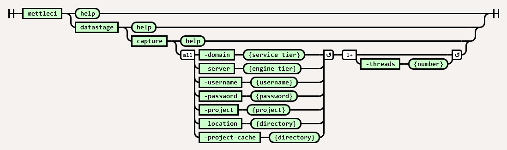

# DataStage Capture Command

# Purpose

This command captures the current state of a DataStage project by exporting its content to ISX files and updating the project cache. The resulting ISX files and project cache can be used by the DataStage Deploy command to incrementally deploy changes that have occurred after DataStage Capture was performed.

*   the `-location` parameter specifies the root directory of ISX files exported from the project.
    
*   the `-project` value is the name of the DataStage target project.
    
*   the `-project-cache` parameter specifies a shared directory containing state information for this DataStage target project. These are the DataStage asset fingerprints which are used to identify changes in your DataStage code. See our [more detailed explanation](https://datamigrators.atlassian.net/wiki/spaces/MCIDOC/pages/1356890161/MettleCI+CLI+and+the+project-cache+directory).
    
*   the `-threads` parameter specifies how many concurrent compilation operations will be performed.
    

# Syntax



(function(){ var data = { "addon\_key":"render-Markdown", "uniqueKey":"render-Markdown\_\_markdown5509533333558878276", "key":"markdown", "moduleType":"dynamicContentMacros", "moduleLocation":"content", "cp":"/wiki", "general":"", "w":"", "h":"", "url":"https://d27i9fmzbobp10.cloudfront.net/render-markdown.html?pageId=2568585238&pageVersion=25&macroHash=bbf7cee7-38f1-47b3-86b6-5593893be756&macroId=bbf7cee7-38f1-47b3-86b6-5593893be756&outputType=email&highlightStyle=&highlight=&xdm\_e=https%3A%2F%2Fdatamigrators.atlassian.net&xdm\_c=channel-render-Markdown\_\_markdown5509533333558878276&cp=%2Fwiki&xdm\_deprecated\_addon\_key\_do\_not\_use=render-Markdown&lic=none&cv=1000.0.0-f660f55a6ec0", "structuredContext": "{\\"confluence\\":{\\"editor\\":{\\"version\\":\\"\\\\\\"v2\\\\\\"\\"},\\"macro\\":{\\"outputType\\":\\"email\\",\\"hash\\":\\"bbf7cee7-38f1-47b3-86b6-5593893be756\\",\\"id\\":\\"bbf7cee7-38f1-47b3-86b6-5593893be756\\"},\\"content\\":{\\"type\\":\\"page\\",\\"version\\":\\"25\\",\\"id\\":\\"2568585238\\"},\\"space\\":{\\"key\\":\\"MCIDOC\\",\\"id\\":\\"264011780\\"}},\\"url\\":{\\"displayUrl\\":\\"https://datamigrators.atlassian.net/wiki\\"}}", "contentClassifier":"content", "productCtx":"{\\"page.id\\":\\"2568585238\\",\\"macro.hash\\":\\"bbf7cee7-38f1-47b3-86b6-5593893be756\\",\\"space.key\\":\\"MCIDOC\\",\\"page.type\\":\\"page\\",\\"content.version\\":\\"25\\",\\"page.title\\":\\"datastage capture command syntax\\",\\"macro.localId\\":\\"\\",\\"macro.body\\":\\"### Syntax : datastage capture \[options\]\\\\n### Description\\\\n\\\\n\* \*\*-domain\*\*\\\\n\\\\n Services tier\\\\n\\\\n \*Required\*\\\\n\* \*\*-server\*\*\\\\n\\\\n Engine t\\",\\": = | RAW | = :\\":null,\\"space.id\\":\\"264011780\\",\\"macro.truncated\\":\\"true\\",\\"content.type\\":\\"page\\",\\"output.type\\":\\"email\\",\\"page.version\\":\\"25\\",\\"macro.fragmentLocalId\\":\\"\\",\\"content.id\\":\\"2568585238\\",\\"macro.id\\":\\"bbf7cee7-38f1-47b3-86b6-5593893be756\\",\\"editor.version\\":\\"\\\\\\"v2\\\\\\"\\"}", "timeZone":"UTC", "origin":"https://d27i9fmzbobp10.cloudfront.net", "hostOrigin":"https://datamigrators.atlassian.net", "sandbox":"allow-downloads allow-forms allow-modals allow-popups allow-popups-to-escape-sandbox allow-scripts allow-same-origin allow-top-navigation-by-user-activation allow-storage-access-by-user-activation", "apiMigrations": { "gdpr": true } } ; if(window.AP && window.AP.subCreate) { window.\_AP.appendConnectAddon(data); } else { require(\['ac/create'\], function(create){ create.appendConnectAddon(data); }); } // For Confluence App Analytics. This code works in conjunction with CFE's ConnectSupport.js. // Here, we add a listener to the initial HTML page that stores events if the ConnectSupport component // has not mounted yet. In CFE, we process the missed event data and disable this initial listener. const \_\_MAX\_EVENT\_ARRAY\_SIZE\_\_ = 20; const connectAppAnalytics = "ecosystem.confluence.connect.analytics"; window.connectHost && window.connectHost.onIframeEstablished((eventData) => { if (!window.\_\_CONFLUENCE\_CONNECT\_SUPPORT\_LOADED\_\_) { let events = JSON.parse(window.localStorage.getItem(connectAppAnalytics)) || \[\]; if (events.length >= \_\_MAX\_EVENT\_ARRAY\_SIZE\_\_) { events.shift(); } events.push(eventData); window.localStorage.setItem(connectAppAnalytics, JSON.stringify(events)); } }); }());

# Example

Capture the current state of the project.

```
c:\> mettleci datastage capture ^
     -domain datastage-services.myorganization.com:59445 ^
     -server datastage-engine.myorganization.com ^
     -project myproject ^
     -username isadmin ^
     -password **** ^
     -location datastage ^
     -threads 4 ^
     -project-cache "C:\MettleCI\cache\datastage-engine.myorganization.com\myproject" 

MettleCI Command Line (build 128)
(C) 2018-2022 Data Migrators Pty Ltd
Analyzing DATASTAGE-ENGINE.MYORGANIZATION.COM/myproject
Exporting DataStage assets...
 * Export 'DATASTAGE-ENGINE.MYORGANIZATION.COM/myproject/Jobs/Load/LD_SUPPLIER.pjb' - COMPLETED
 * Export 'DATASTAGE-ENGINE.MYORGANIZATION.COM/myproject/Jobs/Connections/DMSqlServer_OLTP.dcn' - COMPLETED
 * Export 'DATASTAGE-ENGINE.MYORGANIZATION.COM/myproject/Jobs/Utilities/UT_CONTROL.pjb' - COMPLETED
 * Export 'DATASTAGE-ENGINE.MYORGANIZATION.COM/myproject/Jobs/Load/LD_TRANSACTION.pjb' - COMPLETED
 * Export 'DATASTAGE-ENGINE.MYORGANIZATION.COM/myproject/Jobs/Extract/EX_PURCHASE.pjb' - COMPLETED
 * Export 'DATASTAGE-ENGINE.MYORGANIZATION.COM/myproject/Jobs/Extract/EX_TRANSACTION_TYPE.pjb' - COMPLETED
 * Export 'DATASTAGE-ENGINE.MYORGANIZATION.COM/myproject/Jobs/Transform/TR_CUSTOMER.pjb' - COMPLETED
 * Export 'DATASTAGE-ENGINE.MYORGANIZATION.COM/myproject/Jobs/Transform/TR_CITY.pjb' - COMPLETED
 * Export 'DATASTAGE-ENGINE.MYORGANIZATION.COM/myproject/Jobs/Transform/TR_STOCKITEM.pjb' - COMPLETED
 * Export 'DATASTAGE-ENGINE.MYORGANIZATION.COM/myproject/Jobs/Transform/TR_ORDERS.pjb' - COMPLETED
 * Export 'DATASTAGE-ENGINE.MYORGANIZATION.COM/myproject/Jobs/Extract/EX_STOCKITEM.pjb' - COMPLETED
 * Export 'DATASTAGE-ENGINE.MYORGANIZATION.COM/myproject/Jobs/Extract/EX_STOCK_HOLDING.pjb' - COMPLETED
 * Export 'DATASTAGE-ENGINE.MYORGANIZATION.COM/myproject/Jobs/ParameterSets/pDMSqlServer_DW.pst' - COMPLETED
 * Export 'DATASTAGE-ENGINE.MYORGANIZATION.COM/myproject/Jobs/Extract/EX_MOVEMENT.pjb' - COMPLETED
 * Export 'DATASTAGE-ENGINE.MYORGANIZATION.COM/myproject/Jobs/Load/LD_SALE.pjb' - COMPLETED
 * Export 'DATASTAGE-ENGINE.MYORGANIZATION.COM/myproject/Jobs/ParameterSets/pGlobal.pst' - COMPLETED
 * Export 'DATASTAGE-ENGINE.MYORGANIZATION.COM/myproject/Jobs/Load/LD_MOVEMENT.pjb' - COMPLETED
 * Export 'DATASTAGE-ENGINE.MYORGANIZATION.COM/myproject/Jobs/Load/LD_ORDERS.pjb' - COMPLETED
 * Export 'DATASTAGE-ENGINE.MYORGANIZATION.COM/myproject/Jobs/Transform/TR_TRANSACTION_TYPE.pjb' - COMPLETED
 * Export 'DATASTAGE-ENGINE.MYORGANIZATION.COM/myproject/Jobs/Transform/TR_EMPLOYEE.pjb' - COMPLETED
 * Export 'DATASTAGE-ENGINE.MYORGANIZATION.COM/myproject/Jobs/Load/LD_CUSTOMER.pjb' - COMPLETED
 * Export 'DATASTAGE-ENGINE.MYORGANIZATION.COM/myproject/Jobs/Connections/DMSqlServer_DW.dcn' - COMPLETED
 * Export 'DATASTAGE-ENGINE.MYORGANIZATION.COM/myproject/Jobs/Extract/EX_ORDERS.pjb' - COMPLETED
 * Export 'DATASTAGE-ENGINE.MYORGANIZATION.COM/myproject/Jobs/Load/LD_TRANSACTION_TYPE.pjb' - COMPLETED
 * Export 'DATASTAGE-ENGINE.MYORGANIZATION.COM/myproject/Jobs/Utilities/UT_LOAD_TABLE.pjb' - COMPLETED
 * Export 'DATASTAGE-ENGINE.MYORGANIZATION.COM/myproject/Jobs/Extract/EX_CITY.pjb' - COMPLETED
 * Export 'DATASTAGE-ENGINE.MYORGANIZATION.COM/myproject/Jobs/Load/LD_STOCK_HOLDING.pjb' - COMPLETED
 * Export 'DATASTAGE-ENGINE.MYORGANIZATION.COM/myproject/Jobs/Extract/EX_CUSTOMER.pjb' - COMPLETED
 * Export 'DATASTAGE-ENGINE.MYORGANIZATION.COM/myproject/Jobs/Load/LD_CITY.pjb' - COMPLETED
 * Export 'DATASTAGE-ENGINE.MYORGANIZATION.COM/myproject/Jobs/Load/LD_PAYMENT_METHOD.pjb' - COMPLETED
 * Export 'DATASTAGE-ENGINE.MYORGANIZATION.COM/myproject/Jobs/Load/LD_EMPLOYEE.pjb' - COMPLETED
 * Export 'DATASTAGE-ENGINE.MYORGANIZATION.COM/myproject/Jobs/ParameterSets/pDMSqlServer_OLTP.pst' - COMPLETED
 * Export 'DATASTAGE-ENGINE.MYORGANIZATION.COM/myproject/Jobs/Load/LD_STOCKITEM.pjb' - COMPLETED
 * Export 'DATASTAGE-ENGINE.MYORGANIZATION.COM/myproject/Jobs/Transform/TR_TRANSACTION.pjb' - COMPLETED
 * Export 'DATASTAGE-ENGINE.MYORGANIZATION.COM/myproject/Jobs/Transform/TR_MOVEMENT.pjb' - COMPLETED
 * Export 'DATASTAGE-ENGINE.MYORGANIZATION.COM/myproject/Jobs/Transform/TR_SUPPLIER.pjb' - COMPLETED
 * Export 'DATASTAGE-ENGINE.MYORGANIZATION.COM/myproject/Jobs/Extract/EX_TRANSACTION.pjb' - COMPLETED
 * Export 'DATASTAGE-ENGINE.MYORGANIZATION.COM/myproject/Jobs/Extract/EX_PAYMENT_METHOD.pjb' - COMPLETED
 * Export 'DATASTAGE-ENGINE.MYORGANIZATION.COM/myproject/Jobs/Extract/EX_SALE.pjb' - COMPLETED
 * Export 'DATASTAGE-ENGINE.MYORGANIZATION.COM/myproject/Jobs/Load/LD_PURCHASE.pjb' - COMPLETED
 * Export 'DATASTAGE-ENGINE.MYORGANIZATION.COM/myproject/Jobs/Transform/TR_SALE.pjb' - COMPLETED
 * Export 'DATASTAGE-ENGINE.MYORGANIZATION.COM/myproject/Jobs/Transform/TR_PURCHASE.pjb' - COMPLETED
 * Export 'DATASTAGE-ENGINE.MYORGANIZATION.COM/myproject/Jobs/Transform/TR_PAYMENT_METHOD.pjb' - COMPLETED
 * Export 'DATASTAGE-ENGINE.MYORGANIZATION.COM/myproject/Jobs/Extract/EX_SUPPLIER.pjb' - COMPLETED
 * Export 'DATASTAGE-ENGINE.MYORGANIZATION.COM/myproject/Jobs/Transform/TR_STOCK_HOLDING.pjb' - COMPLETED
 * Export 'DATASTAGE-ENGINE.MYORGANIZATION.COM/myproject/Jobs/Extract/EX_EMPLOYEE.pjb' - COMPLETED
Export complete
Attempting to identify last change with 4 working threads.
Inspecting DataStage assets for last change...
Last change to project occurred at 2023-12-21 04:37:37 GMT 
```

The DataStage Project has been captured as a set of ISX files and the project cache. Deploying the captured state back into the source project will not cause any changes to be detected:

```
c:\> mettleci datastage deploy
     -domain datastage-services.myorganization.com:59445
     -server datastage-engine.myorganization.com
     -project myproject
     -username isadmin
     -password ****
     -assets datastage
     -threads 4
     -project-cache "C:\MettleCI\cache\datastage-engine.myorganization.com\myproject" 

MettleCI Command Line (build 128)
(C) 2018-2022 Data Migrators Pty Ltd
Analyzing DATASTAGE-ENGINE.MYORGANIZATION.COM/myproject
Attempting to identify changes with 4 working threads.
Inspecting DataStage assets for changes...
Change identification complete, 0 asset changes detected in project
```