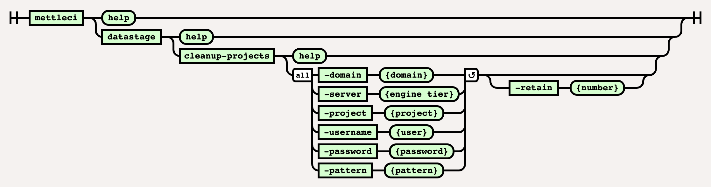

# DataStage Cleanup-Projects Command

# Purpose

Deletes redundant DataStage projects matching a supplied pattern.

## Syntax



//<!\[CDATA\[ (function(){ var data = { "addon\_key":"render-Markdown", "uniqueKey":"render-Markdown\_\_markdown890051730879335071", "key":"markdown", "moduleType":"dynamicContentMacros", "moduleLocation":"content", "cp":"/wiki", "general":"", "w":"", "h":"", "url":"https://d27i9fmzbobp10.cloudfront.net/render-markdown.html?pageId=864878626&pageVersion=184&macroHash=40ff7b07-937f-4f4e-a46b-e9b292b78e71&macroId=40ff7b07-937f-4f4e-a46b-e9b292b78e71&outputType=email&highlightStyle=&highlight=&xdm\_e=https%3A%2F%2Fdatamigrators.atlassian.net&xdm\_c=channel-render-Markdown\_\_markdown890051730879335071&cp=%2Fwiki&xdm\_deprecated\_addon\_key\_do\_not\_use=render-Markdown&lic=none&cv=1000.0.0-f660f55a6ec0", "structuredContext": "{\\"confluence\\":{\\"macro\\":{\\"outputType\\":\\"email\\",\\"hash\\":\\"40ff7b07-937f-4f4e-a46b-e9b292b78e71\\",\\"id\\":\\"40ff7b07-937f-4f4e-a46b-e9b292b78e71\\"},\\"content\\":{\\"type\\":\\"page\\",\\"version\\":\\"184\\",\\"id\\":\\"864878626\\"},\\"space\\":{\\"key\\":\\"MCIDOC\\",\\"id\\":\\"264011780\\"}},\\"url\\":{\\"displayUrl\\":\\"https://datamigrators.atlassian.net/wiki\\"}}", "contentClassifier":"content", "productCtx":"{\\"page.id\\":\\"864878626\\",\\"macro.hash\\":\\"40ff7b07-937f-4f4e-a46b-e9b292b78e71\\",\\"space.key\\":\\"MCIDOC\\",\\"page.type\\":\\"page\\",\\"content.version\\":\\"184\\",\\"page.title\\":\\"datastage cleanup-projects command syntax\\",\\"macro.localId\\":\\"\\",\\"macro.body\\":\\"### Syntax : datastage cleanup-projects \[options\]\\\\n### Description\\\\n\\\\n\* \*\*-domain\*\*\\\\n\\\\n Services Tier (required)\\\\n\\\\n \*Required\*\\\\n\* \*\*-\\",\\": = | RAW | = :\\":null,\\"space.id\\":\\"264011780\\",\\"macro.truncated\\":\\"true\\",\\"content.type\\":\\"page\\",\\"output.type\\":\\"email\\",\\"page.version\\":\\"184\\",\\"macro.fragmentLocalId\\":\\"\\",\\"content.id\\":\\"864878626\\",\\"macro.id\\":\\"40ff7b07-937f-4f4e-a46b-e9b292b78e71\\"}", "timeZone":"UTC", "origin":"https://d27i9fmzbobp10.cloudfront.net", "hostOrigin":"https://datamigrators.atlassian.net", "sandbox":"allow-downloads allow-forms allow-modals allow-popups allow-popups-to-escape-sandbox allow-scripts allow-same-origin allow-top-navigation-by-user-activation allow-storage-access-by-user-activation", "apiMigrations": { "gdpr": true } } ; if(window.AP && window.AP.subCreate) { window.\_AP.appendConnectAddon(data); } else { require(\['ac/create'\], function(create){ create.appendConnectAddon(data); }); } // For Confluence App Analytics. This code works in conjunction with CFE's ConnectSupport.js. // Here, we add a listener to the initial HTML page that stores events if the ConnectSupport component // has not mounted yet. In CFE, we process the missed event data and disable this initial listener. const \_\_MAX\_EVENT\_ARRAY\_SIZE\_\_ = 20; const connectAppAnalytics = "ecosystem.confluence.connect.analytics"; window.connectHost && window.connectHost.onIframeEstablished((eventData) => { if (!window.\_\_CONFLUENCE\_CONNECT\_SUPPORT\_LOADED\_\_) { let events = JSON.parse(window.localStorage.getItem(connectAppAnalytics)) || \[\]; if (events.length >= \_\_MAX\_EVENT\_ARRAY\_SIZE\_\_) { events.shift(); } events.push(eventData); window.localStorage.setItem(connectAppAnalytics, JSON.stringify(events)); } }); }()); //\]\]>

# Example

```
$> mettleci datastage cleanup-projects \
   -domain my-services.datamigrators.io:59445 \
   -username isadmin \
   -password isadminpwd \
   -server my-engine.datamigrators.io \
   -pattern Test[0-9] \
   -retain 1
Listing projects:
  - ANALYZERPROJECT
  - DataClick
  - dstage1
  - Test1
    - matches pattern
  - Test2
    - matches pattern
  - Test4
    - matches pattern
  - SWPensionStrategy
  - wwi_prod
Cleaning up old projects, retaining 1 most recent projects
 * Delete 'test2-engn.datamigrators.io/Test4' - SKIPPED
Deleting project: SNTest2
 * Delete 'test2-engn.datamigrators.io/Test2' - COMPLETED
Deleting project: SNTest1
 * Delete 'test2-engn.datamigrators.io/Test1' - COMPLETED


```