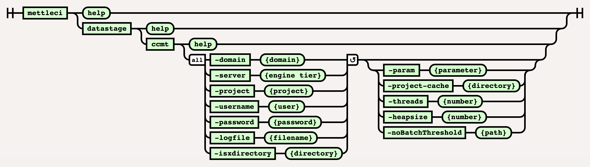

# DataStage Connector Migration Command

# Purpose

This command performs a connector migration using [IBM’s Connector Migration Tool](https://www.ibm.com/docs/en/iis/11.7?topic=connectivity-connector-migration-tool) ('CCMT'). It specifically provides the following capabilities….

*   Invoke the DataStage Connector Migration Tool using optional supplied parameters.
    
*   Logs all behaviour to a specified log file.
    
*   Runs using parallelism (using the `-threads` option) for optimum performance
    
*   Once complete, it runs a DataStage compilation command (`mettleci datastage compile`, [described here](../datastage-namespace/datastage-compile-command.md)) and produces a [JUnit-compatible](https://datamigrators.atlassian.net/wiki/spaces/MCIDOC/pages/1754890299/JUnit+Test+Results) test result.
    

# Syntax



Error rendering macro 'include' : com.atlassian.renderer.v2.macro.MacroException: No page title provided.

# Example

```
$> mettleci datastage ccmt ^
   -domain my_service_tier.datamigrators.io:59445 ^
   -username isadmin ^
   -password my_password ^
   -server my_engine_tier.datamigrators.io ^
   -project my_project ^
   -param "-J ConnectorTest" ^
   -logfile \log\ccmt\log\cc_migrate.log.txt ^
   -isxdirectory /path/to/isx ^
   -threads 4 ^
   -param " -M " ^
   -param " -T " ^
   -param " -V OracleConnector=12,OracleConnectorPX=12 "
MettleCI Command Line (build 128)
(C) 2018-2022 Data Migrators Pty Ltd
Generating dump report on... my_project
Project my_project dump report generated (22.871 seconds)
Executing CCMT on... my_project
Project my_project CCMigrated successfully (32.634 seconds)
The following jobs Connector Migrated:
   CCMT_Test migrated successfully
Executing CCMT on... my_project
Project ccmt_test CCMigrated successfully (15.220 seconds)
Variant for stage type OracleConnectorPX was changed in 2 stage instances
Variant for stage type OracleConnector was changed in 0 stage instances
Variant for stage type updated complete
Compiling DataStage jobs...
 * Compile 'my_engine_tier.datamigrators.io/my_project/Jobs/CCMT_Test.pjb' - COMPLETED
Compilation complete
Creating JUnit test suite
JUnit test suite created successfully
```