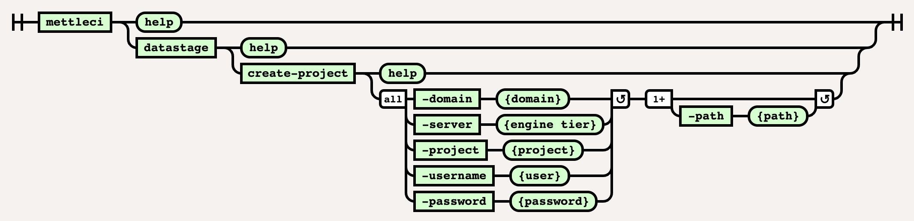

# DataStage Create-Project Command

# Purpose

This command either creates a DataStage project in a nominated environment or simply exist with a success code if the DataStage project already exists. It is used frequently at the beginning of pipelines to [assert](https://en.wikipedia.org/wiki/Assertion_(software_development)) that a target environment with which the pipeline will deploy and execute code is present and available.

# Syntax



(function(){ var data = { "addon\_key":"render-Markdown", "uniqueKey":"render-Markdown\_\_markdown2557303912684554878", "key":"markdown", "moduleType":"dynamicContentMacros", "moduleLocation":"content", "cp":"/wiki", "general":"", "w":"", "h":"", "url":"https://d27i9fmzbobp10.cloudfront.net/render-markdown.html?pageId=864714781&pageVersion=184&macroHash=06d0ff8e-f739-48f8-aad5-a4338f10af39&macroId=06d0ff8e-f739-48f8-aad5-a4338f10af39&outputType=email&highlightStyle=&highlight=&xdm\_e=https%3A%2F%2Fdatamigrators.atlassian.net&xdm\_c=channel-render-Markdown\_\_markdown2557303912684554878&cp=%2Fwiki&xdm\_deprecated\_addon\_key\_do\_not\_use=render-Markdown&lic=none&cv=1000.0.0-f660f55a6ec0", "structuredContext": "{\\"confluence\\":{\\"macro\\":{\\"outputType\\":\\"email\\",\\"hash\\":\\"06d0ff8e-f739-48f8-aad5-a4338f10af39\\",\\"id\\":\\"06d0ff8e-f739-48f8-aad5-a4338f10af39\\"},\\"content\\":{\\"type\\":\\"page\\",\\"version\\":\\"184\\",\\"id\\":\\"864714781\\"},\\"space\\":{\\"key\\":\\"MCIDOC\\",\\"id\\":\\"264011780\\"}},\\"url\\":{\\"displayUrl\\":\\"https://datamigrators.atlassian.net/wiki\\"}}", "contentClassifier":"content", "productCtx":"{\\"page.id\\":\\"864714781\\",\\"macro.hash\\":\\"06d0ff8e-f739-48f8-aad5-a4338f10af39\\",\\"space.key\\":\\"MCIDOC\\",\\"page.type\\":\\"page\\",\\"content.version\\":\\"184\\",\\"page.title\\":\\"datastage create-project command syntax\\",\\"macro.localId\\":\\"\\",\\"macro.body\\":\\"### Syntax : datastage create-project \[options\]\\\\n### Description\\\\n\\\\n\* \*\*-domain\*\*\\\\n\\\\n Services Tier (required)\\\\n\\\\n \*Required\*\\\\n\* \*\*-se\\",\\": = | RAW | = :\\":null,\\"space.id\\":\\"264011780\\",\\"macro.truncated\\":\\"true\\",\\"content.type\\":\\"page\\",\\"output.type\\":\\"email\\",\\"page.version\\":\\"184\\",\\"macro.fragmentLocalId\\":\\"\\",\\"content.id\\":\\"864714781\\",\\"macro.id\\":\\"06d0ff8e-f739-48f8-aad5-a4338f10af39\\"}", "timeZone":"UTC", "origin":"https://d27i9fmzbobp10.cloudfront.net", "hostOrigin":"https://datamigrators.atlassian.net", "sandbox":"allow-downloads allow-forms allow-modals allow-popups allow-popups-to-escape-sandbox allow-scripts allow-same-origin allow-top-navigation-by-user-activation allow-storage-access-by-user-activation", "apiMigrations": { "gdpr": true } } ; if(window.AP && window.AP.subCreate) { window.\_AP.appendConnectAddon(data); } else { require(\['ac/create'\], function(create){ create.appendConnectAddon(data); }); } // For Confluence App Analytics. This code works in conjunction with CFE's ConnectSupport.js. // Here, we add a listener to the initial HTML page that stores events if the ConnectSupport component // has not mounted yet. In CFE, we process the missed event data and disable this initial listener. const \_\_MAX\_EVENT\_ARRAY\_SIZE\_\_ = 20; const connectAppAnalytics = "ecosystem.confluence.connect.analytics"; window.connectHost && window.connectHost.onIframeEstablished((eventData) => { if (!window.\_\_CONFLUENCE\_CONNECT\_SUPPORT\_LOADED\_\_) { let events = JSON.parse(window.localStorage.getItem(connectAppAnalytics)) || \[\]; if (events.length >= \_\_MAX\_EVENT\_ARRAY\_SIZE\_\_) { events.shift(); } events.push(eventData); window.localStorage.setItem(connectAppAnalytics, JSON.stringify(events)); } }); }());

# Example

```
$> mettleci datastage create-project \
   -domain service_tier.datamigrators.io:59445 \
   -username isadmin -password mypassword \
   -server engine_tier.datamigrators.io \
   -project Test4

Test4 created successfully.
$>
```

## Usage Notes

Due to a known issue with the DataStage `dsadmin` command itself it is not possible to distinguish between…

*   a DataStage project that already exists, and
    
*   a DataStage project that doesn’t exist in the DataStage repository, but for which the associated filesystem directories does exist.
    

There may be some situations in which this causes the `create-project` command to fail.

When faced with an inexplicable failure of this nature check to see if the project’s directory structure already exists on the filesystem. If so, and it’s safe to do so, remove the file structure and try again

* * *

# See also

*   [The \`mettleci datastage create-project\` command fails](https://datamigrators.atlassian.net/wiki/spaces/MCIDOC/pages/1791197232)