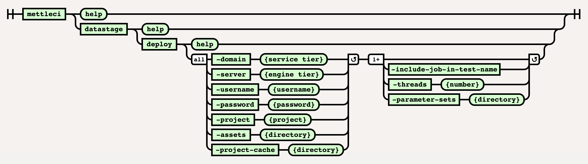

# DataStage Deploy Command

# Purpose

This command deploys a specified directory containing one or more DataStage ISX files to a specified target DataStage environment (project). 

*   the `datastage deploy` command performs incremental deployment.
    
*   the `-assets` parameter specifies the deployment source directory containing ISX files.
    
*   the `-project` value is the name of the DataStage target project.
    
*   the `-project-cache` parameter specifies a shared directory containing state information for this DataStage target project. These are the DataStage asset fingerprints which are used to identify changes in your DataStage code. See our [more detailed explanation](https://datamigrators.atlassian.net/wiki/spaces/MCIDOC/pages/1356890161/MettleCI+CLI+and+the+project-cache+directory).
    
*   the `-threads` parameter specifies how many concurrent compilation operations will be performed.
    
*   DataStage compilation results are converted to test results in JUnit format.
    

See [Repeatable DataStage Project Deployments](https://datamigrators.atlassian.net/wiki/spaces/MCIDOC/pages/1266843717/Repeatable+DataStage+Project+Deployments) for more details on how the `-project-cache` parameter is used to implement **incremental deployment**.

# Syntax



(function(){ var data = { "addon\_key":"render-Markdown", "uniqueKey":"render-Markdown\_\_markdown8139894130051836732", "key":"markdown", "moduleType":"dynamicContentMacros", "moduleLocation":"content", "cp":"/wiki", "general":"", "w":"", "h":"", "url":"https://d27i9fmzbobp10.cloudfront.net/render-markdown.html?pageId=864878730&pageVersion=196&macroHash=882fe01f-6835-48ff-8b1f-cbc28d10f566&macroId=882fe01f-6835-48ff-8b1f-cbc28d10f566&outputType=email&highlightStyle=&highlight=&xdm\_e=https%3A%2F%2Fdatamigrators.atlassian.net&xdm\_c=channel-render-Markdown\_\_markdown8139894130051836732&cp=%2Fwiki&xdm\_deprecated\_addon\_key\_do\_not\_use=render-Markdown&lic=none&cv=1000.0.0-f660f55a6ec0", "structuredContext": "{\\"confluence\\":{\\"editor\\":{\\"version\\":\\"\\\\\\"v2\\\\\\"\\"},\\"macro\\":{\\"outputType\\":\\"email\\",\\"hash\\":\\"882fe01f-6835-48ff-8b1f-cbc28d10f566\\",\\"id\\":\\"882fe01f-6835-48ff-8b1f-cbc28d10f566\\"},\\"content\\":{\\"type\\":\\"page\\",\\"version\\":\\"196\\",\\"id\\":\\"864878730\\"},\\"space\\":{\\"key\\":\\"MCIDOC\\",\\"id\\":\\"264011780\\"}},\\"url\\":{\\"displayUrl\\":\\"https://datamigrators.atlassian.net/wiki\\"}}", "contentClassifier":"content", "productCtx":"{\\"page.id\\":\\"864878730\\",\\"macro.hash\\":\\"882fe01f-6835-48ff-8b1f-cbc28d10f566\\",\\"space.key\\":\\"MCIDOC\\",\\"page.type\\":\\"page\\",\\"content.version\\":\\"196\\",\\"page.title\\":\\"datastage deploy command syntax\\",\\"macro.localId\\":\\"\\",\\"macro.body\\":\\"### Syntax : datastage deploy \[options\]\\\\n### Description\\\\n\\\\n\* \*\*-domain\*\*\\\\n\\\\n Services tier\\\\n\\\\n \*Required\*\\\\n\* \*\*-server\*\*\\\\n\\\\n Engine ti\\",\\": = | RAW | = :\\":null,\\"space.id\\":\\"264011780\\",\\"macro.truncated\\":\\"true\\",\\"content.type\\":\\"page\\",\\"output.type\\":\\"email\\",\\"page.version\\":\\"196\\",\\"macro.fragmentLocalId\\":\\"\\",\\"content.id\\":\\"864878730\\",\\"macro.id\\":\\"882fe01f-6835-48ff-8b1f-cbc28d10f566\\",\\"editor.version\\":\\"\\\\\\"v2\\\\\\"\\"}", "timeZone":"UTC", "origin":"https://d27i9fmzbobp10.cloudfront.net", "hostOrigin":"https://datamigrators.atlassian.net", "sandbox":"allow-downloads allow-forms allow-modals allow-popups allow-popups-to-escape-sandbox allow-scripts allow-same-origin allow-top-navigation-by-user-activation allow-storage-access-by-user-activation", "apiMigrations": { "gdpr": true } } ; if(window.AP && window.AP.subCreate) { window.\_AP.appendConnectAddon(data); } else { require(\['ac/create'\], function(create){ create.appendConnectAddon(data); }); } // For Confluence App Analytics. This code works in conjunction with CFE's ConnectSupport.js. // Here, we add a listener to the initial HTML page that stores events if the ConnectSupport component // has not mounted yet. In CFE, we process the missed event data and disable this initial listener. const \_\_MAX\_EVENT\_ARRAY\_SIZE\_\_ = 20; const connectAppAnalytics = "ecosystem.confluence.connect.analytics"; window.connectHost && window.connectHost.onIframeEstablished((eventData) => { if (!window.\_\_CONFLUENCE\_CONNECT\_SUPPORT\_LOADED\_\_) { let events = JSON.parse(window.localStorage.getItem(connectAppAnalytics)) || \[\]; if (events.length >= \_\_MAX\_EVENT\_ARRAY\_SIZE\_\_) { events.shift(); } events.push(eventData); window.localStorage.setItem(connectAppAnalytics, JSON.stringify(events)); } }); }());

# Example

```
c:\> mettleci datastage deploy
     -domain datastage-services.myorganization.com:59445
     -server datastage-engine.myorganization.com
     -project wwi_jenkins_ds_115_ci
     -username isadmin
     -password ****
     -assets datastage
     -parameter-sets "config\Parameter Sets"
     -threads 1
     -project-cache "C:\MettleCI\cache\datastage-engine.myorganization.com\jenkins_project" 

MettleCI Command Line (build 128)
(C) 2018-2022 Data Migrators Pty Ltd
Analyzing datastage-engine.myorganization.com/myproject
Attempting to identify changes with 4 working threads.
Inspecting DataStage assets for changes...
* Check datastage-engine.myorganization.com/myproject/Jobs/Transform/TR_CITY.pjb - CHANGED
Change identification complete, 1 asset changes detected in project
Deleting assets...
* Delete 'datastage-engine.myorganization.com/myproject/Jobs/Transform/TR_CITY.pjb' - COMPLETED
Deletion complete
Optimising assets for import
* Update 'Jobs/ParameterSets/pGlobal.pst' - COMPLETED
* Update 'Jobs/ParameterSets/pDMSqlServer_DW.pst' - COMPLETED
s* Update 'Jobs/ParameterSets/pDMSqlServer_OLTP.pst' - COMPLETED
Attempting to import with 1 working threads.
Importing DataStage assets...
* Import 'datastage-engine.myorganization.com/myproject/Jobs/ParameterSets/pDMSqlServer_OLTP.pst' - COMPLETED
* Import 'datastage-engine.myorganization.com/myproject/Jobs/ParameterSets/pDMSqlServer_DW.pst' - COMPLETED
* Import 'datastage-engine.myorganization.com/myproject/Jobs/ParameterSets/pGlobal.pst' - COMPLETED
* Import 'datastage-engine.myorganization.com/myproject/Jobs/Transform/TR_CITY.pjb' - COMPLETED
Import complete
Compiling DataStage jobs...
* Compile 'datastage-engine.myorganization.com/myproject/Jobs/Transform/TR_CITY.pjb' - COMPLETED
Compilation complete
sCreating JUnit test suite
JUnit test suite (mettleci_compilation.xml) created successfully
Attempting to identify last change with 4 working threads.
Inspecting DataStage assets for last change...
Last change to project occurred at 2023-12-17 22:07:00 GMT     
```