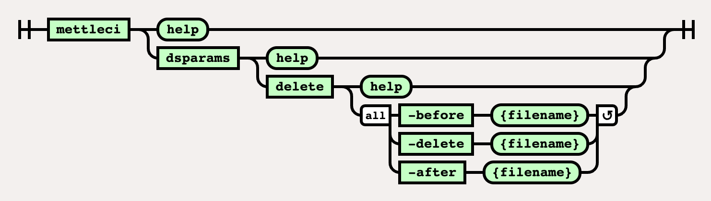

# DSParams  Delete Command

# Purpose

Reads a DSParams diff file and removes matching values from a DSParams file.

# Syntax



//<!\[CDATA\[ (function(){ var data = { "addon\_key":"render-Markdown", "uniqueKey":"render-Markdown\_\_markdown5797550264255987842", "key":"markdown", "moduleType":"dynamicContentMacros", "moduleLocation":"content", "cp":"/wiki", "general":"", "w":"", "h":"", "url":"https://d27i9fmzbobp10.cloudfront.net/render-markdown.html?pageId=864813073&pageVersion=184&macroHash=be399b29-dac2-46f0-8d3a-42e6197846da&macroId=be399b29-dac2-46f0-8d3a-42e6197846da&outputType=email&highlightStyle=&highlight=&xdm\_e=https%3A%2F%2Fdatamigrators.atlassian.net&xdm\_c=channel-render-Markdown\_\_markdown5797550264255987842&cp=%2Fwiki&xdm\_deprecated\_addon\_key\_do\_not\_use=render-Markdown&lic=none&cv=1000.0.0-f660f55a6ec0", "structuredContext": "{\\"confluence\\":{\\"macro\\":{\\"outputType\\":\\"email\\",\\"hash\\":\\"be399b29-dac2-46f0-8d3a-42e6197846da\\",\\"id\\":\\"be399b29-dac2-46f0-8d3a-42e6197846da\\"},\\"content\\":{\\"type\\":\\"page\\",\\"version\\":\\"184\\",\\"id\\":\\"864813073\\"},\\"space\\":{\\"key\\":\\"MCIDOC\\",\\"id\\":\\"264011780\\"}},\\"url\\":{\\"displayUrl\\":\\"https://datamigrators.atlassian.net/wiki\\"}}", "contentClassifier":"content", "productCtx":"{\\"page.id\\":\\"864813073\\",\\"macro.hash\\":\\"be399b29-dac2-46f0-8d3a-42e6197846da\\",\\"space.key\\":\\"MCIDOC\\",\\"page.type\\":\\"page\\",\\"content.version\\":\\"184\\",\\"page.title\\":\\"dsparams delete command syntax\\",\\"macro.localId\\":\\"\\",\\"macro.body\\":\\"### Syntax : dsparams delete \[options\]\\\\n### Description\\\\n\\\\n\* \*\*-before\*\*\\\\n\\\\n input DSParams - the \\\\\\"before\\\\\\" state\\\\n\\\\n \*Required\*\\\\n\* \*\*-\\",\\": = | RAW | = :\\":null,\\"space.id\\":\\"264011780\\",\\"macro.truncated\\":\\"true\\",\\"content.type\\":\\"page\\",\\"output.type\\":\\"email\\",\\"page.version\\":\\"184\\",\\"macro.fragmentLocalId\\":\\"\\",\\"content.id\\":\\"864813073\\",\\"macro.id\\":\\"be399b29-dac2-46f0-8d3a-42e6197846da\\"}", "timeZone":"UTC", "origin":"https://d27i9fmzbobp10.cloudfront.net", "hostOrigin":"https://datamigrators.atlassian.net", "sandbox":"allow-downloads allow-forms allow-modals allow-popups allow-popups-to-escape-sandbox allow-scripts allow-same-origin allow-top-navigation-by-user-activation allow-storage-access-by-user-activation", "apiMigrations": { "gdpr": true } } ; if(window.AP && window.AP.subCreate) { window.\_AP.appendConnectAddon(data); } else { require(\['ac/create'\], function(create){ create.appendConnectAddon(data); }); } // For Confluence App Analytics. This code works in conjunction with CFE's ConnectSupport.js. // Here, we add a listener to the initial HTML page that stores events if the ConnectSupport component // has not mounted yet. In CFE, we process the missed event data and disable this initial listener. const \_\_MAX\_EVENT\_ARRAY\_SIZE\_\_ = 20; const connectAppAnalytics = "ecosystem.confluence.connect.analytics"; window.connectHost && window.connectHost.onIframeEstablished((eventData) => { if (!window.\_\_CONFLUENCE\_CONNECT\_SUPPORT\_LOADED\_\_) { let events = JSON.parse(window.localStorage.getItem(connectAppAnalytics)) || \[\]; if (events.length >= \_\_MAX\_EVENT\_ARRAY\_SIZE\_\_) { events.shift(); } events.push(eventData); window.localStorage.setItem(connectAppAnalytics, JSON.stringify(events)); } }); }()); //\]\]>

# Example

```
$> mettleci dsparams delete \
   -before ./DSParams \
   -delete ./DSParams_delete \
   -after ./DSParams_new
```