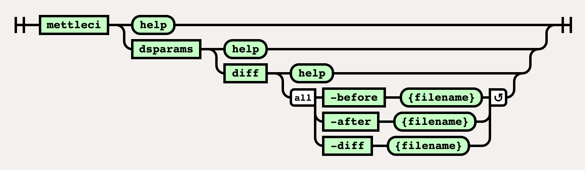

# DSParams  Diff Command

# Purpose

Compares two DSParams files and generates a new file containing differences which can later be re-applied using the [DSParams Merge Command](../dsparams-namespace/dsparams-merge-command.md) or deleted using the [DSParams Delete Command](../dsparams-namespace/dsparams-delete-command.md).

# Syntax



//<!\[CDATA\[ (function(){ var data = { "addon\_key":"render-Markdown", "uniqueKey":"render-Markdown\_\_markdown1748727585463724654", "key":"markdown", "moduleType":"dynamicContentMacros", "moduleLocation":"content", "cp":"/wiki", "general":"", "w":"", "h":"", "url":"https://d27i9fmzbobp10.cloudfront.net/render-markdown.html?pageId=864911379&pageVersion=184&macroHash=c1d74f09-8d50-41a5-95b9-ef37ced20a01&macroId=c1d74f09-8d50-41a5-95b9-ef37ced20a01&outputType=email&highlightStyle=&highlight=&xdm\_e=https%3A%2F%2Fdatamigrators.atlassian.net&xdm\_c=channel-render-Markdown\_\_markdown1748727585463724654&cp=%2Fwiki&xdm\_deprecated\_addon\_key\_do\_not\_use=render-Markdown&lic=none&cv=1000.0.0-f660f55a6ec0", "structuredContext": "{\\"confluence\\":{\\"macro\\":{\\"outputType\\":\\"email\\",\\"hash\\":\\"c1d74f09-8d50-41a5-95b9-ef37ced20a01\\",\\"id\\":\\"c1d74f09-8d50-41a5-95b9-ef37ced20a01\\"},\\"content\\":{\\"type\\":\\"page\\",\\"version\\":\\"184\\",\\"id\\":\\"864911379\\"},\\"space\\":{\\"key\\":\\"MCIDOC\\",\\"id\\":\\"264011780\\"}},\\"url\\":{\\"displayUrl\\":\\"https://datamigrators.atlassian.net/wiki\\"}}", "contentClassifier":"content", "productCtx":"{\\"page.id\\":\\"864911379\\",\\"macro.hash\\":\\"c1d74f09-8d50-41a5-95b9-ef37ced20a01\\",\\"space.key\\":\\"MCIDOC\\",\\"page.type\\":\\"page\\",\\"content.version\\":\\"184\\",\\"page.title\\":\\"dsparams diff command syntax\\",\\"macro.localId\\":\\"\\",\\"macro.body\\":\\"### Syntax : dsparams diff \[options\]\\\\n### Description\\\\n\\\\n\* \*\*-before\*\*\\\\n\\\\n input DSParams - the \\\\\\"before\\\\\\" state\\\\n\\\\n \*Required\*\\\\n\* \*\*-af\\",\\": = | RAW | = :\\":null,\\"space.id\\":\\"264011780\\",\\"macro.truncated\\":\\"true\\",\\"content.type\\":\\"page\\",\\"output.type\\":\\"email\\",\\"page.version\\":\\"184\\",\\"macro.fragmentLocalId\\":\\"\\",\\"content.id\\":\\"864911379\\",\\"macro.id\\":\\"c1d74f09-8d50-41a5-95b9-ef37ced20a01\\"}", "timeZone":"UTC", "origin":"https://d27i9fmzbobp10.cloudfront.net", "hostOrigin":"https://datamigrators.atlassian.net", "sandbox":"allow-downloads allow-forms allow-modals allow-popups allow-popups-to-escape-sandbox allow-scripts allow-same-origin allow-top-navigation-by-user-activation allow-storage-access-by-user-activation", "apiMigrations": { "gdpr": true } } ; if(window.AP && window.AP.subCreate) { window.\_AP.appendConnectAddon(data); } else { require(\['ac/create'\], function(create){ create.appendConnectAddon(data); }); } // For Confluence App Analytics. This code works in conjunction with CFE's ConnectSupport.js. // Here, we add a listener to the initial HTML page that stores events if the ConnectSupport component // has not mounted yet. In CFE, we process the missed event data and disable this initial listener. const \_\_MAX\_EVENT\_ARRAY\_SIZE\_\_ = 20; const connectAppAnalytics = "ecosystem.confluence.connect.analytics"; window.connectHost && window.connectHost.onIframeEstablished((eventData) => { if (!window.\_\_CONFLUENCE\_CONNECT\_SUPPORT\_LOADED\_\_) { let events = JSON.parse(window.localStorage.getItem(connectAppAnalytics)) || \[\]; if (events.length >= \_\_MAX\_EVENT\_ARRAY\_SIZE\_\_) { events.shift(); } events.push(eventData); window.localStorage.setItem(connectAppAnalytics, JSON.stringify(events)); } }); }()); //\]\]>

# Examples

```
$> mettleci dsparams diff \
   -before ./DSParams_old
   -after ./DSParams_new
   -diff ./DSParams_diff

MettleCI Command Line (build ${buildNumber})
(C) 2018-2020 Data Migrators Pty Ltd
Identfying differences in ./DSParams_new (-after) compared to ./DSParams_old (-before):
Identification complete.
Differences:
[EnvVarDefns]
APT_CONFIG_FILE\Parallel\3\FilePath/u01/prod/app/IBM/InformationServer870/Server/Configurations/default.apt\3\Project\Configuration file\The Parallel job configuration file.
APT_ORCHHOME\Parallel\3\DirPath/u01/prod/app/IBM/InformationServer870/Server/P…
"APT_NO_SORT_INSERTION"\1"1"
"QSM_DISABLE_DISTRIBUTE_COMPONENT"\1"1"
"TMPDIR"\1"/var/tmp"
[AUTO-PURGE]
PurgeEnabled=1
DaysOld=3
PrevRuns=0
$>
```

  

```
$> mettleci dsparams diff \
   -before ./DSParams_new
   -after ./DSParams_new
   -diff ./DSParams_diff

MettleCI Command Line (build ${buildNumber})
(C) 2018-2020 Data Migrators Pty Ltd
Identfying differences in ./DSParams_new (-after) compared to ./DSParams_new (-before):
Identification complete.
No differences identified.
%>
```