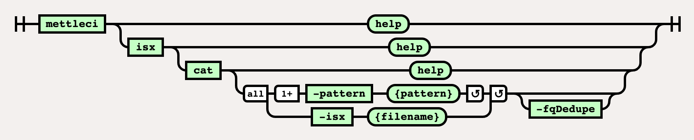

# ISX Cat Command

# Purpose

The `isx cat` command concatenates the specified ISX files into a single ISX output file.

# Syntax



(function(){ var data = { "addon\_key":"render-Markdown", "uniqueKey":"render-Markdown\_\_markdown580863200046713141", "key":"markdown", "moduleType":"dynamicContentMacros", "moduleLocation":"content", "cp":"/wiki", "general":"", "w":"", "h":"", "url":"https://d27i9fmzbobp10.cloudfront.net/render-markdown.html?pageId=864878623&pageVersion=175&macroHash=2f49b3d7-e8cc-4bb9-a240-0740ec3c8169&macroId=2f49b3d7-e8cc-4bb9-a240-0740ec3c8169&outputType=email&highlightStyle=&highlight=&xdm\_e=https%3A%2F%2Fdatamigrators.atlassian.net&xdm\_c=channel-render-Markdown\_\_markdown580863200046713141&cp=%2Fwiki&xdm\_deprecated\_addon\_key\_do\_not\_use=render-Markdown&lic=none&cv=1000.0.0-f660f55a6ec0", "structuredContext": "{\\"confluence\\":{\\"macro\\":{\\"outputType\\":\\"email\\",\\"hash\\":\\"2f49b3d7-e8cc-4bb9-a240-0740ec3c8169\\",\\"id\\":\\"2f49b3d7-e8cc-4bb9-a240-0740ec3c8169\\"},\\"content\\":{\\"type\\":\\"page\\",\\"version\\":\\"175\\",\\"id\\":\\"864878623\\"},\\"space\\":{\\"key\\":\\"MCIDOC\\",\\"id\\":\\"264011780\\"}},\\"url\\":{\\"displayUrl\\":\\"https://datamigrators.atlassian.net/wiki\\"}}", "contentClassifier":"content", "productCtx":"{\\"page.id\\":\\"864878623\\",\\"macro.hash\\":\\"2f49b3d7-e8cc-4bb9-a240-0740ec3c8169\\",\\"space.key\\":\\"MCIDOC\\",\\"page.type\\":\\"page\\",\\"content.version\\":\\"175\\",\\"page.title\\":\\"isx cat command syntax\\",\\"macro.localId\\":\\"\\",\\"macro.body\\":\\"### Syntax : isx cat \[options\]\\\\n### Description\\\\n\\\\n\* \*\*-pattern\*\*\\\\n\\\\n input isx pattern (can be used multiple times) Wildcards\\",\\": = | RAW | = :\\":null,\\"space.id\\":\\"264011780\\",\\"macro.truncated\\":\\"true\\",\\"content.type\\":\\"page\\",\\"output.type\\":\\"email\\",\\"page.version\\":\\"175\\",\\"macro.fragmentLocalId\\":\\"\\",\\"content.id\\":\\"864878623\\",\\"macro.id\\":\\"2f49b3d7-e8cc-4bb9-a240-0740ec3c8169\\"}", "timeZone":"UTC", "origin":"https://d27i9fmzbobp10.cloudfront.net", "hostOrigin":"https://datamigrators.atlassian.net", "sandbox":"allow-downloads allow-forms allow-modals allow-popups allow-popups-to-escape-sandbox allow-scripts allow-same-origin allow-top-navigation-by-user-activation allow-storage-access-by-user-activation", "apiMigrations": { "gdpr": true } } ; if(window.AP && window.AP.subCreate) { window.\_AP.appendConnectAddon(data); } else { require(\['ac/create'\], function(create){ create.appendConnectAddon(data); }); } // For Confluence App Analytics. This code works in conjunction with CFE's ConnectSupport.js. // Here, we add a listener to the initial HTML page that stores events if the ConnectSupport component // has not mounted yet. In CFE, we process the missed event data and disable this initial listener. const \_\_MAX\_EVENT\_ARRAY\_SIZE\_\_ = 20; const connectAppAnalytics = "ecosystem.confluence.connect.analytics"; window.connectHost && window.connectHost.onIframeEstablished((eventData) => { if (!window.\_\_CONFLUENCE\_CONNECT\_SUPPORT\_LOADED\_\_) { let events = JSON.parse(window.localStorage.getItem(connectAppAnalytics)) || \[\]; if (events.length >= \_\_MAX\_EVENT\_ARRAY\_SIZE\_\_) { events.shift(); } events.push(eventData); window.localStorage.setItem(connectAppAnalytics, JSON.stringify(events)); } }); }());

## Using the `-pattern` option

Ensure you use single quotes (') around the specified pattern, or your command shell will expand the pattern before passing it to the MettleCI command line!

For example, let’s assume we have three ISX files:

```
$> ls -l *.isx
-rw-r--r--@ 1 johnmckeever  staff   5.5M 10 Aug 12:46 jm_one.isx
-rw-r--r--@ 1 johnmckeever  staff   4.7M 10 Aug 12:46 jm_three.isx
-rw-r--r--@ 1 johnmckeever  staff   6.2M 10 Aug 12:46 jm_two.isx
```

The command…

```
$> mettleci isx cat \
   -isx out.isx \
   -pattern ‘jm_*.isx’
```

…will successfully concatenate your three files, but…

```
$> mettleci isx cat \
   -isx out.isx \
   -pattern jm_*.isx
```

…will not work, as `jm_*.isx` will expand to `jm_one.isx jm_three.isx jm_two.isx` which is syntactically incorrect.

## Using a single `-pattern` option

Note that a single `-pattern` option will take multiple patterns delimited by a comma. For example…

```
$> mettleci isx cat \
   -isx out.isx \
   -pattern 'jm_o*.isx,jm_t*.isx'
```

… will process files `jm_one.isx`, `jm_two.isx`, and `jm_three.isx`.

## Example

```
$> mettleci isx cat \
   -isx cat_test2.isx \
   -pattern ‘assets/CleanUser*.isx’ \
   -pattern ‘assets/ConnectorTest*.isx’
loaded "assets\CleanUserDataHC.isx
        added "TEST1-ENGN.DATAMIGRATORS.IO/dstage1/Jobs/CleanUserDataHC.pjb"
loaded "assets\ConnectorTest.isx
        added "TEST1-ENGN.DATAMIGRATORS.IO/dstage1/Jobs/ConnectorTest.pjb"
loaded "assets\CleanUserDataFC.isx
        added "TEST1-ENGN.DATAMIGRATORS.IO/dstage1/Jobs/CleanUserDataFC.pjb"
loaded "assets\ConnectorTest2.isx
        added "TEST1-ENGN.DATAMIGRATORS.IO/dstage1/Jobs/ConnectorTest2.pjb"
loaded "assets\CleanUserData2.isx
        added "TEST1-ENGN.DATAMIGRATORS.IO/dstage1/Jobs/CleanUserData2.pjb"
loaded "assets\CleanUserData.isx
        added "TEST1-ENGN.DATAMIGRATORS.IO/dstage1/Jobs/CleanUserData.pjb"
loaded "assets\CleanUserData3.isx
        added "TEST1-ENGN.DATAMIGRATORS.IO/dstage1/Jobs/CleanUserData3.pjb"
isx cat complete.

```