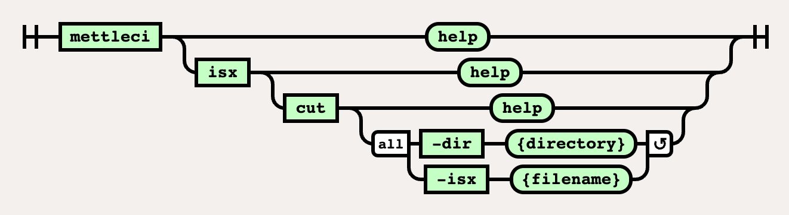

# ISX Cut Command

Cuts an ISX File containing the definition of multiple DataStage assets into multiple ISX files, each containing the definition of a single DataStage asset.

# Syntax



(function(){ var data = { "addon\_key":"render-Markdown", "uniqueKey":"render-Markdown\_\_markdown4820422655914662148", "key":"markdown", "moduleType":"dynamicContentMacros", "moduleLocation":"content", "cp":"/wiki", "general":"", "w":"", "h":"", "url":"https://d27i9fmzbobp10.cloudfront.net/render-markdown.html?pageId=864976936&pageVersion=180&macroHash=e8d78beb-74b5-4ddf-9dcc-60a62c477202&macroId=e8d78beb-74b5-4ddf-9dcc-60a62c477202&outputType=email&highlightStyle=&highlight=&xdm\_e=https%3A%2F%2Fdatamigrators.atlassian.net&xdm\_c=channel-render-Markdown\_\_markdown4820422655914662148&cp=%2Fwiki&xdm\_deprecated\_addon\_key\_do\_not\_use=render-Markdown&lic=none&cv=1000.0.0-f660f55a6ec0", "structuredContext": "{\\"confluence\\":{\\"editor\\":{\\"version\\":\\"\\\\\\"v2\\\\\\"\\"},\\"macro\\":{\\"outputType\\":\\"email\\",\\"hash\\":\\"e8d78beb-74b5-4ddf-9dcc-60a62c477202\\",\\"id\\":\\"e8d78beb-74b5-4ddf-9dcc-60a62c477202\\"},\\"content\\":{\\"type\\":\\"page\\",\\"version\\":\\"180\\",\\"id\\":\\"864976936\\"},\\"space\\":{\\"key\\":\\"MCIDOC\\",\\"id\\":\\"264011780\\"}},\\"url\\":{\\"displayUrl\\":\\"https://datamigrators.atlassian.net/wiki\\"}}", "contentClassifier":"content", "productCtx":"{\\"page.id\\":\\"864976936\\",\\"macro.hash\\":\\"e8d78beb-74b5-4ddf-9dcc-60a62c477202\\",\\"space.key\\":\\"MCIDOC\\",\\"page.type\\":\\"page\\",\\"content.version\\":\\"180\\",\\"page.title\\":\\"isx cut command syntax\\",\\"macro.localId\\":\\"\\",\\"macro.body\\":\\"### Syntax : isx cut \[options\]\\\\n### Description\\\\n\\\\n\* \*\*-dir\*\*\\\\n\\\\n output directory\\\\n\\\\n \*Required\*\\\\n\* \*\*-isx\*\*\\\\n\\\\n isx package to cut\\\\n\\\\n \\",\\": = | RAW | = :\\":null,\\"space.id\\":\\"264011780\\",\\"macro.truncated\\":\\"true\\",\\"content.type\\":\\"page\\",\\"output.type\\":\\"email\\",\\"page.version\\":\\"180\\",\\"macro.fragmentLocalId\\":\\"\\",\\"content.id\\":\\"864976936\\",\\"macro.id\\":\\"e8d78beb-74b5-4ddf-9dcc-60a62c477202\\",\\"editor.version\\":\\"\\\\\\"v2\\\\\\"\\"}", "timeZone":"UTC", "origin":"https://d27i9fmzbobp10.cloudfront.net", "hostOrigin":"https://datamigrators.atlassian.net", "sandbox":"allow-downloads allow-forms allow-modals allow-popups allow-popups-to-escape-sandbox allow-scripts allow-same-origin allow-top-navigation-by-user-activation allow-storage-access-by-user-activation", "apiMigrations": { "gdpr": true } } ; if(window.AP && window.AP.subCreate) { window.\_AP.appendConnectAddon(data); } else { require(\['ac/create'\], function(create){ create.appendConnectAddon(data); }); } // For Confluence App Analytics. This code works in conjunction with CFE's ConnectSupport.js. // Here, we add a listener to the initial HTML page that stores events if the ConnectSupport component // has not mounted yet. In CFE, we process the missed event data and disable this initial listener. const \_\_MAX\_EVENT\_ARRAY\_SIZE\_\_ = 20; const connectAppAnalytics = "ecosystem.confluence.connect.analytics"; window.connectHost && window.connectHost.onIframeEstablished((eventData) => { if (!window.\_\_CONFLUENCE\_CONNECT\_SUPPORT\_LOADED\_\_) { let events = JSON.parse(window.localStorage.getItem(connectAppAnalytics)) || \[\]; if (events.length >= \_\_MAX\_EVENT\_ARRAY\_SIZE\_\_) { events.shift(); } events.push(eventData); window.localStorage.setItem(connectAppAnalytics, JSON.stringify(events)); } }); }());

# Example

```
$> mettleci isx cut \ 
   -dir output_dir \
   -isx cut_test.isx 
```