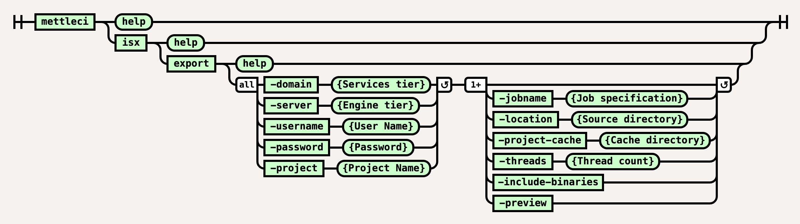

# ISX Export Command

# Purpose

Exports DataStage Assets to ISX files, one file per Asset. This adds a number of capabilities over the IBM-supplied commands, including…

*   Support for high-performance multi-threaded operation (using the `-threads` switch)
    
*   Support for incremental exports (using the `-project-cache` parameter)
    

See [Repeatable DataStage Project Deployments](https://datamigrators.atlassian.net/wiki/spaces/MCIDOC/pages/1266843717) for more details on how the `-project-cache` parameter is used to implement **incremental exports**. For more information on using the `-project-cache` parameter see our [detailed explanation](https://datamigrators.atlassian.net/wiki/spaces/MCIDOC/pages/1356890161/MettleCI+CLI+and+the+project-cache+directory).

> [!INFO]
> Note that the `isx export` commands requires access to a correctly-functioning `istool` command and so is only executable on a Windows-based DataStage Client Tier.

# Syntax



(function(){ var data = { "addon\_key":"render-Markdown", "uniqueKey":"render-Markdown\_\_markdown3901049312529964919", "key":"markdown", "moduleType":"dynamicContentMacros", "moduleLocation":"content", "cp":"/wiki", "general":"", "w":"", "h":"", "url":"https://d27i9fmzbobp10.cloudfront.net/render-markdown.html?pageId=864813087&pageVersion=175&macroHash=9ff5cb83-7cba-49bb-bd77-40c35c390eb9&macroId=9ff5cb83-7cba-49bb-bd77-40c35c390eb9&outputType=email&highlightStyle=&highlight=&xdm\_e=https%3A%2F%2Fdatamigrators.atlassian.net&xdm\_c=channel-render-Markdown\_\_markdown3901049312529964919&cp=%2Fwiki&xdm\_deprecated\_addon\_key\_do\_not\_use=render-Markdown&lic=none&cv=1000.0.0-f660f55a6ec0", "structuredContext": "{\\"confluence\\":{\\"macro\\":{\\"outputType\\":\\"email\\",\\"hash\\":\\"9ff5cb83-7cba-49bb-bd77-40c35c390eb9\\",\\"id\\":\\"9ff5cb83-7cba-49bb-bd77-40c35c390eb9\\"},\\"content\\":{\\"type\\":\\"page\\",\\"version\\":\\"175\\",\\"id\\":\\"864813087\\"},\\"space\\":{\\"key\\":\\"MCIDOC\\",\\"id\\":\\"264011780\\"}},\\"url\\":{\\"displayUrl\\":\\"https://datamigrators.atlassian.net/wiki\\"}}", "contentClassifier":"content", "productCtx":"{\\"page.id\\":\\"864813087\\",\\"macro.hash\\":\\"9ff5cb83-7cba-49bb-bd77-40c35c390eb9\\",\\"space.key\\":\\"MCIDOC\\",\\"page.type\\":\\"page\\",\\"content.version\\":\\"175\\",\\"page.title\\":\\"isx export command syntax\\",\\"macro.localId\\":\\"\\",\\"macro.body\\":\\"### Syntax : isx export \[options\]\\\\n### Description\\\\n\\\\n\* \*\*-domain\*\*\\\\n\\\\n Services tier\\\\n\\\\n \*Required\*\\\\n\* \*\*-server\*\*\\\\n\\\\n Engine tier\\\\n\\\\n \\",\\": = | RAW | = :\\":null,\\"space.id\\":\\"264011780\\",\\"macro.truncated\\":\\"true\\",\\"content.type\\":\\"page\\",\\"output.type\\":\\"email\\",\\"page.version\\":\\"175\\",\\"macro.fragmentLocalId\\":\\"\\",\\"content.id\\":\\"864813087\\",\\"macro.id\\":\\"9ff5cb83-7cba-49bb-bd77-40c35c390eb9\\"}", "timeZone":"UTC", "origin":"https://d27i9fmzbobp10.cloudfront.net", "hostOrigin":"https://datamigrators.atlassian.net", "sandbox":"allow-downloads allow-forms allow-modals allow-popups allow-popups-to-escape-sandbox allow-scripts allow-same-origin allow-top-navigation-by-user-activation allow-storage-access-by-user-activation", "apiMigrations": { "gdpr": true } } ; if(window.AP && window.AP.subCreate) { window.\_AP.appendConnectAddon(data); } else { require(\['ac/create'\], function(create){ create.appendConnectAddon(data); }); } // For Confluence App Analytics. This code works in conjunction with CFE's ConnectSupport.js. // Here, we add a listener to the initial HTML page that stores events if the ConnectSupport component // has not mounted yet. In CFE, we process the missed event data and disable this initial listener. const \_\_MAX\_EVENT\_ARRAY\_SIZE\_\_ = 20; const connectAppAnalytics = "ecosystem.confluence.connect.analytics"; window.connectHost && window.connectHost.onIframeEstablished((eventData) => { if (!window.\_\_CONFLUENCE\_CONNECT\_SUPPORT\_LOADED\_\_) { let events = JSON.parse(window.localStorage.getItem(connectAppAnalytics)) || \[\]; if (events.length >= \_\_MAX\_EVENT\_ARRAY\_SIZE\_\_) { events.shift(); } events.push(eventData); window.localStorage.setItem(connectAppAnalytics, JSON.stringify(events)); } }); }());

# Examples

## Export by regex usage

Export a subset of a project using the `-jobname` parameter which accepts a [regular expression](https://en.wikipedia.org/wiki/Regular_expression) filter.

The export location is structured to mirror the structure of your DataStage repository. In the example below we use a `-jobname` filter to select a set of jobs in the `/Jobs/Load` category of our DataStage project. The `isx export` command mirrors this be creating our exported ISX files in a `/Jobs/Load` folder which it creates during the export process.

```
# Export our ISX files

C:\MettleCI\cli> mettleci isx export ^
     -domain myteam-svcs.corp.com:59445 ^
     -username myuser -password mypassword ^
     -server myteam-engn.corp.com ^
     -project myproject ^
     -jobname .*LD_S.*
Exporting [.*LD_S.*] from repository...
Exporting DataStage assets...
 * Export 'myteam-engn.corp.com/myproject/Jobs/Load/LD_SUPPLIER.pjb' - COMPLETED
 * Export 'myteam-engn.corp.com/myproject/Jobs/Load/LD_STOCK_HOLDING.pjb' - COMPLETED
 * Export 'myteam-engn.corp.com/myproject/Jobs/Load/LD_STOCKITEM.pjb' - COMPLETED
 * Export 'myteam-engn.corp.com/myproject/Jobs/Load/LD_SALE.pjb' - COMPLETED
Export complete

# See the created Jobs directory

c:\MettleCI\cli>dir
 Volume in drive C has no label.
 Volume Serial Number is 8C74-3344

 Directory of c:\MettleCI\cli

15/09/2022  07:29 PM    <DIR>          .
15/09/2022  07:29 PM    <DIR>          ..
15/09/2022  07:29 PM    <DIR>          <SNIP>
15/09/2022  07:29 PM    <DIR>          Jobs
               8 File(s)          9,555 bytes
               8 Dir(s)  15,827,730,432 bytes free

# ... sub-directory

c:\MettleCI\cli>dir Jobs
 Volume in drive C has no label.
 Volume Serial Number is 8C74-3344

 Directory of c:\MettleCI\cli\Jobs

15/09/2022  07:29 PM    <DIR>          .
15/09/2022  07:29 PM    <DIR>          ..
15/09/2022  07:29 PM    <DIR>          Load
               0 File(s)              0 bytes
               3 Dir(s)  15,827,730,432 bytes free

# ... and our ISX files

c:\MettleCI\cli>dir Jobs\Load
 Volume in drive C has no label.
 Volume Serial Number is 8C74-3344

 Directory of c:\MettleCI\cli\Jobs\Load

15/09/2022  07:29 PM    <DIR>          .
15/09/2022  07:29 PM    <DIR>          ..
15/09/2022  07:29 PM            14,161 LD_SALE.isx
15/09/2022  07:29 PM            13,623 LD_STOCKITEM.isx
15/09/2022  07:29 PM            10,010 LD_STOCK_HOLDING.isx
15/09/2022  07:29 PM            11,916 LD_SUPPLIER.isx
               4 File(s)         49,710 bytes
               2 Dir(s)  15,827,783,680 bytes free

c:\MettleCI\cli>
```

## Incremental export usage

Incrementally export project binaries, `C:/shared/myproject/export` is a directory containing previously exported ISX files and `C:/shared/myproject/cache` contains *state* files related to incremental operations performed against `myproject`:

```
C:\MettleCI\cli\> mettleci isx export ^
     -domain myteam-svcs.corp.com:59445 ^
     -username myuser -password mypassword  ^
     -server myteam-engn.corp.com  ^
     -project myproject  ^
     -location C:\shared\myproject\export  ^
     -include-binaries  ^
     -project-cache C:\shared\myproject\cache
Analyzing test2-engn.datamigrators.io/myproject
Attempting to identify changes with 4 working threads.
Inspecting DataStage assets for changes...
 * Check myteam-engn.corp.com/myproject/Jobs/Connections/DMSqlServer_DW.dcn - COMPLETED
 * Check myteam-engn.corp.com/myproject/Jobs/Connections/DMSqlServer_OLTP.dcn - COMPLETED
<SNIP>
 * Check myteam-engn.corp.com/myproject/Jobs/ParameterSets/pGlobal.pst - COMPLETED
 * Check myteam-engn.corp.com/myproject/Jobs/ParameterSets/pDMSqlServer_DW.pst - COMPLETED
Change identification complete
Inspecting ParameterSet definition changes...
ParameterSet definition change identification complete
Deleting assets...
 * Export 'C:\shared\myproject\export\Jobs\Transform\TR_PURCHASE.isx/Jobs/Transform/TR_PURCHASE.pjb' - DELETED
 * Export 'C:\shared\myproject\export\Jobs\Transform\TR_ORDERS.isx/Jobs/Transform/TR_ORDERS.pjb' - DELETED
Deletion complete
Exporting DataStage assets...
 * Export 'myteam-engn.corp.com/myproject/Jobs/Transform/TR_ORDERS.pjb' - COMPLETED
 * Export 'myteam-engn.corp.com/myproject/Jobs/Transform/TR_PURCHASE.pjb' - COMPLETED
Export complete
Attempting to identify last change with 4 working threads.
Inspecting DataStage assets for last change...
 * Check myteam-engn.corp.com/myproject/Jobs/ParameterSets/pDMSqlServer_OLTP.pst - COMPLETED
 * Check myteam-engn.corp.com/myproject/Jobs/ParameterSets/pGlobal.pst - COMPLETED
<SNIP>
 * Check myteam-engn.corp.com/myproject/Jobs/Transform/TR_PURCHASE.pjb - COMPLETED
 * Check myteam-engn.corp.com/myproject/Jobs/Transform/TR_ORDERS.pjb - COMPLETED
Last change identification complete
```

# See also

*   An example using `mettle isx export` to support a [multi-job compliance query](https://datamigrators.atlassian.net/wiki/spaces/MCIDOC/pages/408322069/Compliance+Test+Command#Example).