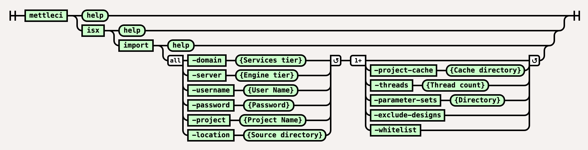

# ISX Import Command

## Purpose

Imports the contents of ISX files underneath a defined location into a DataStage project.  Incremental imports can be performed by including the `-project-cache` parameter.

See [Repeatable DataStage Project Deployments](https://datamigrators.atlassian.net/wiki/spaces/MCIDOC/pages/1266843717/Repeatable+DataStage+Project+Deployments) for more details on how the `-project-cache` parameter is used to implement **incremental imports**. For more information on using the `-project-cache` parameter see our [detailed explanation](https://datamigrators.atlassian.net/wiki/spaces/MCIDOC/pages/1356890161/MettleCI+CLI+and+the+project-cache+directory).

> [!INFO]
> Note that the `isx import` commands requires access to a correctly-functioning `istool` command and so is only executable on a Windows-based DataStage Client Tier.

# Syntax



(function(){ var data = { "addon\_key":"render-Markdown", "uniqueKey":"render-Markdown\_\_markdown234177482513795527", "key":"markdown", "moduleType":"dynamicContentMacros", "moduleLocation":"content", "cp":"/wiki", "general":"", "w":"", "h":"", "url":"https://d27i9fmzbobp10.cloudfront.net/render-markdown.html?pageId=864944156&pageVersion=187&macroHash=87c0444f-21e1-41fe-9e5b-ba36660f72eb&macroId=87c0444f-21e1-41fe-9e5b-ba36660f72eb&outputType=email&highlightStyle=&highlight=&xdm\_e=https%3A%2F%2Fdatamigrators.atlassian.net&xdm\_c=channel-render-Markdown\_\_markdown234177482513795527&cp=%2Fwiki&xdm\_deprecated\_addon\_key\_do\_not\_use=render-Markdown&lic=none&cv=1000.0.0-f660f55a6ec0", "structuredContext": "{\\"confluence\\":{\\"macro\\":{\\"outputType\\":\\"email\\",\\"hash\\":\\"87c0444f-21e1-41fe-9e5b-ba36660f72eb\\",\\"id\\":\\"87c0444f-21e1-41fe-9e5b-ba36660f72eb\\"},\\"content\\":{\\"type\\":\\"page\\",\\"version\\":\\"187\\",\\"id\\":\\"864944156\\"},\\"space\\":{\\"key\\":\\"MCIDOC\\",\\"id\\":\\"264011780\\"}},\\"url\\":{\\"displayUrl\\":\\"https://datamigrators.atlassian.net/wiki\\"}}", "contentClassifier":"content", "productCtx":"{\\"page.id\\":\\"864944156\\",\\"macro.hash\\":\\"87c0444f-21e1-41fe-9e5b-ba36660f72eb\\",\\"space.key\\":\\"MCIDOC\\",\\"page.type\\":\\"page\\",\\"content.version\\":\\"187\\",\\"page.title\\":\\"isx import command syntax\\",\\"macro.localId\\":\\"\\",\\"macro.body\\":\\"### Syntax : isx import \[options\]\\\\n### Description\\\\n\\\\n\* \*\*-domain\*\*\\\\n\\\\n Services tier\\\\n\\\\n \*Required\*\\\\n\* \*\*-server\*\*\\\\n\\\\n Engine tier\\\\n\\\\n \\",\\": = | RAW | = :\\":null,\\"space.id\\":\\"264011780\\",\\"macro.truncated\\":\\"true\\",\\"content.type\\":\\"page\\",\\"output.type\\":\\"email\\",\\"page.version\\":\\"187\\",\\"macro.fragmentLocalId\\":\\"\\",\\"content.id\\":\\"864944156\\",\\"macro.id\\":\\"87c0444f-21e1-41fe-9e5b-ba36660f72eb\\"}", "timeZone":"UTC", "origin":"https://d27i9fmzbobp10.cloudfront.net", "hostOrigin":"https://datamigrators.atlassian.net", "sandbox":"allow-downloads allow-forms allow-modals allow-popups allow-popups-to-escape-sandbox allow-scripts allow-same-origin allow-top-navigation-by-user-activation allow-storage-access-by-user-activation", "apiMigrations": { "gdpr": true } } ; if(window.AP && window.AP.subCreate) { window.\_AP.appendConnectAddon(data); } else { require(\['ac/create'\], function(create){ create.appendConnectAddon(data); }); } // For Confluence App Analytics. This code works in conjunction with CFE's ConnectSupport.js. // Here, we add a listener to the initial HTML page that stores events if the ConnectSupport component // has not mounted yet. In CFE, we process the missed event data and disable this initial listener. const \_\_MAX\_EVENT\_ARRAY\_SIZE\_\_ = 20; const connectAppAnalytics = "ecosystem.confluence.connect.analytics"; window.connectHost && window.connectHost.onIframeEstablished((eventData) => { if (!window.\_\_CONFLUENCE\_CONNECT\_SUPPORT\_LOADED\_\_) { let events = JSON.parse(window.localStorage.getItem(connectAppAnalytics)) || \[\]; if (events.length >= \_\_MAX\_EVENT\_ARRAY\_SIZE\_\_) { events.shift(); } events.push(eventData); window.localStorage.setItem(connectAppAnalytics, JSON.stringify(events)); } }); }());

# Examples

## Import all jobs from a given directory

```
$> mettleci isx import \
   -domain test2-svcs.datamigrators.io:59445 \
   -username myuser -password mypassword \
   -server test2-engn.datamigrators.io \
   -project myproject \
   -location /tmp/isx_location

Analyzing test2-engn.datamigrators.io/myproject
Optimising assets for import
Attempting to import with 1 working threads.
Importing DataStage assets...
 * Import 'test2-engn.datamigrators.io/myproject/Jobs/Load/LD_SALE.pjb' - COMPLETED
 * Import 'test2-engn.datamigrators.io/myproject/Jobs/Load/LD_STOCK_HOLDING.pjb' - COMPLETED
 * Import 'test2-engn.datamigrators.io/myproject/Jobs/Load/LD_STOCKITEM.pjb' - COMPLETED
 * Import 'test2-engn.datamigrators.io/myproject/Jobs/Load/LD_SUPPLIER.pjb' - COMPLETED
Import complete
```

## Incrementally import project binaries only

This example incrementally imports project binaries, ignoring Job design information. Any Jobs in the project which do not exist in the source directory are deleted from the project.  `C:/shared/myproject/export` is a directory containing ISX files (with binaries) to be imported and `C:/shared/myproject/cache` contains *state* files related to incremental operations performed against `myproject`:

```
$> mettleci.cmd isx import \
   -domain test2-svcs.datamigrators.io:59445 \
   -username myuser -password mypassword \
   -server test2-engn.datamigrators.io \
   -project myproject \
   -location c:/shared/myproject/export \
   -exclude-designs \
   -project-cache c:/shared/myproject/cache

Analyzing test2-engn.datamigrators.io/myproject
Attempting to identify changes with 4 working threads.
Inspecting DataStage assets for changes...
 * Check test2-engn.datamigrators.io/myproject/Jobs/Transform/TR_MOVEMENT.pjb - COMPLETED
 * Check test2-engn.datamigrators.io/myproject/Jobs/Load/LD_TRANSACTION_TYPE.pjb - COMPLETED
<SNIP>
 * Check test2-engn.datamigrators.io/myproject/Jobs/ParameterSets/pDMSqlServer_DW.pst - COMPLETED
 * Check test2-engn.datamigrators.io/myproject/Jobs/ParameterSets/pGlobal.pst - COMPLETED
Change identification complete
Deleting assets...
 * Delete 'test2-engn.datamigrators.io/myproject/Jobs/Transform/TR_ORDERS.pjb' - COMPLETED
 * Delete 'test2-engn.datamigrators.io/myproject/Jobs/Transform/TR_PURCHASE.pjb' - COMPLETED
Deletion complete
Optimising assets for import
Attempting to import with 1 working threads.
Importing DataStage assets...
 * Import 'test2-engn.datamigrators.io/myproject/Jobs/Transform/TR_PURCHASE.pjb' - COMPLETED
 * Import 'test2-engn.datamigrators.io/myproject/Jobs/Transform/TR_ORDERS.pjb' - COMPLETED
Import complete
Attempting to identify last change with 4 working threads.
Inspecting DataStage assets for last change...
 * Check test2-engn.datamigrators.io/myproject/Jobs/ParameterSets/pDMSqlServer_OLTP.pst - COMPLETED
 * Check test2-engn.datamigrators.io/myproject/Jobs/ParameterSets/pDMSqlServer_DW.pst - COMPLETED
<SNIP>
 * Check test2-engn.datamigrators.io/myproject/Jobs/Load/LD_EMPLOYEE.pjb - COMPLETED
 * Check test2-engn.datamigrators.io/myproject/Jobs/Load/LD_STOCKITEM.pjb - COMPLETED
Last change identification complete
```