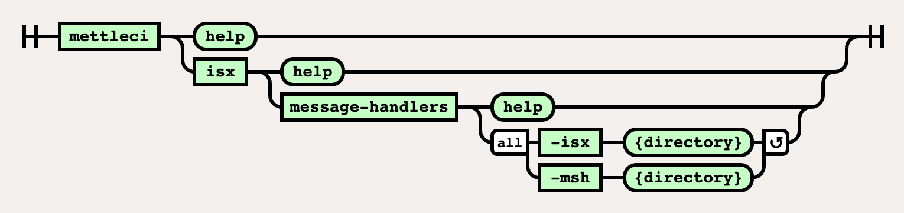

# ISX Message-Handlers Command

# Purpose

Inject Job-level Message Handlers (defined in one or more supplied files) into ISX files intended for subsequent import into DataStage.

# Syntax



(function(){ var data = { "addon\_key":"render-Markdown", "uniqueKey":"render-Markdown\_\_markdown7167767353854473763", "key":"markdown", "moduleType":"dynamicContentMacros", "moduleLocation":"content", "cp":"/wiki", "general":"", "w":"", "h":"", "url":"https://d27i9fmzbobp10.cloudfront.net/render-markdown.html?pageId=864813079&pageVersion=178&macroHash=82dbfa27-19ca-4211-a0ce-10cbe836b2f9&macroId=82dbfa27-19ca-4211-a0ce-10cbe836b2f9&outputType=email&highlightStyle=&highlight=&xdm\_e=https%3A%2F%2Fdatamigrators.atlassian.net&xdm\_c=channel-render-Markdown\_\_markdown7167767353854473763&cp=%2Fwiki&xdm\_deprecated\_addon\_key\_do\_not\_use=render-Markdown&lic=none&cv=1000.0.0-f660f55a6ec0", "structuredContext": "{\\"confluence\\":{\\"macro\\":{\\"outputType\\":\\"email\\",\\"hash\\":\\"82dbfa27-19ca-4211-a0ce-10cbe836b2f9\\",\\"id\\":\\"82dbfa27-19ca-4211-a0ce-10cbe836b2f9\\"},\\"content\\":{\\"type\\":\\"page\\",\\"version\\":\\"178\\",\\"id\\":\\"864813079\\"},\\"space\\":{\\"key\\":\\"MCIDOC\\",\\"id\\":\\"264011780\\"}},\\"url\\":{\\"displayUrl\\":\\"https://datamigrators.atlassian.net/wiki\\"}}", "contentClassifier":"content", "productCtx":"{\\"page.id\\":\\"864813079\\",\\"macro.hash\\":\\"82dbfa27-19ca-4211-a0ce-10cbe836b2f9\\",\\"space.key\\":\\"MCIDOC\\",\\"page.type\\":\\"page\\",\\"content.version\\":\\"178\\",\\"page.title\\":\\"isx message-handlers command syntax\\",\\"macro.localId\\":\\"\\",\\"macro.body\\":\\"### Syntax : isx message-handlers \[options\]\\\\n### Description\\\\n\\\\n\* \*\*-isx\*\*\\\\n\\\\n ISX directory\\\\n\\\\n \*Required\*\\\\n\* \*\*-msh\*\*\\\\n\\\\n Message han\\",\\": = | RAW | = :\\":null,\\"space.id\\":\\"264011780\\",\\"macro.truncated\\":\\"true\\",\\"content.type\\":\\"page\\",\\"output.type\\":\\"email\\",\\"page.version\\":\\"178\\",\\"macro.fragmentLocalId\\":\\"\\",\\"content.id\\":\\"864813079\\",\\"macro.id\\":\\"82dbfa27-19ca-4211-a0ce-10cbe836b2f9\\"}", "timeZone":"UTC", "origin":"https://d27i9fmzbobp10.cloudfront.net", "hostOrigin":"https://datamigrators.atlassian.net", "sandbox":"allow-downloads allow-forms allow-modals allow-popups allow-popups-to-escape-sandbox allow-scripts allow-same-origin allow-top-navigation-by-user-activation allow-storage-access-by-user-activation", "apiMigrations": { "gdpr": true } } ; if(window.AP && window.AP.subCreate) { window.\_AP.appendConnectAddon(data); } else { require(\['ac/create'\], function(create){ create.appendConnectAddon(data); }); } // For Confluence App Analytics. This code works in conjunction with CFE's ConnectSupport.js. // Here, we add a listener to the initial HTML page that stores events if the ConnectSupport component // has not mounted yet. In CFE, we process the missed event data and disable this initial listener. const \_\_MAX\_EVENT\_ARRAY\_SIZE\_\_ = 20; const connectAppAnalytics = "ecosystem.confluence.connect.analytics"; window.connectHost && window.connectHost.onIframeEstablished((eventData) => { if (!window.\_\_CONFLUENCE\_CONNECT\_SUPPORT\_LOADED\_\_) { let events = JSON.parse(window.localStorage.getItem(connectAppAnalytics)) || \[\]; if (events.length >= \_\_MAX\_EVENT\_ARRAY\_SIZE\_\_) { events.shift(); } events.push(eventData); window.localStorage.setItem(connectAppAnalytics, JSON.stringify(events)); } }); }());

# Example

```
$> mettleci isx message-handlers \
   -isx isx_dir \
   -msh msh_handler_dir
```

* * *

## See also

*   [Deploying Message Handlers with Bamboo](https://datamigrators.atlassian.net/wiki/spaces/MCIDOC/pages/2687074305/Deploying+Message+Handlers+with+Bamboo)
    
*   [DataStage Message Handlers Bamboo Task](https://datamigrators.atlassian.net/wiki/spaces/MCIDOC/pages/412155905/Bamboo+DataStage+Message+Handlers+Task)