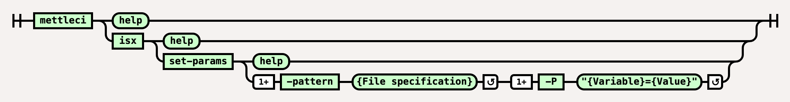

# ISX Set-Params Command

# Purpose

Update Job Parameter values within an ISX file.

File paths supplied to the `-patterns` parameter must follow [Ant-style syntax](https://ant.apache.org/manual/dirtasks.html).

# Syntax



(function(){ var data = { "addon\_key":"render-Markdown", "uniqueKey":"render-Markdown\_\_markdown6355707901155465919", "key":"markdown", "moduleType":"dynamicContentMacros", "moduleLocation":"content", "cp":"/wiki", "general":"", "w":"", "h":"", "url":"https://d27i9fmzbobp10.cloudfront.net/render-markdown.html?pageId=864845848&pageVersion=175&macroHash=a4c14d1c-f35a-441c-9ec6-8b326e2b7119&macroId=a4c14d1c-f35a-441c-9ec6-8b326e2b7119&outputType=email&highlightStyle=&highlight=&xdm\_e=https%3A%2F%2Fdatamigrators.atlassian.net&xdm\_c=channel-render-Markdown\_\_markdown6355707901155465919&cp=%2Fwiki&xdm\_deprecated\_addon\_key\_do\_not\_use=render-Markdown&lic=none&cv=1000.0.0-f660f55a6ec0", "structuredContext": "{\\"confluence\\":{\\"macro\\":{\\"outputType\\":\\"email\\",\\"hash\\":\\"a4c14d1c-f35a-441c-9ec6-8b326e2b7119\\",\\"id\\":\\"a4c14d1c-f35a-441c-9ec6-8b326e2b7119\\"},\\"content\\":{\\"type\\":\\"page\\",\\"version\\":\\"175\\",\\"id\\":\\"864845848\\"},\\"space\\":{\\"key\\":\\"MCIDOC\\",\\"id\\":\\"264011780\\"}},\\"url\\":{\\"displayUrl\\":\\"https://datamigrators.atlassian.net/wiki\\"}}", "contentClassifier":"content", "productCtx":"{\\"page.id\\":\\"864845848\\",\\"macro.hash\\":\\"a4c14d1c-f35a-441c-9ec6-8b326e2b7119\\",\\"space.key\\":\\"MCIDOC\\",\\"page.type\\":\\"page\\",\\"content.version\\":\\"175\\",\\"page.title\\":\\"isx set-params command syntax\\",\\"macro.localId\\":\\"\\",\\"macro.body\\":\\"### Syntax : isx set-params \[options\]\\\\n### Description\\\\n\\\\n\* \*\*-P\*\*\\\\n\\\\n parameter replacement (can be used multiple times)\\\\n Syntax: \\",\\": = | RAW | = :\\":null,\\"space.id\\":\\"264011780\\",\\"macro.truncated\\":\\"true\\",\\"content.type\\":\\"page\\",\\"output.type\\":\\"email\\",\\"page.version\\":\\"175\\",\\"macro.fragmentLocalId\\":\\"\\",\\"content.id\\":\\"864845848\\",\\"macro.id\\":\\"a4c14d1c-f35a-441c-9ec6-8b326e2b7119\\"}", "timeZone":"UTC", "origin":"https://d27i9fmzbobp10.cloudfront.net", "hostOrigin":"https://datamigrators.atlassian.net", "sandbox":"allow-downloads allow-forms allow-modals allow-popups allow-popups-to-escape-sandbox allow-scripts allow-same-origin allow-top-navigation-by-user-activation allow-storage-access-by-user-activation", "apiMigrations": { "gdpr": true } } ; if(window.AP && window.AP.subCreate) { window.\_AP.appendConnectAddon(data); } else { require(\['ac/create'\], function(create){ create.appendConnectAddon(data); }); } // For Confluence App Analytics. This code works in conjunction with CFE's ConnectSupport.js. // Here, we add a listener to the initial HTML page that stores events if the ConnectSupport component // has not mounted yet. In CFE, we process the missed event data and disable this initial listener. const \_\_MAX\_EVENT\_ARRAY\_SIZE\_\_ = 20; const connectAppAnalytics = "ecosystem.confluence.connect.analytics"; window.connectHost && window.connectHost.onIframeEstablished((eventData) => { if (!window.\_\_CONFLUENCE\_CONNECT\_SUPPORT\_LOADED\_\_) { let events = JSON.parse(window.localStorage.getItem(connectAppAnalytics)) || \[\]; if (events.length >= \_\_MAX\_EVENT\_ARRAY\_SIZE\_\_) { events.shift(); } events.push(eventData); window.localStorage.setItem(connectAppAnalytics, JSON.stringify(events)); } }); }());

# Example

The following command recursively finds all `EX_*.isx` and `LD_*.isx` files relative to the current working directory and modifies those files to set …

*   the `$APT_CONFIG_FILE` parameter to the value `/app/IBM/InformationServer/Server/Configs/default.apt`, and
    
*   the `MyParameterName` parameter to the value `MyParameterValue`.
    

```
$> mettleci isx set-params \
    -pattern "**/EX_*.isx" \
    -pattern "**/LD_*.isx" \
    -P "$APT_CONFIG_FILE=/app/IBM/InformationServer/Server/Configs/default.apt" \
    -P "MyParameterName=MyParameterValue"    
```