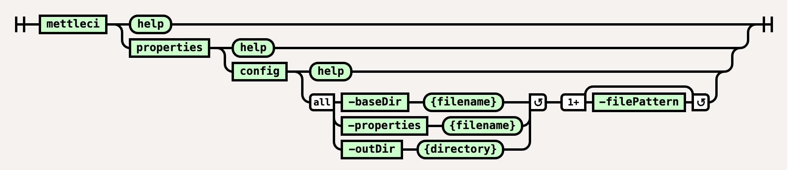

# Properties Config Command

# Purpose

Replaces variables in specified files using a properties file. It will use any environment variables on the system and variables defined in a properties file.

This command is invoked by your build system agent and executes under the user account you configured for that agent in your build system. The command itself does not require any credentials as it runs natively on your [MettleCI Agent Host](https://datamigrators.atlassian.net/wiki/spaces/MCIDOC/pages/1770520622/A+Summary+of+MettleCI+Components#MettleCI-Agent-Host).

# Syntax



(function(){ var data = { "addon\_key":"render-Markdown", "uniqueKey":"render-Markdown\_\_markdown4706027403538111366", "key":"markdown", "moduleType":"dynamicContentMacros", "moduleLocation":"content", "cp":"/wiki", "general":"", "w":"", "h":"", "url":"https://d27i9fmzbobp10.cloudfront.net/render-markdown.html?pageId=865239044&pageVersion=173&macroHash=ebd60e0e-5fc8-4e5b-91f1-84b0a3f9a6eb&macroId=ebd60e0e-5fc8-4e5b-91f1-84b0a3f9a6eb&outputType=email&highlightStyle=&highlight=&xdm\_e=https%3A%2F%2Fdatamigrators.atlassian.net&xdm\_c=channel-render-Markdown\_\_markdown4706027403538111366&cp=%2Fwiki&xdm\_deprecated\_addon\_key\_do\_not\_use=render-Markdown&lic=none&cv=1000.0.0-f660f55a6ec0", "structuredContext": "{\\"confluence\\":{\\"macro\\":{\\"outputType\\":\\"email\\",\\"hash\\":\\"ebd60e0e-5fc8-4e5b-91f1-84b0a3f9a6eb\\",\\"id\\":\\"ebd60e0e-5fc8-4e5b-91f1-84b0a3f9a6eb\\"},\\"content\\":{\\"type\\":\\"page\\",\\"version\\":\\"173\\",\\"id\\":\\"865239044\\"},\\"space\\":{\\"key\\":\\"MCIDOC\\",\\"id\\":\\"264011780\\"}},\\"url\\":{\\"displayUrl\\":\\"https://datamigrators.atlassian.net/wiki\\"}}", "contentClassifier":"content", "productCtx":"{\\"page.id\\":\\"865239044\\",\\"macro.hash\\":\\"ebd60e0e-5fc8-4e5b-91f1-84b0a3f9a6eb\\",\\"space.key\\":\\"MCIDOC\\",\\"page.type\\":\\"page\\",\\"content.version\\":\\"173\\",\\"page.title\\":\\"properties config command syntax\\",\\"macro.localId\\":\\"\\",\\"macro.body\\":\\"### Syntax : properties config \[options\]\\\\n### Description\\\\n\\\\n\* \*\*-baseDir\*\*\\\\n\\\\n The directory to look for files in\\\\n\\\\n \*Required\*\\\\n\* \*\\",\\": = | RAW | = :\\":null,\\"space.id\\":\\"264011780\\",\\"macro.truncated\\":\\"true\\",\\"content.type\\":\\"page\\",\\"output.type\\":\\"email\\",\\"page.version\\":\\"173\\",\\"macro.fragmentLocalId\\":\\"\\",\\"content.id\\":\\"865239044\\",\\"macro.id\\":\\"ebd60e0e-5fc8-4e5b-91f1-84b0a3f9a6eb\\"}", "timeZone":"UTC", "origin":"https://d27i9fmzbobp10.cloudfront.net", "hostOrigin":"https://datamigrators.atlassian.net", "sandbox":"allow-downloads allow-forms allow-modals allow-popups allow-popups-to-escape-sandbox allow-scripts allow-same-origin allow-top-navigation-by-user-activation allow-storage-access-by-user-activation", "apiMigrations": { "gdpr": true } } ; if(window.AP && window.AP.subCreate) { window.\_AP.appendConnectAddon(data); } else { require(\['ac/create'\], function(create){ create.appendConnectAddon(data); }); } // For Confluence App Analytics. This code works in conjunction with CFE's ConnectSupport.js. // Here, we add a listener to the initial HTML page that stores events if the ConnectSupport component // has not mounted yet. In CFE, we process the missed event data and disable this initial listener. const \_\_MAX\_EVENT\_ARRAY\_SIZE\_\_ = 20; const connectAppAnalytics = "ecosystem.confluence.connect.analytics"; window.connectHost && window.connectHost.onIframeEstablished((eventData) => { if (!window.\_\_CONFLUENCE\_CONNECT\_SUPPORT\_LOADED\_\_) { let events = JSON.parse(window.localStorage.getItem(connectAppAnalytics)) || \[\]; if (events.length >= \_\_MAX\_EVENT\_ARRAY\_SIZE\_\_) { events.shift(); } events.push(eventData); window.localStorage.setItem(connectAppAnalytics, JSON.stringify(events)); } }); }());

## Example

```
$> mettleci properties config 
   -baseDir datastage 					# Only consider files under 'datastage' folder in git
   -filePattern "DSParams" 				# Substitute values in the 'DSParams' file
   –filePattern "Parameter Sets/*/*"  	# ... and in the Parameter Set value files
   -properties var.uat   				# Use a Variables Properties file specific to (in this example) the UAT environment
   -outDir config						# Output updated files to separate directory

```

The properties file is in a key/value pair format, e.g:

```
mettleci.prop1=value1
mettleci.prop2=value2
prop3=value3
```

Variables in files to be replaced need to be defined in the format `${VARIABLE_KEY}`, e.g:

```
export MY_FIRST_PROPERTY=${mettleci.prop1}
export MY_SECOND_PROPERTY=${mettleci.prop2}
cat FILE | grep ${prop3}
```