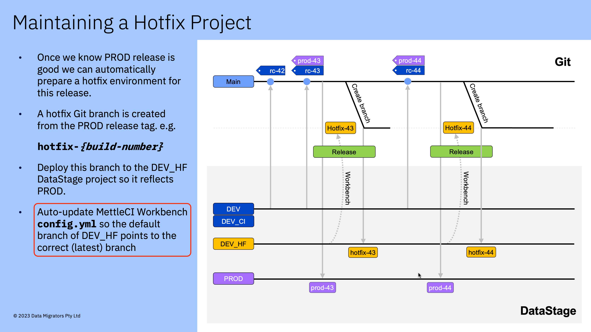
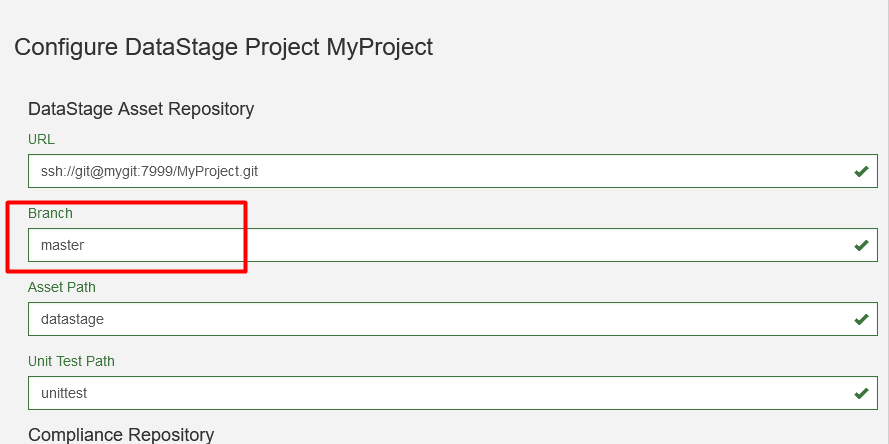
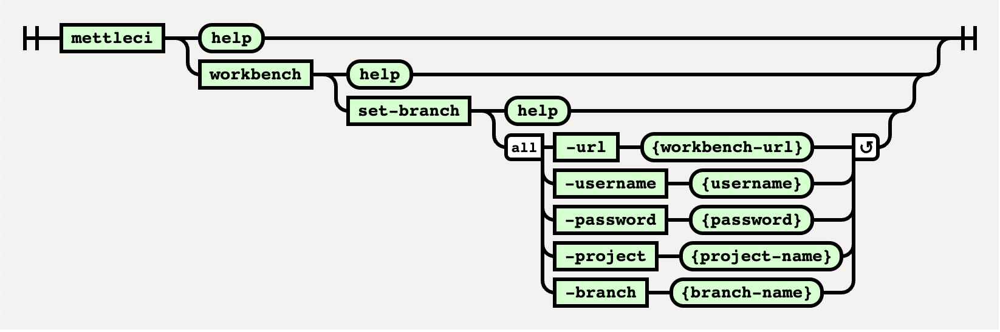

# Workbench Set-Branch Command

# Purpose

This command sets Asset Repository branch of a previously registered project in Workbench.





# Syntax



See the examples below.

(function(){ var data = { "addon\_key":"render-Markdown", "uniqueKey":"render-Markdown\_\_markdown4869515057783193928", "key":"markdown", "moduleType":"dynamicContentMacros", "moduleLocation":"content", "cp":"/wiki", "general":"", "w":"", "h":"", "url":"https://d27i9fmzbobp10.cloudfront.net/render-markdown.html?pageId=2448490539&pageVersion=36&macroHash=492bf715-9984-485d-b290-77b2a48f8809&macroId=492bf715-9984-485d-b290-77b2a48f8809&outputType=email&highlightStyle=&highlight=&xdm\_e=https%3A%2F%2Fdatamigrators.atlassian.net&xdm\_c=channel-render-Markdown\_\_markdown4869515057783193928&cp=%2Fwiki&xdm\_deprecated\_addon\_key\_do\_not\_use=render-Markdown&lic=none&cv=1000.0.0-f660f55a6ec0", "structuredContext": "{\\"confluence\\":{\\"editor\\":{\\"version\\":\\"\\\\\\"v2\\\\\\"\\"},\\"macro\\":{\\"outputType\\":\\"email\\",\\"hash\\":\\"492bf715-9984-485d-b290-77b2a48f8809\\",\\"id\\":\\"492bf715-9984-485d-b290-77b2a48f8809\\"},\\"content\\":{\\"type\\":\\"page\\",\\"version\\":\\"36\\",\\"id\\":\\"2448490539\\"},\\"space\\":{\\"key\\":\\"MCIDOC\\",\\"id\\":\\"264011780\\"}},\\"url\\":{\\"displayUrl\\":\\"https://datamigrators.atlassian.net/wiki\\"}}", "contentClassifier":"content", "productCtx":"{\\"page.id\\":\\"2448490539\\",\\"macro.hash\\":\\"492bf715-9984-485d-b290-77b2a48f8809\\",\\"space.key\\":\\"MCIDOC\\",\\"page.type\\":\\"page\\",\\"content.version\\":\\"36\\",\\"page.title\\":\\"workbench set-branch command syntax\\",\\"macro.localId\\":\\"\\",\\"macro.body\\":\\"### Syntax : workbench set-branch \[options\]\\\\n### Description\\\\n\\\\n\* \*\*-url\*\*\\\\n\\\\n Workbench URL\\\\n\\\\n \*Required\*\\\\n\* \*\*-username\*\*\\\\n\\\\n Workbe\\",\\": = | RAW | = :\\":null,\\"space.id\\":\\"264011780\\",\\"macro.truncated\\":\\"true\\",\\"content.type\\":\\"page\\",\\"output.type\\":\\"email\\",\\"page.version\\":\\"36\\",\\"macro.fragmentLocalId\\":\\"\\",\\"content.id\\":\\"2448490539\\",\\"macro.id\\":\\"492bf715-9984-485d-b290-77b2a48f8809\\",\\"editor.version\\":\\"\\\\\\"v2\\\\\\"\\"}", "timeZone":"UTC", "origin":"https://d27i9fmzbobp10.cloudfront.net", "hostOrigin":"https://datamigrators.atlassian.net", "sandbox":"allow-downloads allow-forms allow-modals allow-popups allow-popups-to-escape-sandbox allow-scripts allow-same-origin allow-top-navigation-by-user-activation allow-storage-access-by-user-activation", "apiMigrations": { "gdpr": true } } ; if(window.AP && window.AP.subCreate) { window.\_AP.appendConnectAddon(data); } else { require(\['ac/create'\], function(create){ create.appendConnectAddon(data); }); } // For Confluence App Analytics. This code works in conjunction with CFE's ConnectSupport.js. // Here, we add a listener to the initial HTML page that stores events if the ConnectSupport component // has not mounted yet. In CFE, we process the missed event data and disable this initial listener. const \_\_MAX\_EVENT\_ARRAY\_SIZE\_\_ = 20; const connectAppAnalytics = "ecosystem.confluence.connect.analytics"; window.connectHost && window.connectHost.onIframeEstablished((eventData) => { if (!window.\_\_CONFLUENCE\_CONNECT\_SUPPORT\_LOADED\_\_) { let events = JSON.parse(window.localStorage.getItem(connectAppAnalytics)) || \[\]; if (events.length >= \_\_MAX\_EVENT\_ARRAY\_SIZE\_\_) { events.shift(); } events.push(eventData); window.localStorage.setItem(connectAppAnalytics, JSON.stringify(events)); } }); }());

# Examples

```
$> mettleci workbench set-branch \
    -url https://my-engine.my-org.com:8080 \
    -username workbench-user \ 
    -password workbench-password \
    -project MyProject \
    -branch develop

MettleCI Command Line (build 128)
(C) 2018-2022 Data Migrators Pty Ltd
workbench set-branch (v1.0-2)
Reading project list from 'https://my-engine.my-org.com:8080'
Found project 'MyProject' with id 2, updating branch to 'develop'
Done.
```

# See Also

*   Page:
    
    [MettleCI CLI produces error 'Incorrectly typed data found for annotation element'](/wiki/spaces/MCIDOC/pages/2524413953/MettleCI+CLI+produces+error+Incorrectly+typed+data+found+for+annotation+element)
    
*   Page:
    
    [MettleCI command 'workbench set-branch' command produces a credentials error](/wiki/spaces/MCIDOC/pages/2501476353/MettleCI+command+workbench+set-branch+command+produces+a+credentials+error)
    
*   Page:
    
    [SSH Configuration](/wiki/spaces/MCIDOC/pages/2396487711/SSH+Configuration)
    
*   Page:
    
    [MettleCI CLI produces 'Failed to connect to host' error](/wiki/spaces/MCIDOC/pages/2396487681/MettleCI+CLI+produces+Failed+to+connect+to+host+error)
    
*   Page:
    
    [Build Pipeline SFTP operations fail due to DataStage Engine name](/wiki/spaces/MCIDOC/pages/2169307137/Build+Pipeline+SFTP+operations+fail+due+to+DataStage+Engine+name)