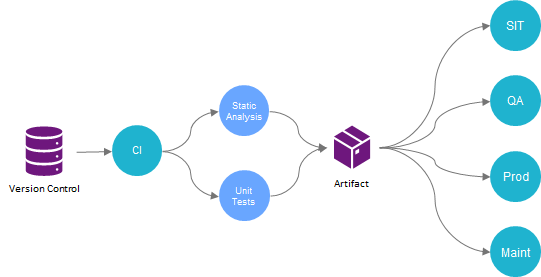

# Trunk Based Development

*   [Introduction](#introduction)
*   [Release-ability of work in progress](#release-ability-of-work-in-progress)
*   [Change Integration](#change-integration)
    *   [Short lived Feature Branches](#short-lived-feature-branches)
    *   [Committing straight to Trunk](#committing-straight-to-trunk)
*   [Release strategies](#release-strategies)
    *   [Release from Trunk](#release-from-trunk)
    *   [Branch for release](#branch-for-release)
        *   [Initializing the DataStage working copy for a release branch](#initializing-the-datastage-working-copy-for-a-release-branch)
        *   [Merging release branch changes](#merging-release-branch-changes)

# Introduction

Trunk Based Development is a source-control branch model where developers frequently integrate code change into a single branch referred to as the “Trunk” (using Git, Trunk is typically called `main` or `master`). This branch model encourages developers to integrate their changes many times a day and is a key enabler of Continuous Integration (CI) and, by extension, Continuous Delivery (CD). This is in stark contrast to feature based branching models which encourage developers to work in isolated, long lived feature branches that are only integrated into the “Trunk” when work on a feature is complete.

The goals of the Trunk Based Development branch model are:

*   Accelerate developer feedback through Continuous Integration
    
*   Limit isolated streams of development (active branches)
    
*   Minimize merge risks (branch “distance”)
    

Given the benefits of CI/CD and the [merging constraints](https://datamigrators.atlassian.net/wiki/spaces/MCIDOC/pages/1389821953/Working+with+DataStage+and+Git+Branches#DataStage-Specific-Constraints) imposed by DataStage development, it is strong recommended that MettleCI users adopt the use of Trunk Based Development. This guide will provide an overview of key considerations and implementation choices when adopting Trunk-Based Development.

# Release-ability of work in progress

A key behavioral change when using Trunk Based Development (compared to what most developers are used to) is the idea that changes will be integrated into the Trunk when progress has been made on a feature. There is no expectation that the feature is complete, just that there has been a worthwhile amount of change to the codebase and that the change won't cause a CI/CD pipeline failure. Developers should never have more than a day’s work that has not been integrated with the Trunk. In practice, developers familiar with working this this way will integrate changes many times a day, happy to integrate an hour’s worth of work or less.

As a consequence of this behavioral change, developers need to get used to the idea of reaching frequent integration points with a partially-built feature. Features which require an extended amount of work need to be decomposed into small pieces of work that can be integrated with Trunk without exposing a partially-built feature or undermining the stability of a running system. When building ETL software with DataStage, this is usually pretty easy: if adding a new column or table to a Data Warehouse, start with the source and progressively add the required calculations but don’t actually load the new column or table until the feature is complete. As a result, the calculations will be performed during transformation but discarded prior to loading the data. New DataStage jobs can also be integrated into Trunk and deployed to production but they are completely inert until they are executed as part of the ETL Batch schedule.

If there is no way to easily hide a feature which is only partially built, [feature toggles](https://datamigrators.atlassian.net/wiki/spaces/MCIDOC/pages/784138241/DataStage+Feature+Toggles) can be used. Not only can feature toggles hide a partially-built feature, they also allow developers to complete development and testing of new functionality but defer its activation until a specific date. ETL solutions typically integrate source and target systems which are not within the control of the development team. Changes to source and target schemas have to be carefully coordinated to ensure that ETL processes are compatible. Using feature toggles, DataStage developers can build, test and deploy changes for source and target changes but only switch them on in production when the source/target changes are deployed.

# Change Integration

Trunk Based Development only prescribes the *frequency* in which change is integrated into the Trunk, it does not describe *how* change is integrated. The following sections describe the strengths and weaknesses of different change integration methods and how they relate to DataStage development. It is strongly recommended that MettleCI users integrate change by [committing straight to the Trunk](https://datamigrators.atlassian.net/wiki/spaces/MCIDOC/pages/1414234192/Trunk+Based+Development#Committing-straight-to-Trunk).

## Short lived Feature Branches

Trunk Based Development and feature branches are not necessarily mutually exclusive. The key differentiator between feature branches as defined by branch models like GitFlow and Trunk Based Development is how long a feature branch remains active before being integrated (merged) into the “Trunk”. Feature driven branch models like GitFlow typically use long lived branches which are not integrated into Trunk until the feature is released. In contrast, Trunk Based Development uses short lived feature branches which should last less than 24 hours. Any longer than a day, and there is a risk of the branch becoming a long-lived feature branch (the antithesis of Trunk Based Development).

The following diagram illustrates the difference between long and short lived feature branches:

Despite changes being made in feature branches, their reduced life time doesn’t prevent the need to hide partial features. Instead, the primary purpose of short lived feature branches is not to isolate a feature until it is complete, but to validate that the changes won't cause failures in the CI/CD pipeline before they are integrated with the Trunk.

Pre-integration validation of change is useful when working with traditional programming languages such as C/C++, Java, etc because developers make changes to isolated working copies. Before committing to a shared Git branch or trunk, developers need to pull the latest changes from the remote Git repository and perform a full build of the software to ensure no breaking changes were introduced. Short lived feature branches enable these pre-integration checks to be automated which prevents significant disruption when a developer “breaks the build”.

In contrast, pre-integration validation is less important when working with DataStage. DataStage is a shared development environment that allows multiple developers to make concurrent changes to the same DataStage Project. Changes are made to a [shared working copy (the DataStage Project)](https://datamigrators.atlassian.net/wiki/spaces/MCIDOC/pages/1389821953/Working+with+DataStage+and+Git+Branches#Committing-changes-from-DataStage), so no separate pull process is required. DataStage jobs are also compiled independently which means there is no value in performing a full project build as is required with traditional programming languages. Developers are only need to run MettleCI Unit and Compliance tests prior to committing to prevent most CI/CD Pipeline failures. Running MettleCI Unit and Compliance tests prior to committing should be standard practice even when not committing to Trunk.

Modern Git hosting services like GitHub and Bitbucket have made pre-integration peer reviews easy through the use of Pull Requests. Pull Requests fit nicely with feature branches (long or short lived) and allow developers to review every changed line of code and provide annotated feedback to the team members responsible for the changes. However, DataStage assets are not text based code and are not compatible with the code review tools provided for use with Pull Requests. Peer reviews are still an important practice but they need to be performed within DataStage itself and the value of carrying them out pre-integration is diminished.

The advantages of short lived feature branches need to be weighed against the [merge risks](https://datamigrators.atlassian.net/wiki/spaces/MCIDOC/pages/1389821953/Working+with+DataStage+and+Git+Branches#Constraints) and [branching constraints](https://datamigrators.atlassian.net/wiki/spaces/MCIDOC/pages/1389821953/Working+with+DataStage+and+Git+Branches#Considerations) imposed by DataStage:

1.  Creating branches for use with DataStage introduces significant overhead compared to the expected lifetime of a short lived feature branch
    
2.  DataStage merge conflicts can occur if the same DataStage asset is modified in two concurrently developed feature branches
    

Through lived experience, we have come to the conclusion that the advantages of using short lived feature branches with DataStage are overshadowed by the [branch creation overhead](https://datamigrators.atlassian.net/wiki/spaces/MCIDOC/pages/1389821953/Working+with+DataStage+and+Git+Branches#Creating-a-branch-for-DataStage-development) and the [impacts of conflicts](https://datamigrators.atlassian.net/wiki/spaces/MCIDOC/pages/1389821953/Working+with+DataStage+and+Git+Branches#Constraints) when branches are merged. For this reason, we strongly recommend that DataStage users integrate changes by committing straight to Trunk.

## Committing straight to Trunk

Committing assets straight to Trunk is the simplest way to integrate DataStage changes as it avoids unnecessary branching/merging and maximizes change throughput while enabling CI/CD feedback.

In this mode of working, developers collaborate in a “development” DataStage project. When a developer is ready to integrate their changes into Trunk, they should perform the following steps:

1.  Compile their jobs
    
2.  Validate the jobs pass compliance testing
    
3.  Ensure all related unit tests pass
    
4.  Commit changes
    

If a change is committed to the Trunk that causes the CI/CD Pipeline to fail, developers can either resolve the issue with a new commit or, if developing a fix will take an extended period of time, Git can be used to revert the commit until a fix is available.

# Release strategies

Frequent integration of changes into Trunk is great for rapid development throughput, but there will come a time when the software needs to be released. Trunk Based Development has two main strategies for releasing software:

1.  Release from Trunk
    
2.  Branch for Release
    

Release from Trunk is the simplest strategy to adopt and it is very easy to transition from Release from Trunk to Branch for Release at a later date. For this reason, we recommend teams start with Release from Trunk and only consider Branch for Release when there is an *immediate* need to do so.

## Release from Trunk

Using a Release from Trunk strategy, developers integrate changes into the `master` or `main` branch in Git. A CI/CD pipeline is configured to trigger from this Trunk and flags the change as being releasable (green) or not (red). When a passing commit is ready to be “released”, it is tagged with the relevant version number and the CI/CD pipeline deploys it to production.

In the event that a defect is discovered in production, developers can choose one of two possible actions:

1.  Rollback to a previous good release until a fix is available
    
2.  Deploy a new version containing a fix
    

The Release from Trunk strategy assumes that there is no need to maintain multiple software releases. This assumption holds true for typical ETL development as the only release that needs to be maintained is the release currently deployed to production. However, successful implementation of this strategy requires a high release cadence. A low release cadence results in lots of changes being made “in development” between each release of software which limits the feasibility of fixing production issues by rolling back to a previous release or deploying a new release:

## Branch for release

Teams with a low release cadence will need to deploy bug-fix releases to address critical issues discovered in production between planned releases. A Branch for Release strategy is designed to address this requirement, it can also be used by teams that need to maintain more than a single active release:

Planned releases proceed in the same way as Release from Trunk. However, when a critical issue is discovered in production, a branch is retroactively created for the release and fixes committed to the branch. Like the Trunk, each release branch should trigger a CI/CD pipeline determine if the updated release is fit for purpose. When a bug fix has passed CI/CD and is ready to be released, the commit is tagged with the relevant version and the CI/CD pipeline deploys it from the branch into production.

> [!INFO]
> **Technical Clarification**  
> When using traditional programming languages like C/C++, Java, etc, bug-fixes to release branches are not usually committed directly to the release branch. The accepted Trunk Based Development practice is to reproduce and fix the bug on Trunk and then use Git cherry picking to take the related commits from Trunk and apply them to the release branch. Like Git merge, cherry picking should be avoided when working with binary files like DataStage Exports. For this reason, release fixes are committed directly to release branches when using DataStage.

A variation of Branch for Release is to create a branch just *before* a planned release and deploy from the branch for both planned and bug-fix releases. This approach can be useful when there is a high volume of change occurring on the Trunk which is not always “stable”:

Branching before release allows development on the Trunk to continue unaffected while also allowing “stabilizing” changes to be made to the release prior to production deployment. A CI/CD Pipeline should include automated tests which give confidence that a given version of software is releasable. Committing more than a couple “stabilizing” changes prior to deploying to production is an anti-pattern and an indication that the CI/CD Pipeline does not have adequate test coverage, or that development practices are breaking the CI/CD Pipeline for extended periods of time. The goal is for teams to ensure that the Trunk is releasable at all times.

### Initializing the DataStage working copy for a release branch

Given that typical DataStage development teams will only be maintaining a single release branch at any point in time, we recommend setting up “development” and “maintenance” DataStage Projects. The *development* DataStage Project will be the working copy that commits to the Trunk while the *maintenance* DataStage Project will be the working copy that commits to the currently active release branch:

Each time a new Git release branch becomes active, the maintenance DataStage Project will need to be re-initialized from the newly created branch. Including the re-initialization of the maintenance DataStage Project as part of the CI/CD Pipeline is a simple way of significantly reducing the overhead of this activity:

When a Git commit is used as the branch point for a new release, the same Git commit can be deployed to the maintenance DataStage Project (Maint in the diagram) via the CI/CD Pipeline. The deployment would use the [same deployment tools](https://datamigrators.atlassian.net/wiki/spaces/MCIDOC/pages/1266843717/Repeatable+DataStage+Project+Deployments) as all other deployments in the CI/CD Pipeline. The time required to perform a maintenance deployment will be directly proportionate to the number of changes on the Trunk since the last release.

### Merging release branch changes

Whenever a bug-fix is committed to a release branch, the same bug-fix needs to also be applied to the “Trunk” otherwise the next planned release will cause regression. If using a traditional programming language like C/C++, Java, etc, bug-fix commits can be moved from one branch to another through merging or cherry picking. Unfortunately, due to the merge [constraints imposed by DataStage](https://datamigrators.atlassian.net/wiki/spaces/MCIDOC/pages/1389821953/Working+with+DataStage+and+Git+Branches#Merging-DataStage-changes-from-multiple-branches), this is not a viable solution when working with DataStage.

An alternative approach which is based on test driven development can be used to avoid the merge while preventing regression. This approach is only feasible because bug-fixes committed to release branches are usually small in number and in scope, it is not applicable when merging branches more generally:

1.  Create/update unit tests in the maintenance branch to demonstrate the bug which is being fixed
    
2.  Implement bug fix and commit to release branch when unit tests pass
    
3.  Transfer unit test changes from maintenance branch to Trunk
    
4.  Implement bug fix and commit to Trunk when unit tests pass
    

This process will result in duplicated effort in steps 2 & 4, however the using Unit Tests to first demonstrate and then fix the bug will eliminate risk normally associated with these sort of activities. Unlike DataStage exports, unit test specs and data are text based, so Step 3 can be completed by cherry picking the relevant Unit Test changes. Cherry picking is an advanced Git technique, developers which are not familiar with Git should consider transferring Unit Test changes manually using MettleCI Workbench.