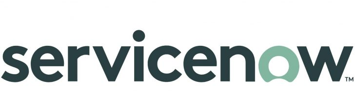

# MettleCI Integrations

This section of the documentation explains how to integrate MettleCI components with the corresponding parts of popular application lifecycle management (ALM) systems. The following table lists ALM systems that MettleCI has been tested with. However if yours isn’t there, ask your Data Migrators contact as it might be work in progress or easily enabled.

> [!WARNING]
> It is **highly** recommended that you read the [CI / CD Developer’s Guide](https://datamigrators.atlassian.net/wiki/spaces/MCIDOC/pages/512360453/CI+CD+Pipeline+Developer+s+Guide) before starting to implement automated build and deployment solutions (AKA “pipelines”) in your chosen CI / CD system.

> [!INFO]
> Note that the sample build pipelines shipped with MettleCI are provided solely as examples of how to use the MettleCI CLI within the context of various popular build automation tools.
> Your MettleCI license does not provide support for designing or developing your build pipelines. For this you should seek assistance from your build tool support provider or engage Data Migrators to help you achieve your automation goals.

| Name | Identity | Git Repository | Work Item Management | Build and Deploy | MettleCI Integration |
| --- | --- | --- | --- | --- | --- |
| [Atlassian](/wiki/spaces/MCIDOC/pages/731709495/Atlassian) |  | Yes - Bitbucket | Yes - Jira | Yes - Bamboo | [Details](https://datamigrators.atlassian.net/wiki/spaces/MCIDOC/pages/731709495/Atlassian) |
| [Azure DevOps](/wiki/spaces/MCIDOC/pages/741310465/Azure+DevOps) |  | Yes | Yes | Yes | [Details](https://datamigrators.atlassian.net/wiki/spaces/MCIDOC/pages/741310465/Microsoft+Azure+DevOps) |
| [GitHub](/wiki/spaces/MCIDOC/pages/741376173/GitHub) |  | Yes | Yes | Yes | [Details](https://datamigrators.atlassian.net/wiki/spaces/MCIDOC/pages/741376173/GitHub) |
| [GitLab](/wiki/spaces/MCIDOC/pages/741244932/GitLab) |  | Yes | Yes | Yes | [Details](https://datamigrators.atlassian.net/wiki/spaces/MCIDOC/pages/741244932/GitLab) |
| [Jenkins](/wiki/spaces/MCIDOC/pages/731709604/Jenkins) |  | \-  | \-  | Yes | [Details](https://datamigrators.atlassian.net/wiki/spaces/MCIDOC/pages/731709604/Jenkins) |
| [Micro Focus ALM](/wiki/spaces/MCIDOC/pages/2224128001/Micro+Focus+ALM) |  | \-  | Yes | \-  | Supported |
| [ServiceNow](/wiki/spaces/MCIDOC/pages/741277807/ServiceNow) |  | \-  | Yes | \-  | [Details](https://datamigrators.atlassian.net/wiki/spaces/MCIDOC/pages/741277807) |

Email your Data Migrators or IBM representative for details on other integrations

* * *