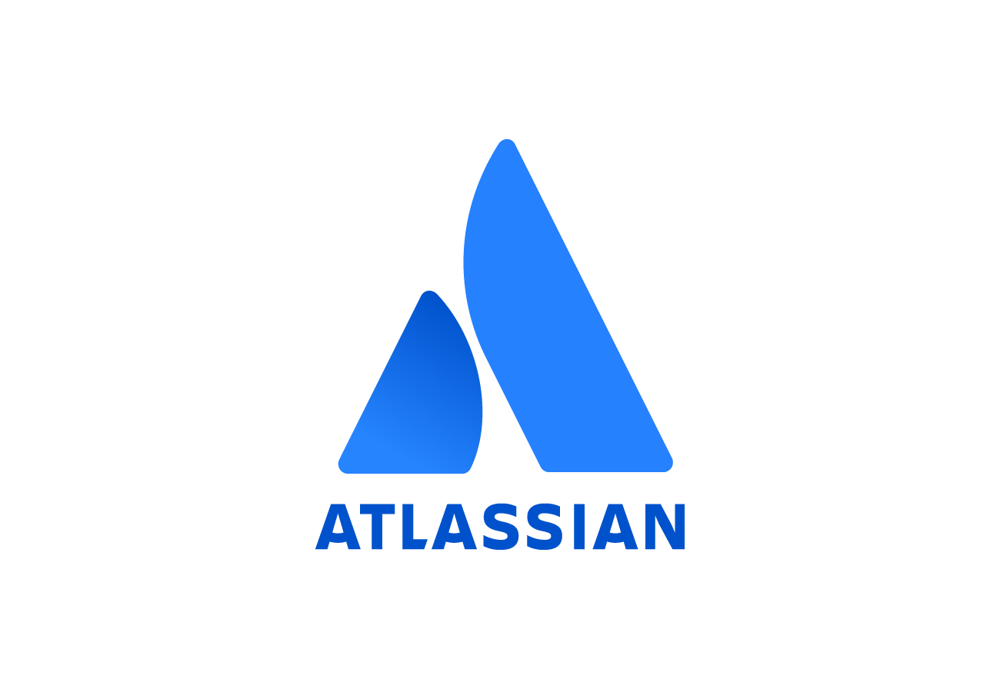

# Atlassian

Atlassian Corporation is an Australian enterprise software multinational that develops products for software development, project management, and content management. It is best known for its issue tracking application Jira, and its team collaboration and wiki product Confluence. Bitbucket is a web-based version control repository hosting service owned by Atlassian, for source code and development projects that use either Mercurial or Git revision control systems. Bamboo is a continuous integration and continuous deployment server developed by Atlassian.

### Ways MettleCI can integrate with Atlassian

*   Commit to Bitbucket repositories
    
*   Source Compliance Rules from a Bitbucket repository
    
*   Perform a live story lookup from Jira when prompting a user performing a Git commit
    
*   Enable sophisticated CI/CD pipelines for Information Server via MettleCI’s native Bamboo Interface
    
*   Provide Compliance, Unit Test, and Integration Test results as Bamboo-compatible [JUnit test reports](https://confluence.atlassian.com/bamboo/junit-parser-289277056.html)
    

* * *

## Detailed Integration Steps

*   [Atlassian Jira](./atlassian/atlassian-jira.md)
    *   [Jira and MettleCI Workbench via OAuth explained](./atlassian/atlassian-jira/jira-and-mettleci-workbench-via-oauth-explained.md)
    *   [Integrating Atlassian Jira with MettleCI Workbench](./atlassian/atlassian-jira/integrating-atlassian-jira-with-mettleci-workbench.md)
*   [Atlassian Bamboo](./atlassian/atlassian-bamboo.md)
    *   [Atlassian Bamboo MettleCI Plugins Installation](./atlassian/atlassian-bamboo/atlassian-bamboo-mettleci-plugins-installation.md)
    *   [Atlassian Bamboo MettleCI License Activation](./atlassian/atlassian-bamboo/atlassian-bamboo-mettleci-license-activation.md)
    *   [Install and configure an Atlassian Bamboo Agent](./atlassian/atlassian-bamboo/install-and-configure-an-atlassian-bamboo-agent.md)
    *   [Defining Atlassian Bamboo YAML Specs](./atlassian/atlassian-bamboo/defining-atlassian-bamboo-yaml-specs.md)
    *   [Bamboo Tasks](./atlassian/atlassian-bamboo/bamboo-tasks.md)
    *   [Deploying Message Handlers with Bamboo (Deprecated)](./atlassian/atlassian-bamboo/deploying-message-handlers-with-bamboo-deprecated.md)
    *   [Deploying Message Handlers with Bamboo](./atlassian/atlassian-bamboo/deploying-message-handlers-with-bamboo.md)
*   [Atlassian Bitbucket](./atlassian/atlassian-bitbucket.md)
    *   [Configuring Authentication between Workbench and Atlassian Bitbucket](./atlassian/atlassian-bitbucket/configuring-authentication-between-workbench-and-atlassian-bitbucket.md)
    *   [Installing the MettleCI Job Visualisation Plugin for Atlassian Bitbucket](./atlassian/atlassian-bitbucket/installing-the-mettleci-job-visualisation-plugin-for-atlassian-bitbucket.md)
    *   [Adding public keys to Bitbucket](./atlassian/atlassian-bitbucket/adding-public-keys-to-bitbucket.md)
    *   [Bitbucket Data Center vs. Bitbucket Cloud](./atlassian/atlassian-bitbucket/bitbucket-data-center-vs-bitbucket-cloud.md)
*   [Atlassian Questions and Answers](./atlassian/atlassian-questions-and-answers.md)

## See also

*   [Generic MettleCI Pipeline Description](#)
    
*   [MettleCI Example Pipeline for DevOps](#)
    
*   [MettleCI Example Pipeline for Upgrades](#)