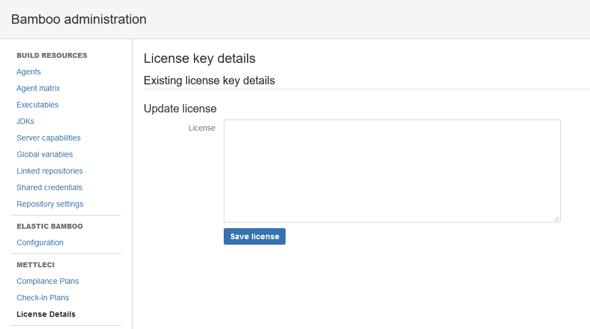

# Atlassian Bamboo MettleCI License Activation

If you are using Bamboo to run MettleCI-enabled automation processes (e.g. continuous integration testing of DataStage Jobs), you **must** activate MettleCI in Bamboo with a valid MettleCI license. This will enable you to use the MettleCI Tasks provided by MettleCI's Bamboo Plugins.

> [!WARNING]
> It's essential at this point that the following 2 MettleCI Plugins are installed and enabled in Bamboo, in the following order:-
> 1.  **dm-capability-plugin**
>     
> 2.  **dm-bamboo-license-admin-plugin**
> If any are not installed then follow the instructions on the MettleCI Plugins Installation page.

# License Deployment Steps

1.  Log in to Bamboo with an account that has application administration rights.
    
2.  Click the **cog** icon in the Bamboo header and choose  **Overview**.
    
3.  Scroll to the the **MettleCI** section in the left-hand navigation menu and click on **License Details***.*  
    If the **METTLECI** section is not visible on your **Bamboo Administration** page then refresh your browser using the process described [here](https://datamigrators.atlassian.net/wiki/spaces/MCIDOC/pages/488800735/A+Workbench+update+doesn+t+appear+to+have+installed).
    
    
    
4.  Open the license file named `mettleci.lic` and paste its content into the License field and click on **Save license**
    
5.  Once your license is saved, the details from your license will appear on the top.
    
    .png)
    

* * *

Once you have completed the steps on this page, you may move on to [configuring your Bamboo Agents](../atlassian-bamboo/install-and-configure-an-atlassian-bamboo-agent.md).

* * *