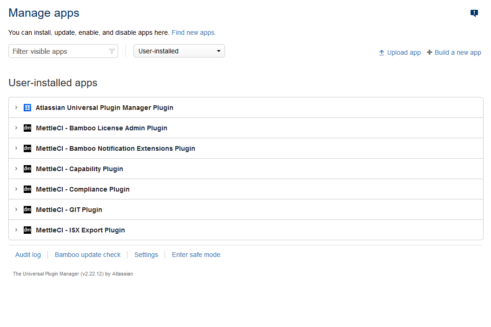

# Atlassian Bamboo MettleCI Plugins Installation

MettleCI includes a set of Plugins for Bamboo that provide unique capabilities which are harnessed to enable DevOps for IBM InfoSphere Information Server.

# Installation Steps

1.  Download the MettleCI Plugins from the MettleCI software distribution website. These follow the **<plugin name>-<version>.jar** naming convention.
    
2.  Starting with the **dm-capability-plugin**, install each MettleCI Plugin relevant to the MettleCI Edition you have licensed (see tables on this page) to Bamboo or Bitbucket via [the file upload method](https://confluence.atlassian.com/upm/installing-add-ons-273875715.html#Installingadd-ons-Installingbyfileupload).  
    

> [!WARNING]
> It is crucial that the **dm-capability-plugin** is installed before all others.  Failing to do so will result in some MettleCI Plugins being installed but not enabled.
> If you do accidentally install other Plugins first, [follow these instructions](https://confluence.atlassian.com/bamboo/disabling-or-enabling-a-plugin-289277281.html#Disablingorenablingaplugin-Enablingaplugin) to enable any disabled Plugins after the **dm-capability-plugin** has been successfully installed.

## **Bamboo Plugins**

The Bamboo Plugins are listed [here](../atlassian-bamboo/bamboo-tasks.md).

How to check MettleCI plugins are installed in Bamboo?

After installing your MettleCI plugins in Bamboo your Add-ons page should display one or more MettleCI plugins like the screenshot below:

* * *

Once you have completed the steps on this page, you may move on to: [Atlassian Bamboo MettleCI License Activation](../atlassian-bamboo/atlassian-bamboo-mettleci-license-activation.md).

* * *