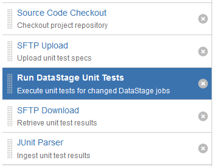

# Bamboo Run DataStage Unit Tests Task

You can use the Run DataStage Unit Tests task to execute Unit Test specification created by the MettleCI Workbench. 

## Using the Run DataStage Unit Tests Task user interface

Steps

1.  Navigate to the **Tasks** configuration tab for the job (this will be the default job if creating a new plan).
    
2.  Click the name of an existing Execute DataStage Job task or click **Add Task** and then search 'DataStage' to easily locate the Run DataStage Unit Tests task type, in order to create a new task.
    
3.  Complete the following settings:
    

|     |     |
| --- | --- |
| **Task Description** | A description of the task, which is displayed in Bamboo. |
| **Disable this task** | Check, or clear, to selectively run this task. |
| **Executable** | From the pulldown list, choose a DataStage [Capability](https://datamigrators.atlassian.net/wiki/spaces/MCIDOC/pages/116525745/Bamboo+DataStage+Capability). |
| **Domain** | Enter the Domain of the DataStage instance (Host Name of the Services Tier). e.g. `${bamboo.Domain}` |
| **Server** | Enter the Server of the DataStage instance (Host Name of the Engine Tier). e.g. `${bamboo.ServerName}` |
| **Username** | Enter the DataStage Username. e.g. `${bamboo.DataStageUsername}` |
| **Password** | Enter the DataStage Password |
| **Project name** | DataStage Project containing assets to be executed |
| **Specification Directory** | Enter the location of Unit Test spec directory used by the Unit Tests harness, typically `/opt/dm/mci/specs/<Project Name>`.<br><br>See notes below when the Bamboo agent does not have direct access to directories on the DataStage engine. |
| **Reports Directory** | Enter the location of Unit Test reports directory which the Unit Tests harness writes to, typically `/opt/dm/mci/reports/<Project Name>`.<br><br>See notes below when the Bamboo agent does not have direct access to directories on the DataStage engine. |
| **Only test changed jobs?** | Skip all tests related to jobs which have not changed since the last execution of this task. |
| **Fail build when a Unit Test fails?** | Fail the build if any Unit Tests fail. |
| **Maximum Concurrent Jobs** | Specify the maximum number of concurrent jobs executed during Unit Testing |

4.  Click **Save**
    

## Running Unit Testing without direct access to DataStage engine storage

When the Run DataStage Unit Tests task does not have direct access to the test specifications and reports directories on the DataStage engine, the [SCP Upload](../bamboo-tasks/bamboo-sftp-upload-task.md) and [SCP Download](../bamboo-tasks/bamboo-sftp-download-task.md) Bamboo tasks provided with MettleCI can be used to work around this limitation.  Below is a high-level overview of running Unit Test Specifications from a Git repository without direct access to the Specifications and Reports directories on the DataStage Engine:



### Task Execution Description

1.  **Source Code Checkout** is used to checkout the Unit Test specifications that have been created by Workbench and checked into Git.  These typically reside in the `unittest` directory in the root of your Git repository.
    
2.  **SFTP Upload** recursively transfers the content of the `unittest` directory to the remote `/opt/dm/mci/specs/<project name>` directory on the DataStage Engine.
    
3.  **Run DataStage Unit Tests** with the Specifications directory option referring to the `unittest` directory created by step 1 and the Reports directory set to `test-reports`.  The Fail build when a Unit Test fails? option but be unchecked.
    
4.  **SFTP Download** recursively transfers the content of the remote `/opt/dm/mci/reports/<project name>` directory on the DataStage engine to the local `test-reports` directory.
    
5.  **JUnit Parser** is configured to recursively parse all test results produced by Steps 3 and 4 using the pattern `test-reports/**/*.xml`
    

## Using the Run DataStage Unit Tests Task in a YAML pipeline

```
- mci-datastage-unit-tests:
    server-name: ${bamboo.ServerName}
    incremental: 'true'
    project-name: ${bamboo.ProjectName}
    domain-name: ${bamboo.DomainName}
    specs-location: unittest
    max-threads: '8'
    reports-location: test-reports
    dsinstall: DataStage v11.7
    shared-credentials: *datastage_credentials
    description: Execute unit tests for changed DataStage jobs
```