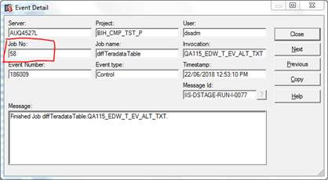

# Deploying Message Handlers with Bamboo (Deprecated)

There are two types of Message Handlers in DataStage.

1.  **Project Level Message Handlers:** These are installed in an application directory per Engine and and aren't supported by MettleCI so should be migrated manually.
    
2.  **Job Level Message Handlers:** There is a MettleCI plugin to support their deployment only.  While MettleCI deploys Job Level Message Handler files from a Project's Git repository, it doesn't offer native check-in and deletion functions for them so they must be managed via command line Git.
    

## Anti-Pattern

Message Handlers are not an asset of DataStage. See Note below for an explanation why.

> [!WARNING]
> According to [https://www.ibm.com/support/knowledgecenter/en/SSZJPZ\_11.5.0/com.ibm.swg.im.iis.ds.deploy.help.doc/topics/usingismanager.html](https://www.ibm.com/support/knowledgecenter/en/SSZJPZ_11.5.0/com.ibm.swg.im.iis.ds.deploy.help.doc/topics/usingismanager.html)
> "You can use the IBM® InfoSphere® Information Server Manager (the deployment tool) to move, deploy, and control your IBM InfoSphere DataStage® and QualityStage® assets."
> However, message handlers cannot be managed individually using the IS Manager or istool command line tool.

High-performing DataStage development teams rightly view message handlers as something that disguises poor coding or job design decisions. They are most often found in organizations that mandate that Jobs should run without warnings but with little else to encourage their developers to remediate the root cause. As a result, Jobs are often set to Abort (e.g. via an After Routine) if they generate warning messages. Unfortunately, this oftem leads to developers - especially those under pressure - applying message handlers to quickly get compliant and move on.

Organizations should refrain from using Message Handlers and should configure their Job Schedulers to be able to allow Warnings in exceptional circumstances. That way, high standards of development are generally maintained but in the unlikely situation that there is no alternative, Job Warnings can be allowed.

## Message Handler Deployment Plug-In

There is a Bamboo Plugin to support deployment of Job-Level Message Handlers: dm-dsmsgh-plugin.

The Plugin includes a task that will read all Message Handlers that follow the "<Job Name>.msh" naming convention and "inject" them into the ISX file of the corresponding Job during deployment.  The updated ISX file can then be deployed like normal, resulting in both the Job design and Job-Level Message Handler ending up in the target DataStage instance.

In order to use this MettleCI feature:

*   All Job-Level Message Handlers in a particular DataStage Project will need to be added to the corresponding Git repository, alongside the existing ISX files.  These files need to be named following the "<Job Name>.msh" convention.
    
*   Continuous Integration Build Plans and Deployment Environments in Bamboo will need to be updated to execute the new "DataStage Message Handlers Task" **immediately before** the "DataStage Incremental Deployment Task".
    
*   For each Message Handler added to Git, the corresponding <Job Name>.isx jobs need to be checked in to Git again. This is necessary to ensure that the subsequent CI Build Plan deployment (triggered by the check-in) will process the Message Handler as necessary.
    
*   No changes to Bamboo Deployment Environment configuration is required.
    

How to Find the relevant Local.msh in the Information Server File System.

1.  For example: There is a Job called “GR\_ACCOUNTS\_LOCAL"
    
2.  Within the relevant Project filesystem, find the RT\_SC<Job Number> directory that corresponds to the Job. The simplest method is to use Director to open up a log entry for the Job then get the "Job No." entry from that dialog box.
    
    
    
3.  Within the RT\_SC<Job Number> directory, find the Job-Level Message Handler config file (Local.msh)
    
4.  Once found, copy and rename that file to GR\_ACCOUNTS\_LOCAL.msh and check it into Git alongside the existing ISX file 
    
    
    
5.  Once this file has been checked in, re-check in the corresponding Job. This ensures that automated deployments pick it up.
    
6.  The (updated) Continuous Integration Bamboo Plan for the corresponding DataStage Project will be auto-triggered and must complete successfully. This will ensure that subsequent deployments to other environments (Test, QA, Production) will include Job-Level Message Handlers.
    

## Changes to CI Plans

Continuous Integration Build Plans in Bamboo will need to be updated to execute the "DataStage Message Handlers" Task.

Once you have deployed the dm-dsmsgh-plugin plugin .jar to Bamboo, you will be able to add a 'DataStage Message Handlers' Task to an existing Continuous Integration Build Plan.

Ensure the new Task is **immediately before** the "Incremental DataStage Deployment" Task.

Both the 'Root ISX directory' and 'Root message handler directory' fields must contain: `datastage`.

  

> [!CAUTION]
> As previously highlighted, the very nature of IBM’s tools for managing Job Level Message Handlers in Information Server means any automation solution for them will be at risk of permanent regression with future IBM Fix Packs and Releases. Even in the absence of such automation challenges, we suggest the general situation with Job Level Message Handlers ought to trigger customers to reconsider their use (or at least modify the tolerance of Warning Messages by dependent systems) and refactor accordingly.