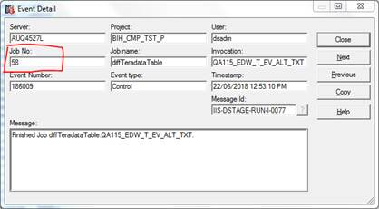
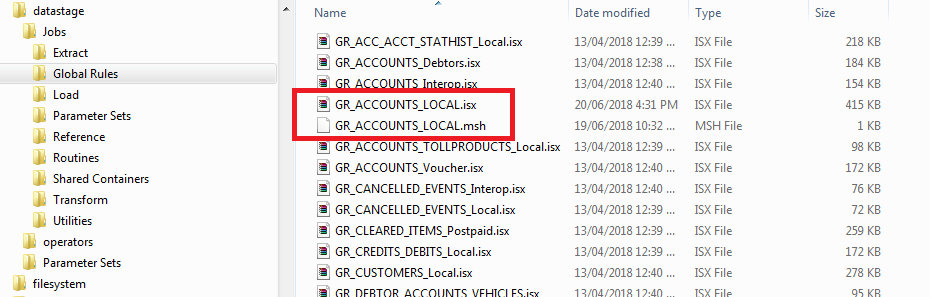
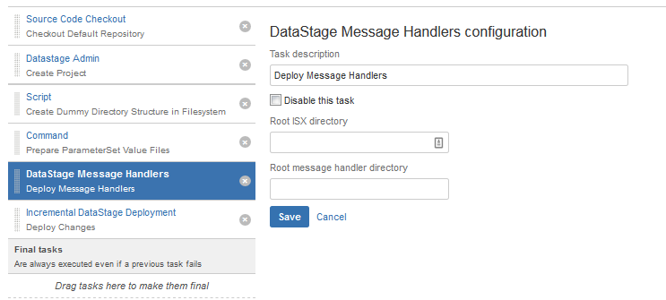

# Deploying Message Handlers with Bamboo

There are two types of Message Handlers in DataStage.

1.  **Project-Level Message Handlers:** These are installed in an application directory per Engine and and aren't supported by MettleCI so should be deployed manually.
    
2.  **Job-Level Message Handlers:** The MettleCI’s CLI and Bamboo plugin suite provides support for automated deployment of this type Message Handler from a Project's Git repository. However, MettleCI Workbench doesn’t offer native check-in and deletion functions for them as they are not “DataStage-native” assets (refer to [The Problem With Message Handlers](https://datamigrators.atlassian.net/wiki/spaces/MCIDOC/pages/2689630209/The+Problem+With+Message+Handlers)) and must be managed via an alternative Git client (inc. the Git CLI).
    

# Message Handler Deployment Plug-In

The Bamboo Plugin to support deployment of Job-Level Message Handlers is `dm-dsmsgh-plugin`. Installing this plugin enables the [DataStage Message Handlers Bamboo Task](../atlassian-bamboo/bamboo-tasks/bamboo-datastage-message-handlers-task.md). The corresponding MettleCI CLI command is `isx message-handlers` ([ISX Message-Handlers Command](https://datamigrators.atlassian.net/wiki/spaces/MCIDOC/pages/412286979/ISX+Message-Handlers+Command) ).

The plugin includes a task that will read all Message Handlers that follow the `<Job Name>.msh` naming convention and "inject" them into the ISX file of the corresponding Job during deployment.  The updated ISX file can then be deployed like normal, resulting in both the Job design and Job-Level Message Handler ending up in the target DataStage instance.

In order to use this MettleCI feature:

*   All Job-Level Message Handlers in a particular DataStage Project will need to be added to the corresponding Git repository, alongside the existing ISX files.  These files need to be named following the `<Job Name>.msh` convention.
    
*   Continuous Integration Build Plans and Deployment Environments in Bamboo will need to be updated to execute the new "DataStage Message Handlers Task" **immediately before** the "DataStage Incremental Deployment Task".
    
*   After each Message Handler is added to Git, you will need to re-check-in the corresponding Jobs. This is necessary to ensure that the subsequent CI Build Plan deployment (triggered by the check-in) will process the Message Handler.
    
*   No change to Bamboo Deployment Environment configuration is required.
    

# How To Obtain a Job's Message Handlers

Follow these steps to find the relevant `Local.msh` file for a given Job in the Information Server File System.

1.  Example: There is a Job called “GR\_ACCOUNTS\_LOCAL"
    
2.  Within the relevant Project directory, find the `RT_SC<Job Number>` directory that corresponds to the Job. The simplest method is to use Director to open up a log entry for the Job then get the "Job No." entry from that dialog box.
    
    
    
3.  Within the `RT_SC<Job Number>` directory, find the Job-Level Message Handler config file (`Local.msh`)
    
4.  Once found, copy and rename that file to `GR_ACCOUNTS_LOCAL.msh` and check it into Git alongside the existing ISX file 
    
    
    
5.  Once this file has been checked in, **re-check in the corresponding Job**. This ensures that automated deployments pick it up.
    
6.  The (updated) Continuous Integration Bamboo Plan for the corresponding DataStage Project will be auto-triggered and must complete successfully. This will ensure that subsequent deployments to downstream environments (e.g. Test, QA, Production) will include Job-Level Message Handlers.
    

# Changes to CI Plans

Continuous Integration Build Plans in Bamboo will need to be updated to execute the "DataStage Message Handlers" Task.

Once you have deployed the `dm-dsmsgh-plugin` plugin .jar to Bamboo, you will be able to add a 'DataStage Message Handlers' Task to an existing Continuous Integration Build Plan.

Ensure the new Task is **immediately before** the "Incremental DataStage Deployment" Task.

Both the 'Root ISX directory' and 'Root message handler directory' fields must contain the following text: `datastage`.

