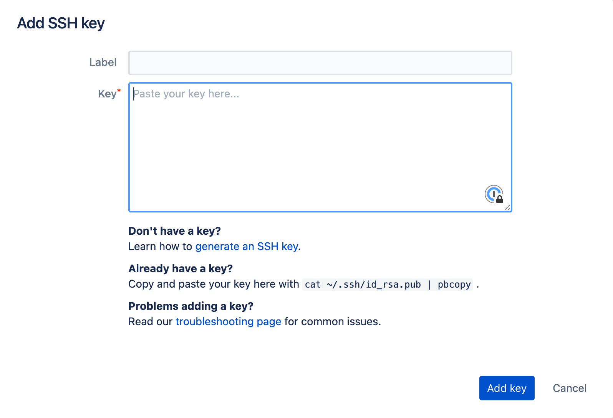

# Adding public keys to Bitbucket

To use the SSH keys to connect to Bitbucket you'll need to provide it with your public key.

## Bitbucket[​](https://developer.1password.com/docs/ssh/public-key-autofill#bitbucket)

Visit the [Bitbucket SSH key settings](https://bitbucket.org/account/settings/ssh-keys/) to add a new key:

It also works for [access keys](https://support.atlassian.com/bitbucket-cloud/docs/add-access-keys/).