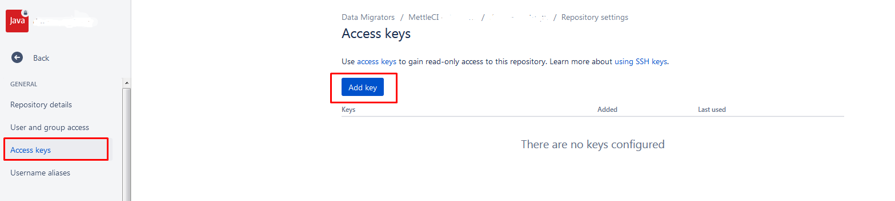
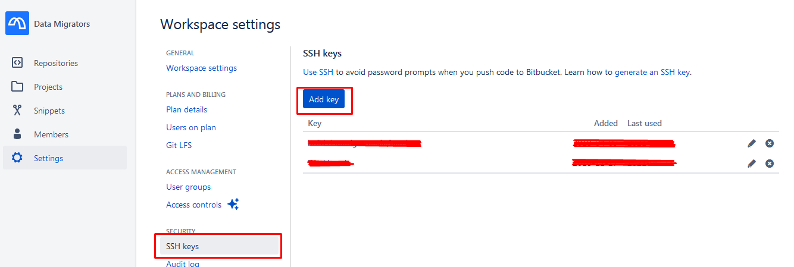
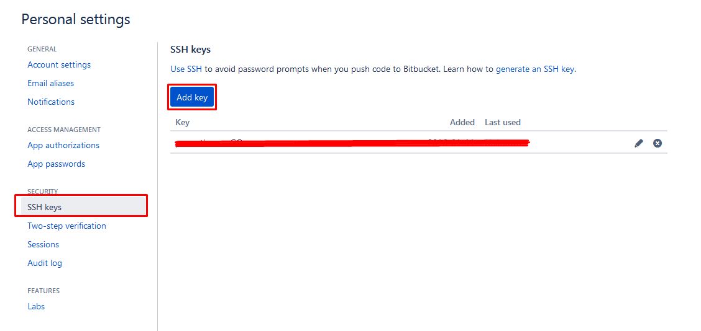

# Bitbucket Data Center vs. Bitbucket Cloud

Bitbucket Cloud's SSH Key settings are somewhat inconsistent with those provided by Bitbucket Data Center. 

This configuration is designed for CI/CD tools but assumes that the Git repository does not need to be updated.  Given most modern CI/CD pipelines apply Git tags and automatically branch/merge, this rarely provides the desired level of access. 

There are two potential approaches for configuring read/write access:

1.  Add the MettleCI Workbench SSH Key to the [Workspace](https://support.atlassian.com/bitbucket-cloud/docs/what-is-a-workspace/)
    
    
    
    The advantage of adding the key to the Workspace (#1) is that you only need to configure it once and can use it with all Git repositories that reside in the Workspace.  Additionally, MettleCI Workbench access isn't coupled to a specific user.  The downside is that you can't restrict access to specific repositories. (edited) 
    
2.  Add the MettleCI Workbench SSH Key to a user
    
    
    

Adding the MettleCI Workbench SSH Key to a specific user (#2) will allow more granular access to Git repositories, permitting the granting/revocation of access to the user with the SSH Key, but will tie MettleCI access to a particular user account.  This is problematic if the user's account is closed.  You could create a Bitbucket user purely for use by MettleCI Workbench (i.e. A ‘service account’) but this will contribute toward the user count in your Bitbucket subscription, and may not be compatible with organisational security requirements.

Unless per repository access is required, option #1 is usually the preferred approach for its ease of configuration.   It is worth noting that the self-hosted versions of Bitbucket allows read/write SSH keys to be configured per repository.