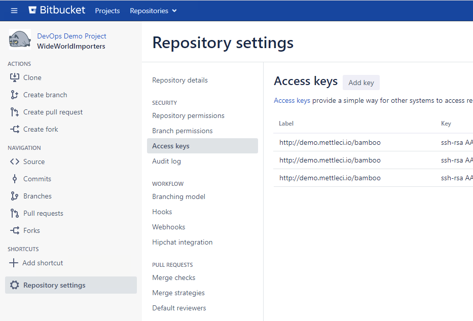
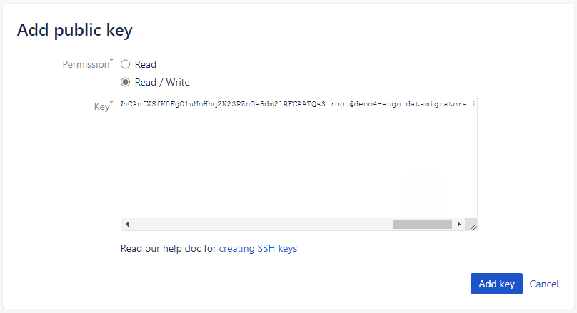

# Configuring Authentication between Workbench and Atlassian Bitbucket

1.  Navigate to your Bitbucket repository and select **Repository settings** from repository menu bar.
    
    
    
2.  From the Repository settings page select **Access keys** and click **Add key**.
    
3.  Select **Read / Write** and paste the contents of the `/opt/dm/mci/workbench.key.pub` file in to the **Key** field .
    
    
    
4.  Select **Add key** to confirm your entry.
    

Your authentication is now configured!

> [!INFO]
> NOTE: you will need to be a repository admin to do this.  
> NOTE: If you have already used this key at the user level, you may need to remove it from your user(s) first. If so it will warn you about this