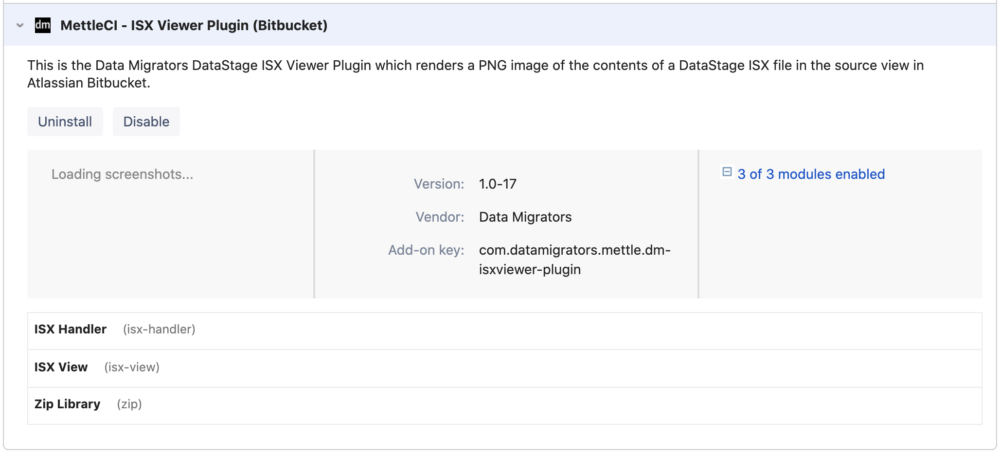

# Installing the MettleCI Job Visualisation Plugin for Atlassian Bitbucket

MettleCI provides a plugin for Atlassian Bitbucket Server which enables the visualisation of DataStage jobs and containers directly within the Bitbucket interface. You can install plugins from the Bitbucket admin interface using the Atlassian Universal Plugin Manager (UPM) as described below. You need to be an administrator to install plugins using UPM.

> [!NOTE]
> **Note**
> *   Installation of this plugin is optional, and its omission will have no functional impact on your ability to use any MettleCI features or functions
>     
> *   This plugin only works for Atlassian Bitbucket Server as Bitbucket Cloud does not permit the installation of third-party plugins.
>     
> *   The plugin will only visualise Server and Parallel Jobs and Shared Containers which have been committed to Bitbucket using MettleCI, either the Workbench or the MettleCI command line.

# Installation and Update

> [!INFO]
> Note that the MettleCI Job Visualisation Plugin for Atlassian Bitbucket is currently outside the scope of the IBM Cloud Pak entitlement, but may, upon request, be provided by Data Migrators as an unsupported utility .

## Installation

1.  Your download media (see [Accessing the MettleCI Software Distribution](https://datamigrators.atlassian.net/wiki/spaces/MCIDOC/pages/1565687876/Accessing+the+MettleCI+Software+Distribution)) will contain the MettleCI Job Visualisation plugin JAR file named `dm-isxviewer-plugin-x.x-xxx.jar` (where `x.x-xxx` is the version number)
    
2.  Log in to Bitbucket Server as an admin.
    
3.  Navigate to the Bitbucket admin page.
    
4.  Go to **ADD-ONS → Manage add-ons**.
    
5.  Click **Upload add-on**
    
6.  In the **From my computer** field select your downloaded `dm-isxviewer-plugin-x.x-xxx.jar` file.
    
7.  Click **Upload**.
    
8.  Your plugin will now be visible in the Universal Plugin Manager
    

## Updating

Follow the same steps as Installation.

## Usage

Once the MettleCI Job Visualisation Plugin is installed you’ll be able to see the job canvas rendered on the screen when looking at ISX files in your repository.

> [!INFO]
> Note that this plugin will only visualise ISX files which have been committed to your repository using MettleCI Workbench or the MettleCI Command Line Interface.

