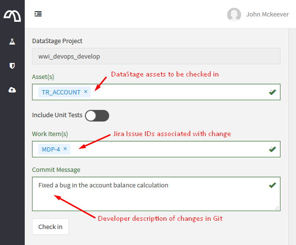
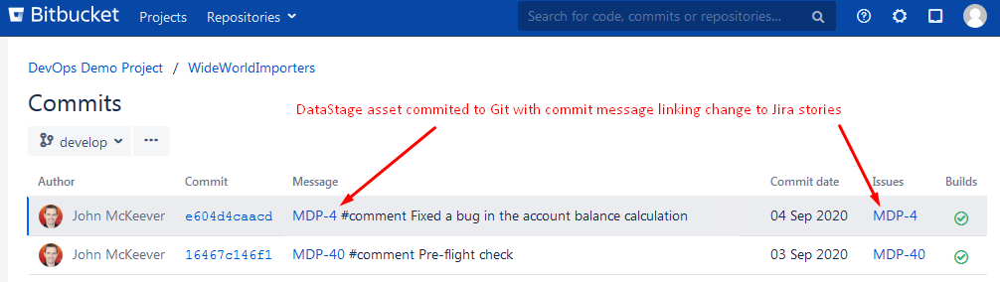
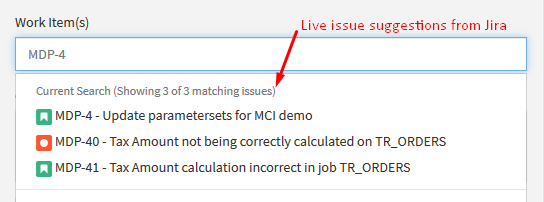
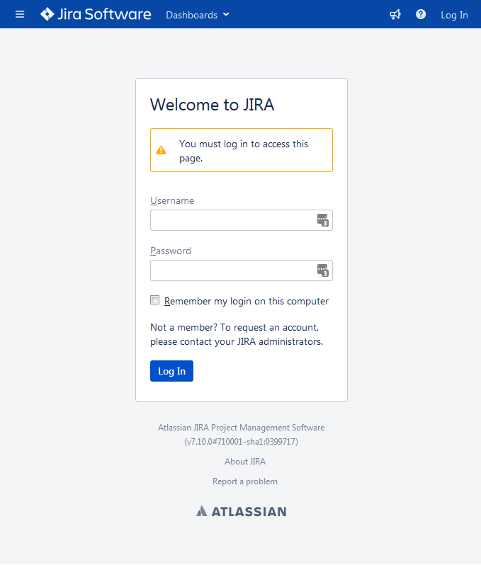
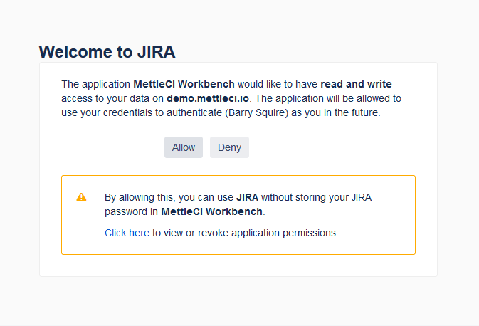

# Jira and MettleCI Workbench via OAuth explained

# Introduction

Teams who want to integrate MettleCI Workbench with Jira will usually need to engage a separate Atlassian Jira Administration team to complete the configuration. While the integration method used by MettleCI is simple, secure and fully supported by Atlassian, some Jira Administrators aren’t familiar with the Three-Legged OAuth (3LO) integration protocol used and might be anxious about configuring the required AppLink to connect a non-Atlassian application such as MettleCI.

This page is intended for Jira Administrators who want to understand why MettleCI Workbench integrates with Jira via OAuth and provides answers to questions that are often asked while evaluating whether to allow this type of integration.

# What is MettleCI and how is it related to Jira?

For traditional software development such as Java or C/C++, developers make changes to source code on their local machines and commit their work to Git/Bitbucket using a Git client. Once in Git, modern software development tools such as those provided by Atlassian can automatically build, test and deploy software and provide a complete audit trail from software produced all the way back to issues raised in Jira. In contrast, DataStage development involves using graphical tools to develop ETL jobs on a shared server. There is no source code and no simple way of committing work to Git/Bitbucket.

MettleCI Workbench is an on premise, web based application which allows DataStage developers commit their changes to Git/Bitbucket and to leverage modern development practices. When a DataStage developer initiates a Git commit via MettleCI Workbench, they are presented with the following screen that allows them to select the DataStage assets to commit, associate one or more Jira Issue IDs and add a brief description of the change:

During the Git commit process, MettleCI Workbench ensures the message included with the Git commit is formatted so that Git/Bitbucket recognizes that there is a connection between the change and Jira:

By enabling Jira integration via an AppLink with three-legged OAuth (3LO), MettleCI Workbench is able to to provide a live lookup of Jira issues based on the currently logged in user.

# What is OAuth and is it safe?

OAuth is an open-standard authorization protocol or framework that describes how unrelated servers and services can safely allow authenticated access to their assets without actually sharing the initial, related, single logon credential. In authentication parlance, this is known as secure, third-party, user-agent, delegated authorization. The simplest example of OAuth is when you go to log onto a website and it offers one or more opportunities to log on using another website’s/service’s logon. You then click on the button linked to the other website, the other website authenticates you, and the website you were originally connecting to logs you on itself afterward using permission gained from the second website.

Enabling OAuth integration between Jira and MettleCI Workbench doesn’t immediately grant MettleCI Workbench any access to actions or data within Jira. Instead, when MettleCI Workbench first attempts to fetch a list of Jira issues on the current user’s behalf, the user will be redirected to the Jira login page and, after successful login, will be prompted to grant access to MettleCI Workbench. This login process is performed on your Jira instance and MettleCI Workbench never has access to any usernames or passwords:

After the user has granted access to MettleCI Workbench, Jira will generate a *request token* which is used for all REST API requests made from MettleCI Workbench to Jira. Using the user specific *request token* rather than Basic username and password or Cookie based authentication has the following advantages:

*   MettleCI Workbench can only access data on behalf of another user, it is unable to access data by itself
    
*   Data retrieved from Jira will be restricted to only those issues which the user would normally have access to within Jira.
    
*   The generated *request token* can be revoked by the user at anytime from within Jira
    
*   All MettleCI Workbench access can be revoked at anytime by removing the MettleCI Workbench AppLink from within Jira
    

To quote Atlassian’s own [Security Overview](https://developer.atlassian.com/server/jira/platform/security-overview/) about using OAuth to access REST APIs:

> OAuth uses request tokens generated from Jira to authenticate users. We recommend using OAuth when you integrate with Jira. It takes more effort to implement, but it is more flexible and secure compared to the other two authentication methods.

> [!TIP]
> For additional security, *request tokens* are stored on the user’s browser and are not stored by MettleCI itself.

# OAuth 1.0a vs OAuth 2

There are two major version of OAuth in active use today: version 1.0a and version 2.0. Atlassian specifically implements OAuth 1.0a, rather than the newer OAuth 2.0. While this might raise concerns about OAuth 1.0a security, its worth highlighting that OAuth 2.0 was focused on making OAuth more interoperable and flexible between sites and devices. Regardless of the intent, OAuth 2.0 is *less* secure then OAuth 1.0a and many of the original OAuth founders do not support version 2.0 of the standard.

A detailed explanation of Jira’s OAuth 1.0a Authorization Flow is available from [Atlassian’s documentation](https://developer.atlassian.com/server/jira/platform/oauth/).

# Jira REST API Endpoints

Once MettleCI Workbench has secure access to Jira’s REST API, the `/rest/api/2/issue/picker` endpoint is used to retrieve Jira Issue suggestions based on text entered by the user. Full documentation for this REST API endpoint is available from Atlassian’s [developer documentation](https://developer.atlassian.com/cloud/jira/platform/rest/v2/api-group-issue-search/).

> [!TIP]
> MettleCI Workbench uses the same REST API endpoint as Jira does when Jira users [link issues](https://confluence.atlassian.com/jiracoreserver/linking-issues-939937913.html). The additional Jira performance load generated by MettleCI Workbench is therefore negligible, with a check-in through MettleCI Workbench being the equivalent of a Jira user linking issues.

The data retrieved by this endpoint is relatively lightweight and MettleCI Workbench uses the following information to render the search results:

*   Issue Icon/Image
    
*   Issue ID
    
*   Issue Summary Text
    

After a user has selected the issue they wish to link to a commit, Workbench retains only the Issue ID and adds it to the Git commit message. This avoids exposing any sensitive information that might be contained in Issue Summary Text beyond momentary display in the the Workbench UI.